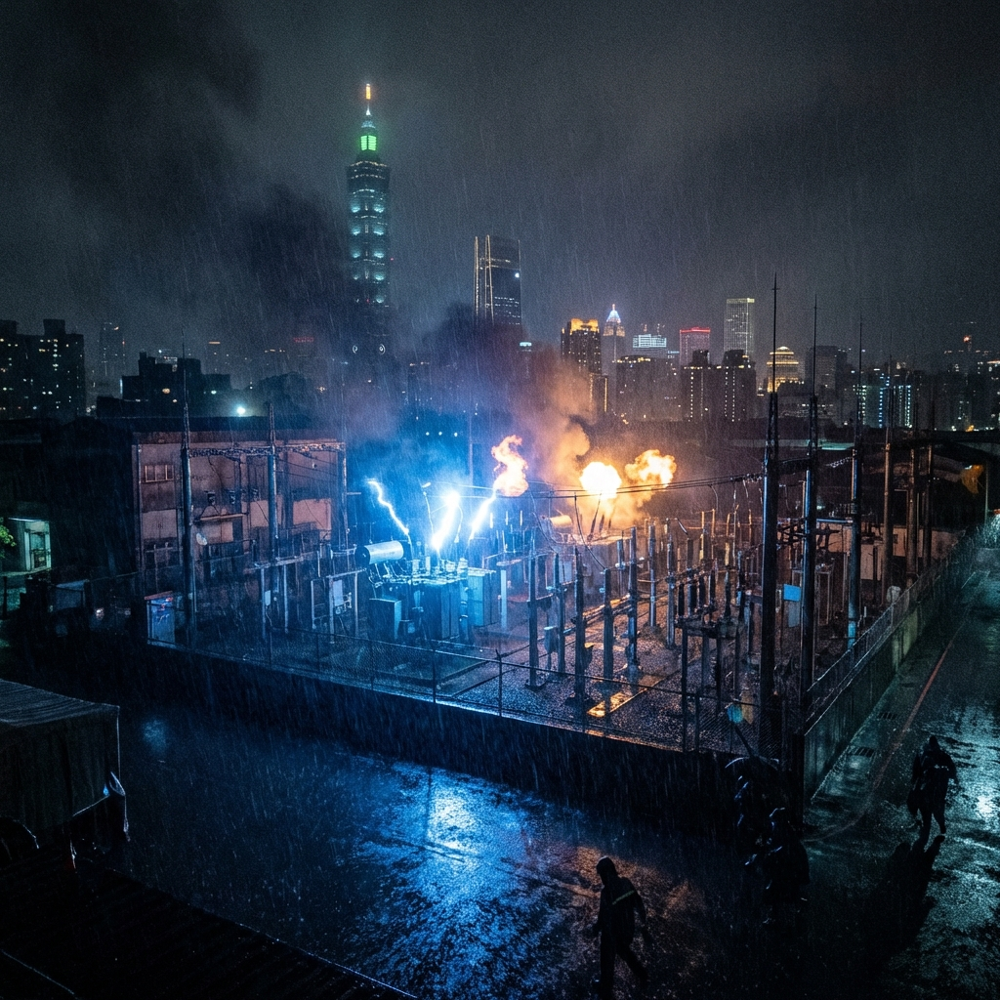

#### **[20:20:00] - 異常 (Anomaly)**

雨下得不大，但足夠讓擋風玻璃變得模糊。陳家豪坐在他那輛灰色的老舊 Toyota Altis 裡，雨刷發出規律的、令人煩躁的嘎吱聲。車內的冷氣壞了，混合著冷掉的超商便當味和這一週沒洗澡的汗味。

但他不敢開窗。

他把最後一口飯糰吞下去，目光沒有離開過對街那個不起眼的鐵捲門。那裡掛著「光速寬頻」的招牌，實際上是一個台電的外包維修站。

「那是第三次了。」他對著放在副駕駛座上的老式 Sony 錄音筆喃喃自語，「同一輛車，車牌 AFC-8891，在兩個小時內進出了變電站三次。每次都不是空車進去，但出來的時候懸吊明顯變高了。他們在卸貨。」

作為調查局裡最後幾個還堅持用「老派」方法辦案的調查官，陳家豪這輩子大半時間都在跟這種直覺打交道。局裡的年輕人都依賴大數據分析，依賴 AI 監控系統，但陳家豪知道，機器只能看到那些設計好的異常，而真正的魔鬼藏在日常的瑣碎裡。

例如那輛工程車的司機。
他在抽菸時習慣用左手擋風，右手點火，點完後會下意識地拍一下右大腿外側。
那是標準的步槍射擊姿勢後遺症，或者是確認腿掛槍套的肌肉記憶。

一個普通的寬頻維修工人，不會有這種習慣。

這裡不是光纖節點。這裡連接著林口發電廠這座超級巨獸，控制著大台北地區 30% 的基載電力。

他拉開夾克拉鍊，確認了一下腋下槍套裡的那把史密斯威森 M36 左輪手槍。局長總是笑他跟不上時代，還在用這種只有五發子彈的老古董。但陳家豪不信任那些工程塑膠做的 Glock。在這種充滿靜電與謊言的夜晚，機械結構才是最誠實的朋友。

「嘟——」

他嘗試撥打局裡的加密專線，想回報異常。電話通了，但充滿了奇怪的電流聲，像是無數隻蜜蜂在聽筒裡振翅。

「這裡是北區機動組 AI 接線員，所有線路忙線中。若有緊急狀況請按 9……」

「去你的 AI。」陳家豪掛斷電話。從早上開始，整個台北的通訊網絡就變得怪怪的。Line 的訊息延遲，交通號誌偶爾會全部變紅燈，甚至連他的車用收音機都充滿了蓋台的雜訊。

好像有什麼東西正在城市的血管裡爬行。

---

#### **[20:35:00] - 政治掩護 (Political Cover)**

**地點：台北市，內湖區，「新時代傳媒」電視台 VIP 休息室**
**視角：趙無忌 (Zhao Wu-Chi) / 新時代黨主席**

趙無忌對著鏡子整理了一下他的亞曼尼西裝領帶。鏡子裡的那張臉保養得宜，帶著一種誠懇的憂國憂民氣質。這是一張選民喜歡的臉。

化妝師正在幫他補粉。「委員，您的氣色看起來很好。」

「是嗎？但我心裡很焦慮啊。」趙無忌嘆了口氣，語氣完美得像是在排練，「這種局勢，執政黨還在粉飾太平。」

這時，放在桌上的保密手機震動了一下。
是一個沒有號碼的簡訊。內容只有一行字：
**「香燭已備妥。法會準時開始。」**

趙無忌的嘴角微微上揚，但他在鏡子裡迅速收斂了那個笑容，換上了一副凝重的神情。

那是**標叔**的訊號。這意味著針對林口發電廠的「物理阻斷」已經就位。

他轉頭看向旁邊的沙發，那裡坐著另外一個人——**汪震**，正拿著平板電腦在刷數據。「直播流量已經衝到五十萬了。他們都在等你的『獨家爆料』。」

「很好。」趙無忌拿起手機，回覆了一個「善」字，然後徹底刪除了訊息。

「走吧。」他站起身，「今天晚上的劇本不是『停電』，而是『能源政策崩潰』。記住，要把這定義為人禍，不是敵襲。這樣我們才能在斷網後掌握話語權。」

「了解。」汪震露出一口森白的牙齒，「我甚至準備好了 AI 生成的『台電員工內部爆料音檔』。」

兩人走出休息室，走向耀眼的攝影棚燈光。
這是一場完美的雙簧。而在這場戲的背後，台灣的電力心臟即將停止跳動。

---

#### **[20:50:00] - 破殼 (Breach)**

對街的鐵捲門緩緩升起。那輛工程車要出來了。

這一次，副駕駛座上下來了一個人。穿著藍色的工裝，戴著寫有「台電外包」字樣的黃色頭盔。他在門口停了一下，拿出手機看了一眼。

陳家豪瞇起眼睛。在那個人低頭的瞬間，藉著路燈微弱的光線，他看到了對方脖子上的一處刺青。
那是一條盤踞的青龍。

「**標叔**的人。」陳家豪的手握緊了方向盤。

標叔 (Uncle Biao)，本名林大標，新北市最大的宮廟主委，也是這一帶的地下里長伯。表面上熱心公益，甚至還跟總統握過手，但陳家豪追了他三年，知道這傢伙的宮廟地下室不只是放香灰，還放著從對岸走私進來的黑槍。而那個刺青，是標叔手下「護法隊」的標誌。

這已經不是單純的電纜竊盜案了。
一群黑道份子，在這個敏感的時間點，滲透進了國家關鍵基礎設施的核心。

「蟻穴 (The Ant Colony)。」這個詞突然出現在他的腦海裡。這是兩年前他在一份未被採納的威脅評估報告中用的詞。*「敵人不會只從海灘上來，他們會像螞蟻一樣，先蛀空我們的地基。」*

當時的處長把報告丟進碎紙機，說他有「冷戰被迫害妄想症」。

「抓到你了。」陳家豪沒有再猶豫。他知道再次通報已經來不及了。這群螞蟻已經把巢穴築好了，如果現在不動作，今晚過後可能就沒機會了。

他發動車子，沒有開大燈，利用雨聲掩護，緩緩滑行到路口，橫著車身擋住了工程車的去路。

雨越下越大。

陳家豪推開車門，雨水瞬間打濕了他滿是鬍渣的臉。他把與手槍同樣老舊的證件夾舉在胸前，左手按在槍柄上，大步走向那輛工程車。

「調查局！熄火！雙手放在方向盤上！」

聲音在雨中顯得有些單薄。

工程車沒有動。雨刷還在擺動。
那個站在門口的青龍刺青男緩緩轉過頭來。眼神裡沒有驚慌，只有一種令人心寒的譏諷。他把抽了一半的菸彈在積水裡，發出「滋」的一聲。

然後他笑了。

那是一種等待了很久、終於可以不用再演戲的笑容。他舉起手機，螢幕亮著，上面顯示著一個倒數計時的紅色數字。

`00:00:05`

「太晚了，長官。」那人用字正腔圓的普通話說道，完全沒有平日卻裝出來的台灣國語腔調。

---

#### **[20:55:00] - 黑暗降臨 (Blackout)**

轟隆——！

不是雷聲。是爆炸。
聲音來自陳家豪的腳下，來自地底深處。緊接著是連鎖反應，維修站內部的變壓器像鞭炮一樣接連炸裂，藍白色的電弧衝破了屋頂，將雨夜照得如同白晝。

巨大的衝擊波將陳家豪掀翻在濕滑的柏油路上。

當他掙扎著抬起頭時，他看到了這輩子最恐怖的景象。
遠方的林口發電廠，那三根巨大的煙囪突然停止了運作。原本燈火通明的廠區，像是一隻被突然掐熄的蠟燭，瞬間陷入了絕對的黑暗。

緊接著是林口台地、泰山、五股…… 黑暗像是有生命一樣，沿著輸電塔的線路這一頭瘋狂蔓延，吞噬著高速公路的路燈、吞噬著遠方大台北盆地的萬家燈火。

台北，熄燈了。

「第五縱隊……」陳家豪咳出一口帶血的唾沫，手顫抖著去摸那把掉落在水坑裡的左輪手槍。

而那輛工程車的車燈，在此刻突然亮起遠光燈。刺眼的白光像是一對在黑暗中睜開的獸眼，引擎發出野獸般的咆哮。
它沒有逃跑。它猛然加速，直接朝著地上的陳家豪衝來。

在那一刻，陳家豪聽到了遠方傳來的、更加低沉的聲音。
那是防空警報。
但那聲音聽起來不像是在警告，更像是在哀悼。

而同一時間，在地球另一端的雪線與森林之間，也有人聽見了另一種「寂靜」——
那種只有獵物屏住呼吸時才會出現的寂靜。

## 名詞解釋
- **M36 左輪手槍**：史密斯威森（Smith & Wesson）經典左輪（五發），結構簡單、可靠但火力有限。
- **Glock**：奧地利格洛克系列手槍品牌，以聚合物槍身與高可靠性著稱（本章用來對比陳家豪偏好的「老派機械」）。

*—— 下一章：Chapter 4: 蘇瓦烏基的騙局 (The Suwałki Deception)*

---

