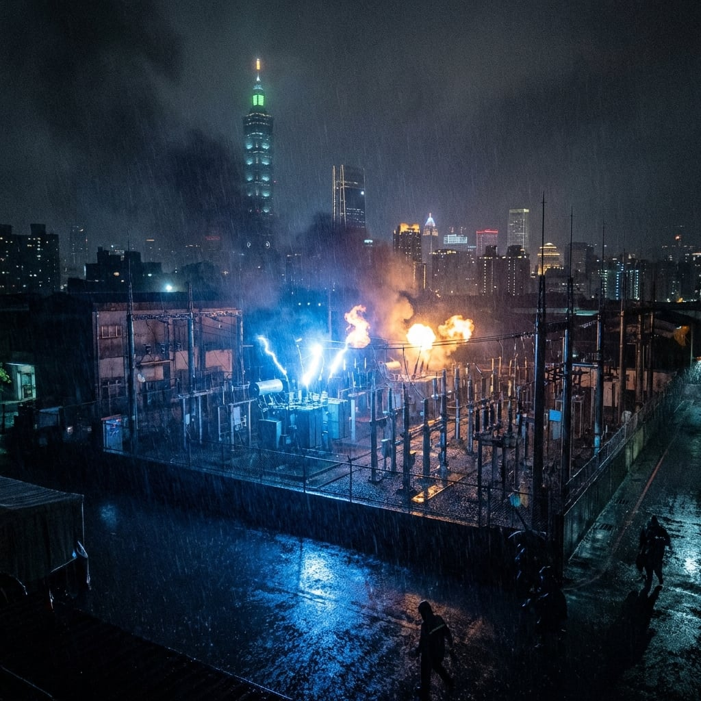

#### **[20:20:00] - 異常 (Anomaly)**

雨下得不大，但足夠讓擋風玻璃變得模糊。陳家豪坐在他那輛灰色的老舊 Toyota Altis 裡，雨刷發出規律的、令人煩躁的嘎吱聲。車內的冷氣壞了，混合著冷掉的超商便當味和這一週沒洗澡的汗味。

但他不敢開窗。

他把最後一口飯糰吞下去，目光沒有離開過對街那個不起眼的鐵捲門。那裡掛著「光速寬頻」的招牌，實際上是一個台電的外包維修站。

「那是第三次了。」他對著放在副駕駛座上的老式 Sony 錄音筆喃喃自語，「同一輛車，車牌 AFC-8891，在兩個小時內進出了變電站三次。每次都不是空車進去，但出來的時候懸吊明顯變高了。他們在卸貨。」

局裡的年輕人都依賴 AI 監控系統。陳家豪不信那套。機器只看得到設計好的異常，真正的魔鬼藏在日常的瑣碎裡。

例如那輛工程車的司機。
他在抽菸時習慣用左手擋風，右手點火，點完後會下意識地拍一下右大腿外側。
那是標準的步槍射擊姿勢後遺症，或者是確認腿掛槍套的肌肉記憶。

一個普通的寬頻維修工人，不會有這種習慣。

這裡不是光纖節點。這裡連接著林口發電廠這座超級巨獸，控制著大台北地區 30% 的基載電力。

他拉開夾克拉鍊，確認了一下腋下槍套裡的那把史密斯威森 M36 左輪手槍。局長總是笑他跟不上時代，還在用這種只有五發子彈的老古董。陳家豪不信任那些工程塑膠做的 Glock。

「嘟——」

他嘗試撥打局裡的加密專線，想回報異常。電話通了，但充滿了奇怪的電流聲，像是無數隻蜜蜂在聽筒裡振翅。

「這裡是北區機動組 AI 接線員，所有線路忙線中。若有緊急狀況請按 9……」

「去你的 AI。」陳家豪掛斷電話。從早上開始，整個台北的通訊網絡就變得怪怪的。Line 的訊息延遲，交通號誌偶爾會全部變紅燈，車用收音機充滿蓋台的雜訊。

---

#### **[20:35:00] - 政治掩護 (Political Cover)**

**地點：台北市，內湖區，「新時代傳媒」電視台 VIP 休息室**
**視角：趙無忌 (Zhao Wu-Chi) / 新時代黨主席**

趙無忌對著鏡子整理了一下他的亞曼尼西裝領帶。鏡子裡的那張臉保養得宜。選民喜歡這張臉。

化妝師正在幫他補粉。「委員，您的氣色看起來很好。」

「是嗎？但我心裡很焦慮啊。」趙無忌嘆了口氣，語氣完美得像是在排練，「這種局勢，執政黨還在粉飾太平。」

這時，放在桌上的保密手機震動了一下。
是一個沒有號碼的簡訊。內容只有一行字：
**「香燭已備妥。法會準時開始。」**

趙無忌的嘴角微微上揚，但他在鏡子裡迅速收斂了那個笑容，換上了一副凝重的神情。

那是**標叔**的訊號。這意味著針對林口發電廠的「物理阻斷」已經就位。

他轉頭看向旁邊的沙發，那裡坐著另外一個人——**汪震**，正拿著平板電腦在刷數據。「直播流量已經衝到五十萬了。他們都在等你的『獨家爆料』。」

「很好。」趙無忌拿起手機，回覆了一個「善」字，然後徹底刪除了訊息。

「走吧。」他站起身，「今天的劇本不是『停電』，是『能源政策崩潰』。人禍，不是敵襲。斷網後話語權就是我們的。」

「了解。」汪震露出一口森白的牙齒，「我甚至準備好了 AI 生成的『台電員工內部爆料音檔』。」

兩人走出休息室，走向攝影棚燈光。

---

#### **[20:50:00] - 破殼 (Breach)**

對街的鐵捲門緩緩升起。那輛工程車要出來了。

這一次，副駕駛座上下來了一個人。穿著藍色的工裝，戴著寫有「台電外包」字樣的黃色頭盔。他在門口停了一下，拿出手機看了一眼。

陳家豪瞇起眼睛。在那個人低頭的瞬間，藉著路燈微弱的光線，他看到了對方脖子上的一處刺青。
那是一條盤踞的青龍。

「**標叔**的人。」陳家豪的手握緊了方向盤。

標叔 (Uncle Biao)，本名林大標，新北市最大的宮廟主委。跟總統握過手，宮廟地下室放著從對岸走私進來的黑槍。陳家豪追了他三年。那個刺青，是標叔手下「護法隊」的標誌。

這已經不是電纜竊盜案了。

兩年前他寫過一份威脅評估報告，用的詞是「蟻穴」。*「敵人不會只從海灘上來，他們會像螞蟻一樣，先蛀空我們的地基。」*

處長把報告丟進碎紙機。

「抓到你了。」陳家豪沒有再猶豫。通報來不及了。

他發動車子，沒有開大燈，利用雨聲掩護，緩緩滑行到路口，橫著車身擋住了工程車的去路。

雨越下越大。

陳家豪推開車門，雨水瞬間打濕了他滿是鬍渣的臉。他把與手槍同樣老舊的證件夾舉在胸前，左手按在槍柄上，大步走向那輛工程車。

「調查局！熄火！雙手放在方向盤上！」

聲音在雨中顯得有些單薄。

工程車沒有動。雨刷還在擺動。
那個青龍刺青男緩緩轉過頭來。他把抽了一半的菸彈在積水裡，發出「滋」的一聲。

然後他笑了。

他舉起手機，螢幕亮著，上面顯示著一個倒數計時的紅色數字。

`00:00:05`

「太晚了，長官。」那人用字正腔圓的普通話說道，完全沒有平日卻裝出來的台灣國語腔調。

---

#### **[20:55:00] - 黑暗降臨 (Blackout)**

轟隆——！

不是雷聲。是爆炸。
聲音來自陳家豪的腳下，來自地底深處。緊接著是連鎖反應，維修站內部的變壓器像鞭炮一樣接連炸裂，藍白色的電弧衝破了屋頂，將雨夜照得如同白晝。

巨大的衝擊波將陳家豪掀翻在濕滑的柏油路上。

他掙扎著抬起頭。
遠方的林口發電廠，三根巨大的煙囪停了。廠區瞬間陷入黑暗。

林口台地、泰山、五股——黑暗沿著輸電塔的線路蔓延，吞噬大台北盆地的萬家燈火。

台北，熄燈了。

「第五縱隊……」陳家豪咳出一口帶血的唾沫，手顫抖著去摸那把掉落在水坑裡的左輪手槍。

工程車的遠光燈亮了。引擎咆哮。
它猛然加速，直接朝地上的陳家豪衝來。

遠方傳來防空警報。

而同一時間，在地球另一端的雪線與森林之間，也有人聽見了另一種「寂靜」——
那種只有獵物屏住呼吸時才會出現的寂靜。

## 名詞解釋
- **M36 左輪手槍**：史密斯威森（Smith & Wesson）經典左輪（五發），結構簡單、可靠但火力有限。
- **Glock**：奧地利格洛克系列手槍品牌，以聚合物槍身與高可靠性著稱（本章用來對比陳家豪偏好的「老派機械」）。

---
