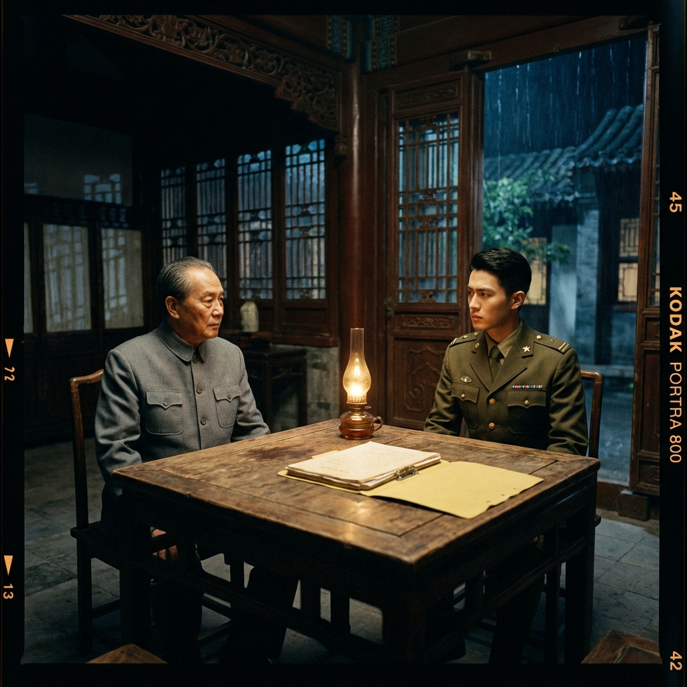

---

## [2008年9月] 北京，國防大學

### I. 種子

二十年前的北京，秋天的陽光還帶著夏末的餘溫。

張弘毅站在國防大學的校門前，手裡捏著那張印有「兩岸軍事學術交流計畫」字樣的邀請函。他那年三十二歲，剛晉升少校，是空軍戰術管制聯隊最年輕的作戰官。

「張少校，歡迎來到北京。」

接待他的人叫李明遠，穿著一身筆挺的軍裝，肩章上是大校的軍銜。他的笑容溫和，眼神卻在丈量。

「這次交流的目的是增進兩岸軍事互信。」李明遠一邊帶他穿過校園，一邊說，「畢竟，我們都是中國人。」

張弘毅沒有回應。國防部每年都會派幾個「有潛力」的軍官參加這類交流。他打算禮貌地撐完兩週然後回家。

但他沒有預料到第三天晚上的那場「私人晚宴」。

---

四合院看起來普通，門口站著的便衣不普通。

餐桌上只有三個人：張弘毅、李明遠，還有一個從頭到尾沒有自我介紹的老人。老人穿著中山裝，說話很慢。

「張少校，」老人開口，「你知道你祖父是誰嗎？」

張弘毅的筷子停在半空中。

「我祖父？他在我出生前就過世了。」

老人微微點頭，從旁邊的公文包裡取出一份泛黃的檔案。

「張德昌，1923年生，黃埔軍校第二十一期。1949年隨部隊撤退至金門，1950年參與古寧頭戰役。」老人念著檔案上的文字，「但你可能不知道的是，他在1947年曾經是我們的人。」

房間裡的空氣凝固了。

「這不可能。」張弘毅說。

「當然可能。」老人將檔案推到他面前，「你祖父曾經是地下黨的外圍成員，負責傳遞情報。後來……他選擇了另一條路。」

檔案上的照片——一個穿國軍制服的年輕人。

那確實是他祖父。

「所以呢？」

「歷史給了你一個機會。」老人說。

---

他應該拒絕的。

但老人說的下一句話：

「我們知道你父親欠的債。三千萬。高利貸。如果你不幫忙，他會在監獄裡度過餘生，你母親會流落街頭。」

張弘毅閉上眼睛。

「你們要我做什麼？」

老人笑了。

「現在什麼都不用做。只要……保持聯繫。」

---

## [2015年3月] 新竹，空軍作戰指揮部

### II. 沉淪

七年過去了。

張弘毅現在是中校，負責整個北部空域的戰術管制。績效永遠甲等。

沒有人知道他每個月都會在台北市區的一家茶藝館裡，與一個自稱「王先生」的人見面。

演習時間表、部隊調動公告、預算分配——這些東西任何一個記者都能從立法院的公報裡找到。

他只是在還債。

---

那天晚上，王先生帶來了一個信封。

「這是你父親的債務清償證明。」王先生說，「從現在開始，你是自由的。你可以選擇結束我們的合作。」

張弘毅看著那張紙。

「當然，」王先生從包裡取出另一個信封，「這些照片可能會讓你的上級產生一些誤解。」

張弘毅在茶藝館裡的身影。接過信封的畫面。在北京四合院裡舉杯。

七年的「合作」，每一刻都被記錄下來。

「你們……」

「我們只是在保護投資。」王先生微笑，「繼續合作，什麼事都不會有。不繼續——這些照片會出現在國安局的桌上。」

「你們想要什麼？」

「現在？什麼都不要。」王先生將信封收回，「總有一天會需要你做更有價值的事。在那之前，繼續就好。」

他站起身。

「你現在是『紅心』了，張中校。」

---

## [2023年6月] 台北，某高級餐廳

### III. 信仰

又過了八年。

張弘毅已經是上校了，空軍戰術管制聯隊的作戰長。在他的推薦下，好幾個「有潛力」的年輕軍官被送去北京「交流」。

不知從什麼時候開始，他不再認為自己是受害者。

王先生的真名是趙國棟，總參謀部情報局的資深幹部。

「統一是歷史的必然。」趙國棟說，「美國正在衰落。你不是在背叛，你是在為未來做準備。」

張弘毅需要相信這是真的。否則過去十五年毫無意義。

---

那天晚上，趙國棟帶來了一個新任務。

「林子修。」趙國棟將一張照片放在桌上，「Link-16架構師，現在被貶到樂山雷達站。我們需要你……確保他在關鍵時刻無法發揮作用。」

張弘毅看著照片上那張年輕的臉。

「他做了什麼？」

「他知道太多。」趙國棟說，「戰爭一開始，他手上的資料可以讓美軍在幾週內重建整個西太平洋的數據鏈。」

「你要我殺了他？」

「不。」趙國棟笑了，「讓他失去行動能力就好。細節行動前告訴你。」

張弘毅沉默了很久。

之前是數據。這是一個人。一個他認識的人。

「張上校？」

「我知道了。」張弘毅聽到自己說。

---

## [T-Hour - 48:00:00] 台北，張弘毅的公寓

### IV. 前夜

現在是2028年11月13日，凌晨三點。

張弘毅站在陽台上。遠處101大樓的燈光還亮著。

四十八小時後，這座城市將陷入黑暗。

他的手機響了。加密應用程式上跳出一條訊息：

**[龍]：最終確認。T-Hour：11月15日 21:00 UTC。執行「鎖鏈」協議。**

「鎖鏈」協議——在關鍵時刻關閉天弓三型的射控雷達，阻止林子修啟動「勝利女神」協定。

張弘毅關上手機，走回客廳。

牆上掛著一張全家福。大女兒今年要考大學了。小兒子剛上國中。

---

張弘毅打開書桌的抽屜，取出一個小盒子。裡面是他祖父留下的唯一遺物——一枚國軍的領章，1949年的舊款式。

*你祖父曾經是我們的人。*

二十年前老人的話在他腦中迴盪。

也許這是真的，也許是謊言。但現在已經不重要了。

每一步都很小。每一步都有理由。

然後有一天回頭一看，懸崖。

---

他拿起手機，打開相簿。

上週的照片——作戰指揮部聚餐。林子修站在角落。柯大勇在抱怨伙食。李正武說要退伍回去陪孫子。

張弘毅將手機放下，走到窗邊。

外面的天空開始泛白。新的一天即將開始。

他深吸一口氣。

*已經沒有退路了。*

他從來不是棋手。

---

## [T-Hour - 24:00:00] 新竹，作戰指揮部

### V. 最後的面具

張弘毅穿上軍裝，整理好領帶，最後看了一眼鏡中的自己。

他打開門。

在作戰指揮部的走廊上，他遇到了林子修。

「張長官。」林子修敬了個禮。

「林少校。」張弘毅回禮，「雷達站那邊還好嗎？」

「還好。只是……最近GPS訊號有點不穩定，我提交了一份報告——」

「我看到了。」張弘毅拍了拍他的肩膀，「別擔心，可能只是太陽黑子活動。這種事以前也發生過。」

林子修點點頭。

張弘毅從他身邊走過，沒有回頭。

---

*[章節結束]*

*—— 下一章：第四章 [伊萊亞斯] 蘇瓦烏基的騙局 (The Suwałki Deception)*

---
