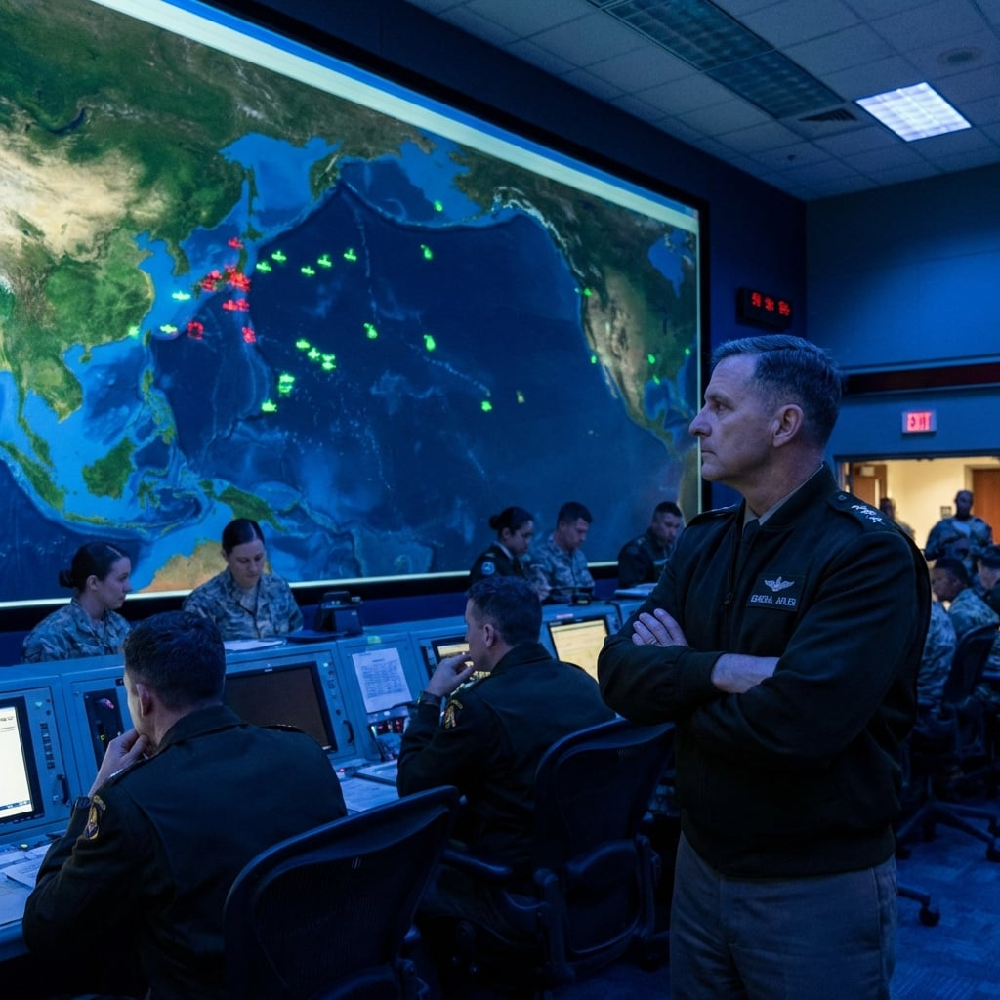

---

## 失明的巨人

**大衛·阿德勒將軍**的手機裡有一張照片。

那是他兒子傑森的照片，穿著海軍少尉的制服，站在關島安德森空軍基地的跑道上。照片拍攝於三個月前，傑森剛從安納波利斯畢業，被分發到太平洋艦隊。

「爸，這裡真的很美。」傑森在電話裡說，「你應該來看看。」

阿德勒從沒去過。他總是很忙。

現在，他站在國家軍事指揮中心的戰情室裡，看著那面巨大的世界地圖。代表美軍單位的綠色光點正在一個接一個地熄滅。

其中一個熄滅的光點，就是關島。

「長官？」

阿德勒回過神。艾琳·張上校站在他身邊，手裡拿著不斷更新的報告。三十八歲，戰情室裡最年輕的參謀。

「報告情況。」

「百分之六十的通訊節點離線。」艾琳的手指在平板上滑動，指尖微顫，「太平洋司令部完全失聯。歐洲司令部只能通過有限的陸基光纖連接。中東司令部……狀態不明。」

阿德勒看著地圖上那片漆黑的太平洋。

*傑森。*

他把這個念頭壓下去。

「衛星呢？」

「SBIRS預警衛星顯示一切正常。」艾琳皺起眉頭，「但我們收到地面部隊的報告——說他們看到了飛彈軌跡、空襲、大規模軍事行動。這些報告與衛星數據完全矛盾。」

阿德勒閉上眼睛。

三十年的軍旅生涯，他見過戰爭。但不是這種——敵人不是站在對面的士兵，而是流過電線的幽靈。

「除非衛星數據是假的。」他說出那個可怕的結論。

艾琳僵住了。「長官，這不可能。SBIRS系統有十層加密——」

「艾琳。」阿德勒轉過身，看著她，「如果有內鬼呢？如果有我們自己的密鑰被竊取呢？」

戰情室裡陷入沉默。

阿德勒走到戰情桌前，拿起那支紅色電話。

*傑森，你在哪裡？*

他撥出了號碼。

---

## 父親的選擇

電話響了兩聲，白宮接通了。

「總統先生，」阿德勒說，「我是阿德勒。我們有一個問題。」

他將情況簡要說明：通訊癱瘓、衛星數據可疑、地面報告顯示大規模攻擊。

電話那頭沉默了很長時間。

然後詹姆斯·哈蒙德總統說：「將軍，我十分鐘後到五角大廈。」

「總統先生——」

「這不是討論。如果這是戰爭，我不會躲在橢圓形辦公室裡。」

電話掛斷了。

阿德勒放下話筒，看向艾琳。

「準備接待總統。」

---

十二分鐘後，哈蒙德總統走進了戰情室。

他比電視上看起來更蒼老。頭髮白了不少。

「將軍，」總統走到戰情牆前，看著那片漆黑的太平洋，「給我最壞的情況。」

「最壞的情況，」阿德勒說，「是我們遭到了系統性的電子攻擊。『寧靜海』——這是我們唯一能想到的代號。三年前，我們的情報部門曾經警告過這種可能性。」

「馬修·柯乃爾。」總統低聲說。

「是的。前NSA副主任。他帶走了量子攻擊武器的核心代碼。我們以為他已經死了。」

「顯然沒有。」

阿德勒看著地圖上的關島——那個熄滅的光點。

「總統先生，」他頓了一下，「我兒子在關島。」

總統轉過身，第一次真正看著他。

「我知道。」哈蒙德說，「我看過你的檔案。」

沉默。

「將軍，」總統的聲音放低了，「如果這是你的個人情感影響你的判斷，我可以理解。我可以讓副主席暫時接替——」

「不。」阿德勒打斷了他。

沉默。

「我留下。」

總統看了他很長時間，然後點了點頭。

「那麼，將軍，告訴我你的建議。」

---

## 傳真紙

阿德勒正在向總統解釋備用通訊系統的選項時，戰情室的門被推開了。

一名年輕的通訊官衝了進來——瑞秋·金恩中尉。她手裡捏著一張紙，指節發白。

「長官！」她的聲音在顫抖，「傳真……從關島轉發站……」

阿德勒的心跳漏了一拍。

他接過那張紙。

紙上只有幾行字：

```
PACOM/關島前進指揮節點：遭巡弋飛彈攻擊。
傷亡不明。
所有對外鏈路中斷。
[轉發途徑：夏威夷→阿拉斯加→本土]
```

戰情室裡的空氣凝固了。

阿德勒盯著那張紙。他的手在抖。

*傑森。*

「將軍？」總統的聲音從很遠的地方傳來。

阿德勒閉上眼睛。

一秒。兩秒。三秒。

然後他睜開眼睛，將那張紙遞給總統。

「總統先生，我們已經被打了。」

---

## 不確定的確定

總統看完那張紙，臉色變得蒼白。

「你確定這是真的？」他問，「不是假情報？」

「我不確定。」阿德勒說出了最不像將軍的話，「但我確定一件事：我們不能再等螢幕替我們做決定。」

他走到戰情牆前，指著那些熄滅的光點。

「敵人要的就是讓我們永遠『不確定』。不確定，就不行動。不行動，盟友死。」

「但如果我們反應過度——」

「我知道風險。」阿德勒說，「1983年，彼得羅夫看到螢幕上五枚美國導彈飛過來。假警報。他賭對了。」

他停頓了一下。

「但那是一個人賭一次。我們現在不是在賭。我只是要讓我們的人知道：美國還在。」

他走到通訊台前。

「啟動『午夜信使』。打開EAM備援流程。所有戰略資產進入『聽令』——不發射，但讓他們知道鑰匙還在。」

瑞秋·金恩中尉抬起頭。「長官，這會暴露我們的備援鏈路——」

「我知道。」阿德勒說，「但如果我們連讓自己人聽見都做不到，暴露不暴露已經不重要了。」

他轉向總統。

「總統先生，我需要你的授權。」

哈蒙德看著他，看著那張傳真紙，看著戰情牆上那片漆黑的太平洋。

「授權。」總統說。

---

## 信號

阿德勒拿起話筒。

「這是參謀長聯席會議主席，呼叫所有能收到此訊息的單位。美國沒有倒下。我們正在恢復通訊。報告你們的位置和狀態。重複：美國沒有倒下。」

靜電雜訊。

阿德勒握著話筒，等。

---

瑞秋·金恩中尉看著將軍的背影。

她按下發射鍵。

---

阿德勒獨自站在戰情室的角落，低頭看著手機裡那張照片。

傑森穿著海軍制服，笑容燦爛。

*「爸，這裡真的很美。你應該來看看。」*

阿德勒關上手機，將它放回口袋。

然後他轉過身，走回戰情牆前。

---

*—— 下一章：第六章 [林雅婷] 浪潮 (The Wave)*

---
