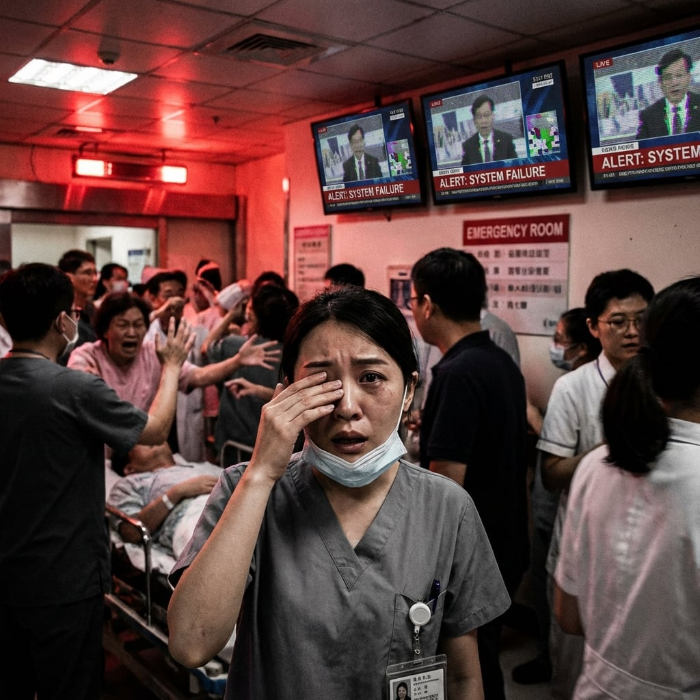

#### **病毒 (The Virus)**

災難的開端不是一聲巨響，而是一條群發簡訊。

**[國家級警報：核一廠冷卻系統異常，偵測到輻射外洩。請鄰近居民保持冷靜，切勿驚慌，等待進一步疏散指示。]**

林雅婷站在急診室的檢傷分類站，看著手機螢幕上的紅字。
核一廠不是早就除役了嗎？

「學姊，妳收到了嗎？」掛號櫃台的學妹臉色蒼白，舉著手機，「我不懂，什麼叫冷卻系統異常？輻射要飄到台北了嗎？」

「別亂想，這可能是系統誤發……就像上次測試一樣。」雅婷的話還沒說完，急診室大廳裡所有的手機同時響了。

*嗶—嗶—嗶—*

數百種鈴聲混雜在一起。每個人都低頭看著同樣的訊息。

「快走！輻射要飄過來了！」一個正在排隊掛號的中年男子大吼一聲，扔下健保卡就往外衝。
「可是我兒子還在發燒——」他的妻子試圖拉住他。
「發燒總比得癌症好！快走！」

急診大廳瞬間變成暴亂現場。推擠，尖叫。大廳那台電視突然切換了畫面。

畫面上是一張充滿雜訊的臉。那是知名網紅名嘴 **汪震 (Wang Zhen)**。他的背景是一片混亂的松山機場停機坪，遠處似乎還有一架正在起飛的專機。

*「各位同胞！我是汪震！我在松山機場現場！」* 他的聲音歇斯底里，帶著極度的煽動性，*「我剛剛親眼看到總統專機起飛了！在高官們逃跑之前，他們沒有發布任何空襲警報！他們拋棄了我們！那條核電廠的簡訊是真的，那是為了掩護他們撤退造的煙霧彈！我們被出賣了！」*

畫面中，一架模糊的私人飛機衝入雲霄。接著畫面切換到蕭承遠總統「登機」的模糊背影。

「該死……」雅婷抓起遙控器想要關掉電視，但遙控器失靈了。那個畫面像是烙印在螢幕上一樣。

那不是新聞。那是 **深度偽造 (Deepfake)**。

雅婷在急診室看過太多人的眼神。汪震那種恐懼是演出來的。而那個「總統背影」的步態太僵硬，不像真人。

但群眾看不出來。

「政府跑了！」「我們死定了！」

暴動升級了。有人開始砸掛號櫃台，有人試圖搶奪藥局的藥品。

「中華電信掛了！」有人大喊，「為什麼打不出去？我要打給我兒子！」

雅婷抓起檢傷站的固網電話，聽筒裡只有死寂。沒有撥號音，連忙線音都沒有。

這不只是當機。這是全面的資訊封鎖。

---

#### **法律的屠刀 (The Legal Blade)**

**位置：台北市，博愛特區，國防部緊急應變中心連外道路**
**視角：趙立言 立法委員 (Legislator Chao, Li-Yan) / 國防委員會召委**

一輛黑色的 Alphard 保姆車停在路障前，擋住了後方整排軍用卡車的去路。

---

#### **衡山指揮所 (Hengshan Command Center)**

**位置：台北市，士林區，衡山指揮所地下三層**
**視角：林國威 國防部長 / 陳志遠 參謀總長 / 蕭承遠總統**

蕭承遠站在巨大的戰情牆前，看著整個台灣島的紅色警報區塊。那些代表空襲、斷電、通訊中斷的紅色區域，正在以肉眼可見的速度擴散。

在他身後，**國防部長林國威**正對著電話怒吼。

「我知道程序！但這是戰爭！不是演習！」林國威的聲音在充滿回音的地下指揮所裡迴盪，「我已經簽了，參謀總長也簽了，總統已經發布緊急命令。你現在告訴我立法院要釋憲？」

蕭承遠轉過身。他們從兩個小時前就在這裡，試圖重建指揮鏈。每一步都遇到阻力。

「立法院那邊是誰在擋？」蕭承遠問。

「趙立言。」林國威放下電話，聲音沙啞，「他現在就在國防部外面，用他的車子堵住了動員車隊。他說程序不正當，要求釋憲。」

**參謀總長陳志遠**站在戰情桌前，雙手撐在桌上，盯著那些不斷閃爍的紅色光點。「總統，如果我們再等下去，解放軍的登陸艦隊就會到達灘頭。我們的動員令必須現在就執行。」

「我們現在有多少部隊進入戰備狀態？」蕭承遠問。

「不到三成。」陳志遠的回答讓整個指揮所陷入沉默，「空軍的防空飛彈系統還在『IFF更新中』的死循環。海軍的通訊鏈全部斷裂。陸軍……陸軍的動員車隊被堵在立法院外面。」

蕭承遠閉上眼睛。

「總統，」林國威走到他身邊，聲音壓低，「我們可以……繞過立法院。根據憲法增修條文，戰時總統有權發布緊急命令，事後追認即可。」

「但那需要立法院『事後追認』。」蕭承遠睜開眼睛，「如果他們現在就在擋，你覺得戰後他們會追認嗎？」

「如果沒有戰後呢？」陳志遠突然開口，他的聲音冷得像冰，「如果我們現在不做決定，就不會有戰後了。我們會變成歷史書上的一個註腳：『2028年11月10日，台灣在兩小時內淪陷，因為程序正義。』」

蕭承遠看著那面戰情牆。紅色區域正在連成一片。

「發布命令。」蕭承遠說，「告訴所有部隊，緊急命令已經生效。如果有任何人阻擋，以『妨礙軍事行動』處理。我要的是結果，不是程序。」

「總統，這會……」

「我知道。」蕭承遠打斷了林國威的話。

他拿起桌上的紅色電話。那是直接連通各軍種司令的專線。

「我是蕭承遠。從現在開始，所有軍事行動進入戰時狀態。程序可以事後補，但現在，我要的是行動。執行。」

---

#### **法律的屠刀 (The Legal Blade)**

**位置：台北市，博愛特區，國防部緊急應變中心連外道路**
**視角：趙立言 立法委員 (Legislator Chao, Li-Yan) / 國防委員會召委**

一輛黑色的 Alphard 保姆車停在路障前，擋住了後方整排軍用卡車的去路。
雨水打在車窗上。車內開著閱讀燈，飄著雪茄的味道。

趙立言放下手中的紅酒杯，看著窗外那位淋得全身濕透、正在用力拍打車窗的陸軍少將。
那是作戰次長。

趙立言慢條斯理地降下車窗，只降下一道縫隙。

「委員！請讓路！」少將吼道，雨水順著他的鋼盔流下來，「這是緊急動員令！我們必須把發電機送到衡山指揮所！」

「動員令？」趙立言扶了扶金邊眼鏡，從公事包裡拿出一份文件，那是憲法增修條文的影本，「將軍，根據我的理解，總統發布緊急命令必須經過立法院追認。而在十分鐘前，我們黨團已經提出釋憲聲請，質疑這次『演習』的合法性。」

「這不是演習！這是戰爭！」少將氣得臉色鐵青，手按在槍套上，「雷達已經瞎了！飛彈可能已經在路上了！」

「如果是戰爭，為什麼沒有宣戰佈告？」趙立言冷冷地反問，「將軍，如果你現在開過去，那就是軍事政變。你承擔得起撕毀憲政體制的罪名嗎？」

少將僵住了。

「很好。」趙立言升起車窗，隔絕了外面的雨聲和少將的咆哮。

他轉頭看向司機。「熄火。我們就在這裡等。按照『程序』來。」

他不需要開槍。

---

#### **黑暗 (The BlackOut)**

就在這時，急診室的自動門被猛地撞開。不是感應開啟，而是被擔架床硬生生撞開的。

「讓開！全部讓開！」

三名救護員推著兩張擔架衝進來，他們的制服上沾滿了碎玻璃和……那是什麼？油漆？

「這是什麼情況？」雅婷衝上前。

「暴動，」帶頭的救護員氣喘吁吁，他的額頭上有一道還在流血的傷口，「信義路口的紅綠燈全停了。自駕計程車像是中邪一樣到處亂撞。這兩個人是被暴民拖下車打傷的……因為他們開的是黑色的高級轎車，暴民以為是官員。」

雅婷看著那個滿頭是血的傷患，他的西裝被撕爛了，手裡還緊緊抓著公事包。

「這是什麼世界……」雅婷喃喃自語。

就在這時，醫院的燈光劇烈閃爍了一下。

啪。
全黑。

沒有任何過渡。原本燈火通明的急診室瞬間陷入了絕對的黑暗。
生命監測儀的螢幕熄滅了。呼吸器的打氣聲停止了。
隨即爆發出更刺耳的尖叫聲。

沒有電，沒有網路，沒有真相。

*嗡————*

備用柴油發電機的低頻轟鳴聲終於響起。十秒後，紅色的應急照明燈亮起。呼吸器重新開始運作。

就在這時，雅婷感覺到口袋裡的手機在震動。

沒有訊號的世界裡，手機不該響。

她拿出來一看，沒有來電顯示，只有一串亂碼：**ERROR_ROUTE_REDIRECT**。

她躲進污物處理間，按下接聽鍵。

「喂？」

「雅婷。」

聲音很遠，靜電雜訊很重。但她認得。

「哥？」她的聲音裂了，「你在哪？外面全亂了，他們說總統跑了，說核電廠爆炸了——」

「聽著，我時間不多。」**林子修**的聲音很平，「那不是核電廠。那是『寧靜海』。簡訊、汪震的影片、謠言，全部都是武器。」

「什麼？」

「認知戰。他們要我們在看到敵人之前就自己崩潰。」林子修說，「待在醫院。不管收到什麼簡訊，都別信。只有妳親眼看到的才是真的。」

「哥，你要去哪裡？你不回來嗎？」

「我要去……很遠的地方。我必須把『鑰匙』送出去。」

電話那頭突然傳來一陣巨大的爆炸聲，緊接著是警報的尖嘯。

「哥！林子修！」

「如果……如果看到閃光，」林子修的聲音被雜訊吞沒了一半，「閉上眼睛。數到三。找掩護。還有……幫我照顧媽。」

「你不要嚇我！你在哪裡？！」

「真的很抱歉，雅婷。真的很……」

*滋————*

訊號斷了。

雅婷呆呆地盯著手機螢幕，直到它自動黑屏。

她推開側門，走到露台。

台北盆地全黑了。101 隱沒在黑暗中，街道上只剩車禍和暴動的火光。遠處松山機場方向，沒有飛機，只有防空砲火劃過夜空的橘色軌跡。

所有人都在撒謊。

不知從哪裡傳來的廣播聲：
『各位市民請注意……這是一次區域性電網維修……請保持冷靜……』

「護理長！快點！那個被石頭砸破頭的病患休克了！」

雅婷擦掉眼角的水，把手機塞回口袋。
她轉身，走回急診室。

「來了！」

## 名詞解釋
- **Deepfake（深度偽造）**：利用人工智慧深度學習技術，合成逼真的人臉或聲音影片。在「寧靜海」行動中，此技術被大規模用於製造假新聞與政治人物的投降聲明，以瓦解敵方民心。

---

---
