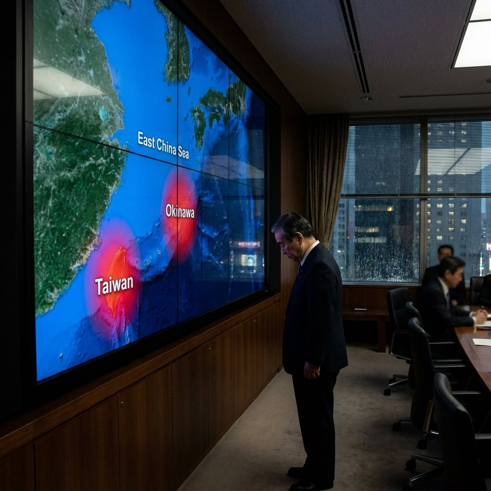

#### **憲法的重量 (The Weight of the Constitution)**

**防衛大臣山田誠一**站在那張巨大的太平洋地圖前，手指指著沖繩的位置。那裡已經被標記為紅色。火光。

「那霸港正在燃燒。」山田說，「嘉手納基地失去百分之八十的供電。那霸機場的油庫爆炸了。協同攻擊。不是意外。」

**日本首相橋本健太**坐在會議桌的主位，手裡拿著一份厚厚的文件。那是《和平憲法》的副本，第九條用紅筆圈了起來。

「山田大臣，」橋本抬起頭，「你知道這意味著什麼嗎？」

「我知道。」山田轉過身。

橋本看向**統合幕僚長中村英樹**。自衛隊的最高軍事指揮官坐在那裡，制服筆挺，一言不發。

「中村幕僚長，」橋本說，「告訴我，如果現在不行動，會發生什麼？」

中村站起來，走到地圖前。

「首相，」他說，「根據我們的評估，如果台灣在未來四十八小時內陷落，中國的下一步就是第一島鏈。沖繩、宮古、石垣……這些島嶼都會成為目標。而如果第一島鏈被切斷，日本本土就會失去屏障。」

他停頓了一下，看向橋本。

「這不是爭端，首相。這是入侵。如果台灣倒了，下一個就是我們。」

橋本閉上眼睛。三個月前有議員問他：如果台灣遭到攻擊，日本會做什麼？

他的回答是：「適當反應。」

「根據《安保條約》，」山田說，「我們有義務協助美軍防衛日本。而台灣，從戰略上來說，是日本防衛的核心。如果台灣陷落，美軍在亞洲的部署就會崩潰。」

橋本睜開眼睛。

「中村幕僚長，」橋本說，「如果我們現在派遣自衛隊支援台灣，在法律上，我們如何解釋？」

中村從文件夾中拿出一份報告。「根據憲法解釋，如果台灣遭到攻擊，這會被視為『對日本安全的直接威脅』。因此，我們可以援引『個別自衛權』和『集體自衛權』。」

「但這會引發國內的反對。」橋本說，「你知道會有多少人上街抗議。」

「如果我們不行動，那些人連抗議的機會都不會有。」

橋本站起來。

「發布命令。」橋本說，「根據《安全保障相關法》，我批准自衛隊在『有事』狀態下，協助美軍和台灣進行防衛行動。但有一個條件：我們只提供後勤支援和防禦性行動。不參與主動攻擊。」

「首相，這可能不夠——」

「我知道。」橋本打斷了他。

他拿起桌上的紅色電話。那是直接連通統合幕僚監部的專線。

「我是橋本健太。自衛隊進入『有事』狀態。所有部隊準備執行防衛任務。執行。」

他掛上電話。

---

#### **石頭與鳥 (The Stone and The Bird)**

會議結束後，首相一個人留在會議室裡。

他拿起那份憲法文件，翻到第九條。讀過無數次的字句。

他拿起筆，在邊緣寫了一句話。看了三秒，撕下那一頁，揉成一團，扔進垃圾桶。

他站起身，走向門口。

門外，山田和中村正在低聲討論著什麼。當他們看到橋本時，兩人同時立正。

「首相，」山田說，「命令已經下達。自衛隊的潛艦和護衛艦正在前往第一島鏈。F-35戰機也在準備起飛。」

橋本點點頭。「記住，我們的目標是防衛，不是進攻。如果台灣陷落……我們就撤回來，專心防衛日本本土。」

「明白，首相。」

橋本拍了拍中村的肩膀。「保護好我們的年輕人。」

「明白，首相。」

---

---

---
