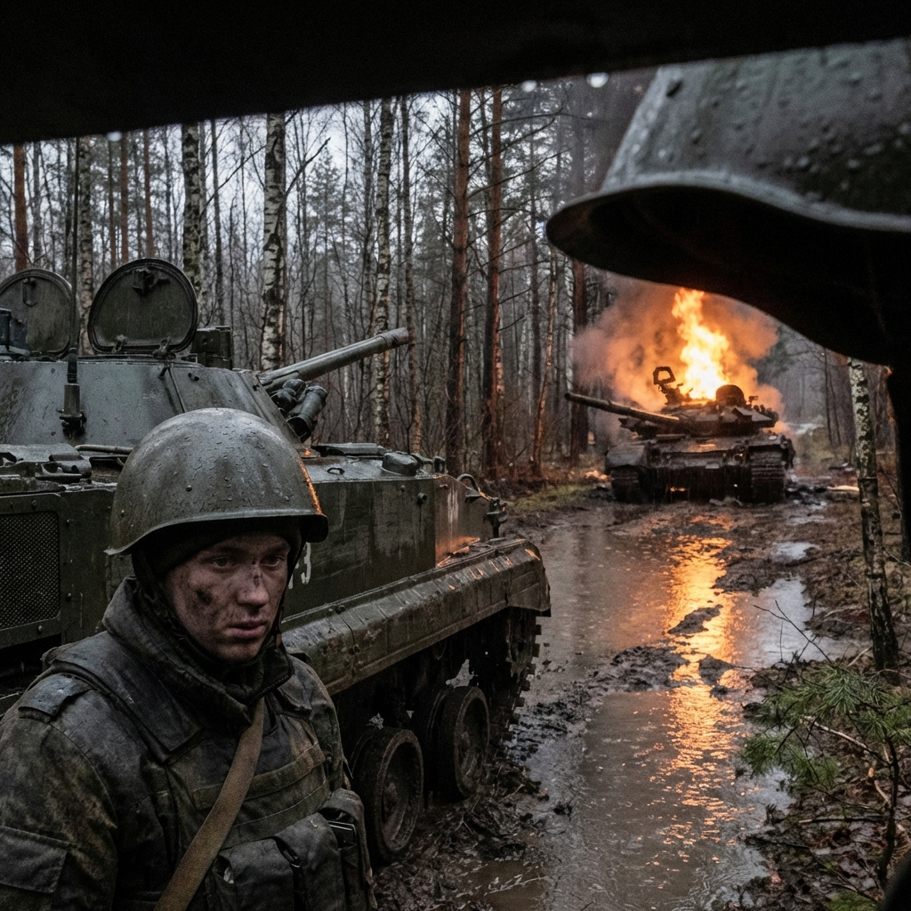

---

「中尉！前方有接觸！」

阿列克謝從潛望鏡裡看出去。

雨幕中，一道火光撕裂了黑暗。那是坦克砲的閃光。

「臥倒——」

他的話還沒說完，一聲巨響震動了整輛戰車。

BMP-3 的裝甲在穿甲彈的撞擊下發出刺耳的尖嘯，但沒有被擊穿。那是一發偏了的砲彈，擦過了他們的側裙裝甲。

「媽的！」伊戈爾大叫，「是豹式！波蘭人的豹式！」

豹式。120mm 滑膛砲。兩千米外能擊穿任何俄軍戰車。

「全速前進！」阿列克謝喊道，「找掩護！」

BMP-3 的引擎咆哮著衝入雨幕。四周都是混亂——無線電裡充滿了尖叫、爆炸聲、求救聲。

「這裡是狼三！我們被擊中了！砲塔失靈——」

「狼五呼叫指揮部！我們的位置——我他媽不知道我們在哪裡——」

「友軍誤擊！友軍誤擊！停止射擊——」

無線電裡的聲音越來越混亂。

---

## 伊萬

一發砲彈擊中了他們前方二十米處的一輛 T-90M。

阿列克謝看著那輛六十噸重的坦克像玩具一樣被掀翻，砲塔在爆炸中飛向天空，然後重重砸在地上。

「上帝啊……」伊戈爾的聲音在顫抖。

阿列克謝強迫自己移開視線。

「繼續前進。我們的任務是——」

「任務？」另一個聲音打斷了他。那是彼得羅夫下士，他們的砲手，一個來自西伯利亞的老兵，「我們的任務是什麼，中尉？送死嗎？」

「彼得羅夫——」

「你他媽看看外面！」彼得羅夫指著潛望鏡，「我們已經損失了一半的車輛！指揮部根本不知道發生了什麼！這是一場該死的災難！」

阿列克謝沉默了。

因為彼得羅夫是對的。

他想起出發前，連長對他們說的話：「這是一次特別軍事行動。我們的目標是保護俄羅斯族裔的權益，抵禦北約的擴張。」

但現在，他們在波蘭的森林裡，面對的是波蘭的坦克。

窗外掠過一塊路牌，波蘭語，上面有彈孔。

---

「中尉，」伊戈爾突然說，「前面……有東西。」

阿列克謝從潛望鏡裡看出去。

雨幕中，一道巨大的黑影橫亙在道路上。那是一列傾倒的貨運列車，幾千噸的木材和鋼鐵形成了一道無法跨越的屏障。

「停車。」阿列克謝說。

BMP-3 緩緩停下。

四周一片寂靜。波蘭人的坦克不見了——他們消失在森林裡，像是從未存在過一樣。

「他們……撤了？」伊戈爾問。

「不。」阿列克謝看著那道「牆」，「他們把我們困住了。」

---

## 等待

半小時過去了。

俄軍的工兵部隊開始試圖清理路障，但進展緩慢。那些巨大的紅杉原木重達數噸，普通的工程車根本推不動。

阿列克謝坐在 BMP-3 的車頂上，看著這一切。

雨已經停了。黑暗的天空開始泛出一絲魚肚白。

「中尉，」伊戈爾爬上來坐在他旁邊，遞給他一根香菸。

阿列克謝接過香菸，點燃，深吸一口。兩人沉默地抽了一會兒。

伊戈爾從口袋裡掏出一張皺巴巴的照片。照片上是一個小男孩，騎在一匹木馬上。

「安德烈。三歲了。」伊戈爾說，「等這一切結束，我要帶他去迪士尼樂園。巴黎的那個。」

阿列克謝看著那張照片，沒有說話。娜塔莎還在莫斯科等他，以為他在參加演習。

*巴黎。*

他們現在正在入侵的國家，距離巴黎只有一千公里。

如果這場戰爭繼續下去，他們下一個入侵的會是法國嗎？

---

## 命令

無線電突然響了起來。

「所有單位注意，這裡是旅部。」一個冰冷的聲音傳來，「路障清理需要更多時間。在此期間，所有部隊原地待命，等待進一步指示。」

阿列克謝按下通話鍵。「旅部，這裡是狼二。我們有傷員，需要後送——」

「負面。後送通道目前不可用。原地待命。」

「但是——」

「執行命令，中尉。旅部完畢。」

無線電斷了。

阿列克謝看著車廂裡的三名傷員。其中一個——一個叫伊萬的年輕士兵——腹部中了彈片，正在失血。他的臉色蒼白得像紙一樣。

「中尉……」伊萬的聲音很微弱，「我……我會死嗎？」

阿列克謝蹲下來，握住他的手。

「不會。」他說，「你不會死。我們會找到辦法。」

但他知道這是謊言。

伊萬的傷勢太嚴重了。沒有手術，沒有輸血，他活不過今天。

伊萬似乎也知道這一點。他閉上眼睛，嘴唇動了動。

「中尉……能幫我……給我媽媽……寫封信嗎？」

阿列克謝點點頭。

「當然。」

「告訴她……我愛她。告訴她我不……」

伊萬的手漸漸失去了力量。

他的聲音越來越弱，最後完全消失了。

阿列克謝低下頭。伊萬的嘴唇還微張著，像是還有什麼話沒說完。

---

## 黎明

天亮了。

阿列克謝站在 BMP-3 旁邊，看著東方升起的太陽。

陽光照在那道由列車殘骸組成的「牆」上，讓它看起來像是一座紀念碑。

一座為死者建造的紀念碑。

他口袋裡還揣著伊戈爾兒子的照片。伊戈爾讓他幫忙保管的，怕打濕了。

阿列克謝·索科洛夫，工程學碩士，二十四歲。他將繼續執行命令。

---

無線電再次響起。

「所有單位，路障已清除。準備前進。重複，準備前進。」

阿列克謝看了最後一眼東方的太陽，然後爬進了戰車。

「伊戈爾，」他說，「啟動引擎。」

BMP-3 的引擎轟鳴著醒來。

戰爭繼續了。

「牆」的另一邊很安靜。

阿列克謝閉上眼睛。

---

*[章節結束]*

*—— 下一章：第十三章 [多視角] 黑霧 (Black Fog)*

---
