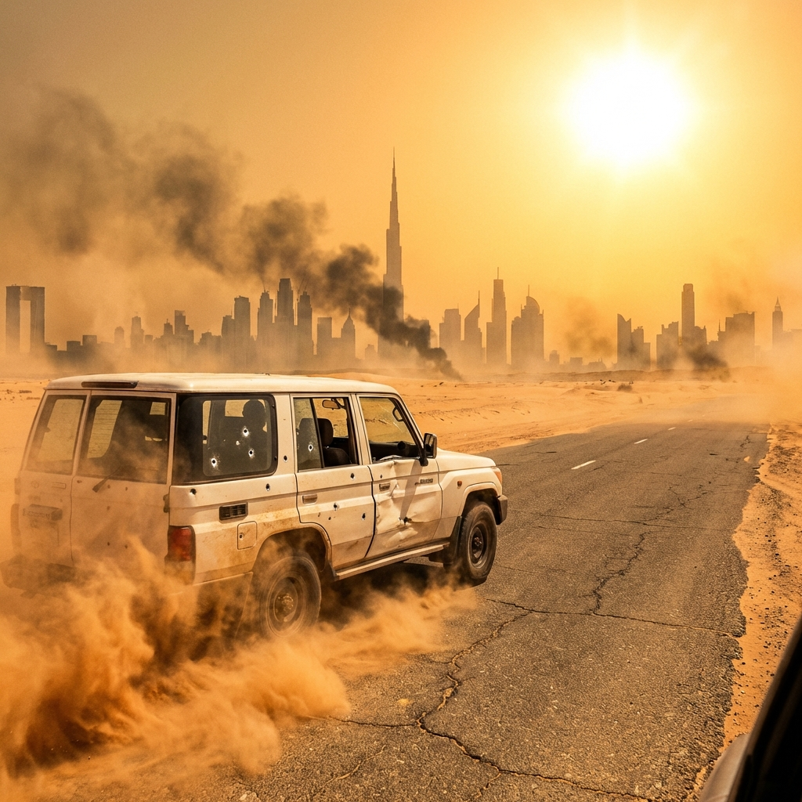

---

#### **綠洲的幻象 (Mirage)**

杜拜是一座建立在伺服器上的海市蜃樓。
當伺服器停止運轉時，這座城市就只剩下沙子與玻璃。

凱恩 (Nomad) 拉低了棒球帽的帽簷，推著賈法爾穿過德拉區擁擠的人潮。這裡不是遊客熟悉的那個杜拜——沒有哈里發塔的冷氣，沒有音樂噴泉。這裡是老城區，充滿了香料味、汗水味，以及現在瀰漫在空氣中的焦慮。

「還要走多久？」賈法爾氣喘吁吁，手裡的銀色手提箱像是有千斤重，「我的心臟藥在……」

「閉嘴。」凱恩低聲說，把兩顆奧施康定 (Oxycodone) 丟進嘴裡，像吃糖果一樣嚼碎。毒品在他血液裡化開，壓制住了 TBI 帶來的偏頭痛，「到了。」

他們停在一間掛滿金飾的店鋪前。招牌上寫著 **「獵鷹珠寶 (The Falcon)」**。

這座城市正在崩潰。電子支付系統全滅，地鐵停駛，號誌燈失靈。那個曾經號稱「全球最智慧」的城市大腦 (Smart City Brain) 已經變成了植物人。身穿白袍的本地人和穿著短褲的遊客困在街道上，只能用最原始的貨幣——美元現鈔和黃金——來交易水和食物。

但在這種混亂中，情報販子就像禿鷹一樣興奮。

---

#### **掮客 (The Broker)**

店鋪後面的 VIP 室裡，冷氣依然運轉著——這意味著他們有獨立發電機。

一個穿著絲綢長袍的胖子坐在堆滿金條的桌子後面，手裡轉著一串念珠。他叫哈米德 (Hamid)，但在地下世界，人們叫他「獵鷹」。

「Nomad，老朋友。」哈米德甚至沒有站起來，「我以為你在敘利亞已經變成了一具乾屍。」

「我也這麼以為。」凱恩把賈法爾推到椅子上，「直到我知道這個世界上還有人願意花大錢買一把『鑰匙』。」

哈米德看了一眼賈法爾，以及他懷裡的銀色手提箱。貪婪的光芒在他眼中一閃而過。

「寧靜海的驗證者。」哈米德嘖嘖稱奇，「現在全世界的情報機構都在找他。CIA、SVR、軍情六處……你選了一個最危險的商品。」

「我只要一本乾淨的美國護照，還有一張去新加坡的船票。」凱恩說，「我要離開這個鬼地方。」

「只有這樣？」哈米德笑了，「當然。成交。」

太快了。哈米德從不這麼爽快。

凱恩看向牆上的大面鏡子。單向玻璃。

「趴下！」凱恩大吼一聲，按住賈法爾的頭把他壓到桌子底下。

幾乎同時，單向玻璃炸裂。
三個穿著黑色戰術裝備的男人衝了出來。他們拿的不是警槍，而是裝著滅音器的 MP7。

「俄羅斯信號旗 (Vympel)？」凱恩一邊拔出腰間的 HK416 (折疊槍托版) 還擊，一邊罵道，「哈米德，你這個雜碎賣我！」

「生意就是生意！」哈米德早已鑽進了防彈櫃檯後面。

凱恩精準地兩槍放倒了最前面的殺手，但對方火力太猛，將他壓制在翻倒的沙發後。

「該死。」藥效開始消退，頭痛欲裂。就在他準備用最後一顆手榴彈同歸於盡時，天花板上的通風管突然掉下來一個人。

---

#### **第三方 (The Third Party)**

那個身影輕盈得像隻貓。

在她落地的瞬間，兩把加裝了補償器的 Glock 19 同時開火。

砰砰——砰。砰砰——砰。兩槍胸口，一槍頭。
剩下的兩名俄國特種兵還沒來得及轉槍口，就已經變成了屍體。

煙霧散去。
那個身影站直了。她穿著一身黑色的緊身作戰服，臉上塗著迷彩，但那雙琥珀色的眼睛在黑暗中閃閃發光。

「Kidon？」凱恩說。

「那是對於救命恩人的問候嗎？Nomad。」女人的聲音沙啞，帶著明顯的希伯來語口音。

「萊拉 (Leyla)。」凱恩記得這個名字，「以色列人來這幹什麼？」

「那個包裹，」萊拉的槍口指向躲在桌下的賈法爾，「他必須死。」

「哇喔，慢著。」凱恩擋在中間，「他是我的票。而且，如果他是設計者，那他也是唯一能修好你們鐵穹系統的人。」

「鐵穹已經失效了。」萊拉冷冷地說，「真主黨的導彈正在像下雨一樣落在海法。我的指令是清除源頭。」

「殺了他也沒用，程式碼不會跟著消失。」凱恩說，「留他一命，我們還有機會。」

萊拉猶豫了。就在這半秒鐘的猶豫裡，店外的街道上傳來了更多剎車聲。
「看來哈米德不只賣了一家。」凱恩苦笑，「伊朗革命衛隊 (IRGC) 也到了。」

「我有車。」萊拉收起一隻槍，另一隻依然指著凱恩，「在後門。」

「我有路。」凱恩指了指被炸開的單向玻璃，「這座迷宮裡，只有老鼠才找得到出口。」

「合作？」

「直到離開這個該死的沙漠。」

凱恩抓起賈法爾，在這位博士還在尖叫的時候把他扛在肩上。

「歡迎加入自殺小隊，萊拉小姐。」

兩人背靠背，衝出了珠寶店的後門。

---

#### **唯一的出口 (The Only Way Out)**

半小時後。

一輛滿身彈孔的 Toyota Land Cruiser 衝上了 44 號公路 (Ras Al Khor Road)，將身後燃燒的德拉區甩在沙漠的熱浪中。

凱恩撕開一包戰術急救包，熟練地為自己手臂上的擦傷止血。開車的是萊拉。這個摩薩德女殺手開車的風格和她殺人一樣——精準、兇狠，時速錶指針死死抵在 160 公里。

後座的賈法爾緊緊抱著他的手提箱，臉色蒼白如紙，正在乾嘔。

凱恩轉過頭，盯著那個銀色的手提箱。

「博士，」凱恩說，「箱子裡是什麼。」

賈法爾神經質地摟緊手提箱，像是抱著自己的孩子。「我……我不能說……」

「不說就滾下車。」萊拉說。

賈法爾閉上眼睛，沉默了很長一段時間。然後他開口了，聲音細弱得像是在懺悔。

「測試參數。漏洞報告。還有……三次失敗的攻擊日誌。」

「用人話說。」凱恩皺起眉頭。

「『寧靜海』不是一個程式，它是一個……生態系統。」賈法爾的手指無意識地撫摸著手提箱的金屬邊緣，「它會自我演化、自我修復。你不能簡單地『關閉』它，因為它沒有一個中央開關。」

「但任何系統都有弱點。我的工作是在部署前找出這些弱點。」他停頓了一下，「我手裡的不是鑰匙，是鎖匠的筆記。」

凱恩和萊拉對視了一眼。

「所以你不是設計者。」萊拉說。

「我只是一個二流的測試工程師。」賈法爾苦笑，「但我恰好知道這道鎖最脆弱的地方在哪裡。」

凱恩轉回頭，看著前方無盡的公路。這個瑟瑟發抖的胖子，手裡握著結束這場戰爭的可能性。

「好。」他說，「那就讓我們確保你活著到達目的地。」

「我們不能去機場。」萊拉盯著後照鏡，確認沒有追兵，「阿勒馬克圖姆機場已經被軍管了。港口也被伊朗人的水雷封鎖。」

「我知道。」凱恩咬著繃帶打結，「杜拜已經是個瓶子裡的死局。」

「那我們去哪裡？阿布達比？那裡也一樣。」

「不。」凱恩打開了那張沾血的紙本地圖，手指劃過一條向東的路線，「我們往東走。穿過哈吉爾山脈 (Hajar Mountains)。」

萊拉皺起眉頭。「阿曼 (Oman)？」

「荷姆茲海峽已經是絞肉機了。」凱恩說，「但阿曼灣 (Gulf of Oman) 是開放的。去馬斯喀特 (Muscat)。」

「那是三百公里的沙漠公路。」萊拉冷笑一聲，「帶著一個心臟病發作的老頭，還有半個伊朗革命衛隊在追殺我們？」

「留在這裡就是死。」凱恩回頭看了一眼賈法爾，「他得活著。」

萊拉猛打方向盤，車身在公路上劃出一道刺耳的弧線，駛向向東的匝道。

「去阿曼。」萊拉踩下油門，「希望你的直覺比你的運氣好，Nomad。」

正午的烈日將沙漠烤得發白。前方是三百公里的空曠公路。

---

---
