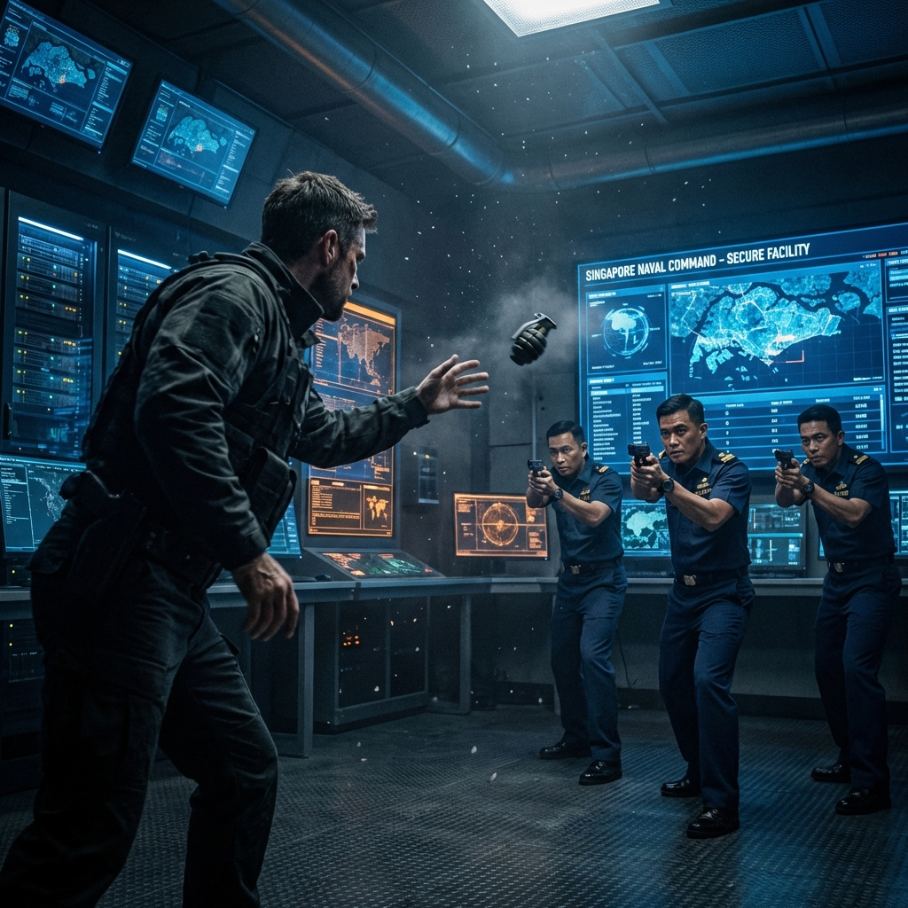

---

#### **歡迎來到叢林 (Welcome to the Jungle)**

「把武器交出來，Nomad。」

凱恩看著眼前的這名穿著整潔海軍制服的中校。他的名牌上寫著 **Sullivan**。
在他的身後，是四名全副武裝的陸戰隊憲兵 (MP)。

「這是你的歡迎儀式？」凱恩沒有動，他的手依然放在背包的背帶上——那裡面有一枚因為害怕被搜身而預先拉開了保險銷的手榴彈，「我剛帶著你們的高價值資產 (HVT)，穿越了半個燃燒的中東，游過了麻六甲海峽。你現在叫我繳械？」

「這是標準程序。」Sullivan 中校面無表情，「這裡是第七艦隊的最後堡壘。我們不能冒險。賈法爾博士會被帶到安全屋進行……甄別。」

「甄別？」萊拉冷笑一聲，她靠在牆邊，手臂上的繃帶已經滲血，「你們是想審訊他，看看還有多少這樣的科學家活著，好讓你們這些官僚能寫報告升官？」

「注意妳的態度，女士。」Sullivan 的眼中閃過一絲不悅，「這裡不是你們的沙漠遊樂場。」

凱恩盯著 Sullivan。制服太乾淨了。在這個世界已經燃燒了半個月的時候，這個人的制服太乾淨了。

「我要見艦隊情報官。」凱恩說，「我要見 Blackwood 上校。福特號的艦長。」

「上校現在是艦隊情報部門的負責人。」Sullivan 的語氣有些不耐煩，「他在開會。把賈法爾交給我。現在。」

賈法爾躲在凱恩身後，抓著凱恩的衣角。他在發抖。
「別……別讓他們帶我走。」賈法爾低聲說，聲音微弱得只有凱恩聽得見，「那個軍官……他的手錶。」

凱恩瞇起眼睛，看向 Sullivan 的左手腕。
那是一支看似普通的 Garmin 戰術手錶。但錶帶上扣著一個微小的、銀色的飾物。
**一條纏繞的蛇**。

那是俄羅斯 GRU "Unit 29155" 的非官方標記。

「好的。」凱恩慢慢舉起雙手，露出一個疲憊的笑容，「你贏了，Sullivan。但在我交人之前，我有個問題。」

「什麼？」

「如果你們的通訊系統都癱瘓了，」凱恩的聲音突然變冷，「你是怎麼知道我們會在今天早上抵達這個碼頭的？我們全程保持無線電靜默。」

Sullivan 的臉色變了。他的手本能地摸向腰間的槍套。

「趴下！」凱恩大吼。

他猛地拉開背包，把那枚手榴彈滾向 Sullivan 的腳邊，同時一把將賈法爾推進了旁邊的清潔間。

**轟！**

---

#### **後門鑰匙 (The Backdoor Key)**

**位置：台北市，下水道維修站 C-4區**
**視角：林子修 (Skywatcher)**

「找到了。」

在黑暗的地下室裡，林子修的臉被筆記本電腦的藍光照亮。
經過三天的暴力破解，他終於打開了張弘毅那天在樂山雷達站試圖刪除、卻被林子修搶救回來的「系統日誌」。

「我看不太懂。」柯大勇湊過來，看著螢幕上密密麻麻的十六進位代碼，「這是什麼？飛彈發射碼？」

「比那個更糟。」林子修指著一行紅色的代碼，「這是『握手協議』(Handshake Protocol)。」

他敲了幾個鍵，將代碼轉譯成可讀文字。

螢幕上跳出一行行日誌——2028年11月11日凌晨4:30，來源是台北防空指揮部，目標是北京戰略指令部。指令名稱：EXECUTE_HEARTS_LOCK。執行狀態：成功。授權者：**COL_CHANG_H_Y**。

林子修的手指在顫抖。「空襲開始前十分鐘，張弘毅主動關閉了所有天弓三型的射控雷達。不是被駭。是他自己關的。」

「這個王八蛋。」柯大勇的拳頭捏得咯咯作響，「我要殺了他。我現在就去殺了他。」

「等等。」林子修拉住他，「光殺了他沒用。他是『紅心』(Hearts)。但他只是撲克牌裡的一張。」

林子修滾動頁面，指著另一行代碼。中繼節點：布魯塞爾安全辦公室。簽章：SOPHIE_L。

「通過歐洲轉發的。」林子修抬起頭，「台北、北京、布魯塞爾——一夥的。」

「那我們怎麼辦？」柯大勇問，「我們只是兩個人，躲在下水道裡。」

「我們有這個。」林子修指著硬碟，「這就是證據。這就是能讓他們身敗名裂的『密碼』。」

他從口袋裡拿出一張皺巴巴的紙，上面寫著那個來自澳洲的頻率。那是松樹谷心跳信號的頻率。

林子修看著那張紙，又看了看硬碟。

「松樹谷的信號加上硬碟裡的 Link-16 參數，就是重啟衛星的兩把鑰匙。」林子修看著那張頻率紙條，「但光送出去不夠。這次我們要讓所有人都聽到。」

「你要做什麼？」

「我要把張弘毅的這份賣國契約，告訴全台灣。」林子修開始瘋狂地敲擊鍵盤，「但不是用網路駭入——張弘毅肯定已經把防災廣播系統的網路端口鎖死了。我們要走實體路線。」

「實體路線？」

「我們要去防災廣播系統的控制中心。那裡有一條備用的類比線路，可以直接連接到發射塔。」林子修指著螢幕上的一個地址，「這是我從『孤島頻率』網路中一個火腿族那裡得到的資訊。他以前在防災中心工作過，知道那裡有一個緊急廣播的實體開關。只要我們能到達那裡，就能繞過所有的數位防護，直接用類比信號廣播。」

「但我們只有兩個人。」

「不，我們有整個網路。」林子修說，「孤島頻率裡有信得過的人，會幫我們製造混亂。我們只需要五分鐘。」

---

#### **獵人的證物 (The Hunter's Proof)**

**位置：波蘭，華沙近郊，廢棄化工廠**
**視角：伊萊亞斯 (Jaeger)**

一把椅子，一張桌子，一盞晃動的燈泡。
被綁在椅子上的俄軍通訊官已經暈過去兩次了。

伊萊亞斯手裡拿著那個從斯佩茨納茲隊長身上搜來的終端機。

「醒醒。」伊萊亞斯把一桶冰水潑在俘虜臉上。

俘虜劇烈咳嗽著。「殺了我吧……你這個瘋子……」

「我會的。」伊萊亞斯平靜地說，「但在那之前，我要你確認這個頻率。」

他把一個寫著頻率的紙條貼在俘虜眼前。
**14.225 MHz**。

那是澳洲松樹谷的頻率。也是這個終端機裡反覆出現的「監聽目標」。

「你們早就知道松樹谷沒死。」伊萊亞斯說，「你們一直在監聽。為什麼不攻擊？」

俘虜笑了，那是一種絕望的笑。「攻擊？為什麼要攻擊？留著它，我們才能釣到你們這些『大魚』。」

伊萊亞斯心頭一震。
這是個陷阱。
老師沒有切斷松樹谷，是因為他在等那些殘存的抵抗者主動聯繫松樹谷，從而暴露位置。

就像林子修在台北做的那樣。

「誰在負責這個『魚餌計畫』？」伊萊亞斯把槍口抵在俘虜的膝蓋上，「給我一個名字。」

俘虜猶豫了一下。
**砰！**
伊萊亞斯開槍打穿了他的大腿。

「啊啊啊啊！」慘叫聲在空曠的廠房裡迴盪。

「下一個是另一條腿。」伊萊亞斯冷冷地說，「名字。」

「蘇菲……」俘虜痛得滿臉冷汗，「蘇菲·洛朗。她是計畫的協調人。她在布魯塞爾提供情資，我們負責獵殺。」

伊萊亞斯閉上眼睛。
他早就猜到了。但親耳聽到是另一回事。

「熊 (Bear)，」伊萊亞斯轉身走出審訊室，對著站在門口的皮奧特說，「收拾東西。我們去布魯塞爾。」

「去幹嘛？」

「去見前女友。」伊萊亞斯給手槍換了一個新彈匣，「然後結束這一切。」

---
