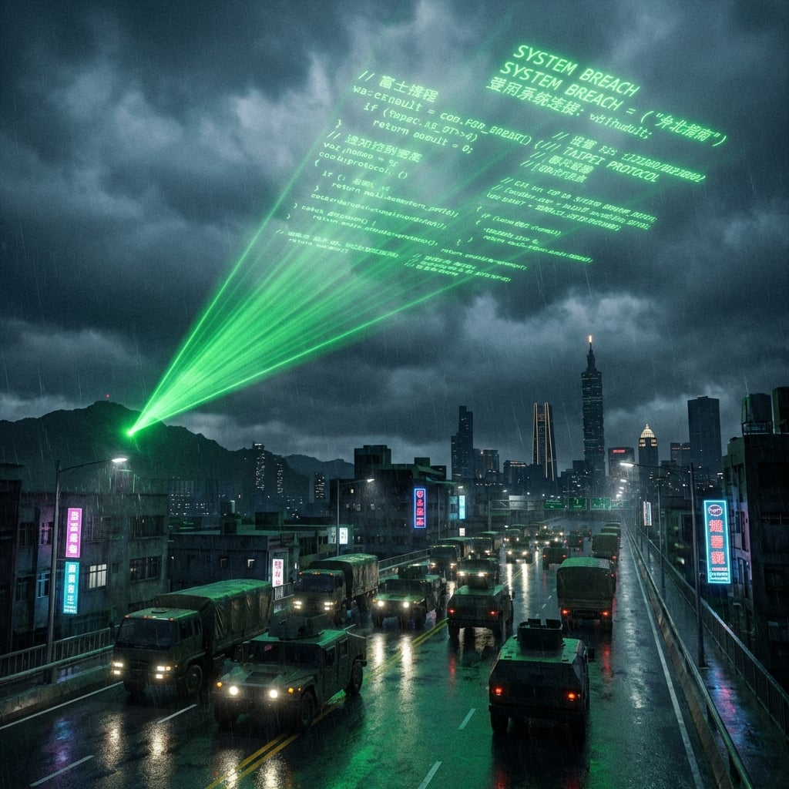

---

#### **審判 (The Verdict)**
**位置：台北市，博愛特區**
**視角：張弘毅 (Colonel Chang)**

張弘毅坐在裝甲指揮車裡，看著平板電腦上的訊號追蹤地圖。

「一定要這麼做嗎？」旁邊的副官低聲問道，「林少校是您以前的學生……」

「閉嘴。」張弘毅的手在發抖，但他握緊了槍，「他是叛徒。他偷走了國家機密。如果我們不盡快回收，這座城市就會被謠言毀掉。」

標叔的人馬已經包圍了出口。那是一群貪婪的土狼，還有張弘毅帶來的憲兵特勤隊。
這是一場完美的圍獵。

突然，指揮車裡的無線電響了。
不是軍用頻率。而是……FM 廣播。

那是全台北市唯一的聲音。每一個還能運作的收音機、每一輛車的音響、甚至那些連接在發電機上的村里廣播系統，同時響了起來。

*「市民們，我是空軍樂山雷達站少校，林子修。」*

張弘毅的臉色瞬間慘白。
「切斷它！快把調頻台炸掉！」他對著無線電狂吼。

但聲音繼續著。冷靜，清晰，帶著審判的重量。

*「你們現在遭受的黑暗，不是意外。這是出賣。如果你們想知道是誰關掉了防空飛彈，是誰讓那些無人機屠殺我們的家人……請看天空。」*

這句話是一個信號。

在蟾蜍山的山頂，突然打出了一發巨大的照明彈。
緊接著，是一台被改裝過的雷射投影機。
它將那份紅色的代碼日誌——那是張弘毅的數位簽章——直接投射在低空的雲層上。

那是雲端上的罪證。

**AUTH: COL_CHANG_H_Y**

整個台北市都看到了。防空洞裡的市民，路上的士兵，包圍下水道出口的憲兵。他們抬起頭，看著雲上的名字，然後轉頭看向張弘毅的指揮車。

「開火！」張弘毅拔出手槍，指著自己的駕駛兵，「快開車！」

但駕駛兵沒有動。他透過後視鏡，冷冷地看著張弘毅。

就在這時，一聲槍響。
不是從外面，而是從遠處的制高點。

一顆 5.56mm 的子彈穿透了指揮車的防彈玻璃。
不偏不倚，擊中了張弘毅握槍的右手。

手槍落地。張弘毅發出慘叫。

下水道的鐵蓋被推開。柯大勇爬了出來，手裡拿著那把冒煙的 T91 步槍。

「上校，」柯大勇走到車窗前，看著蜷縮在座位上的張弘毅，「下課了。」

周圍的憲兵沒有人舉槍。他們默默地讓開了一條路。

幾分鐘後，林子修從下水道裡走了出來。

他走到指揮車前，看著裡面那個他曾經視為導師的人。張弘毅用沒受傷的手捂著右手，血從指縫間滲出來。

「為什麼？」林子修問。

張弘毅沒有回答。他看著自己流血的手，很久。

「二十年前，北京。」他終於開口，聲音幾乎聽不見，「他們手上有東西。不是什麼大不了的，但夠了。」

林子修等著。張弘毅沒有再說下去。

他不需要說。二十年的沉默，本身就是答案。

林子修舉起了手槍。那是他從雷達站帶出來的制式手槍，從未開過火。

砰。

槍聲在寂靜的夜裡迴盪，然後被遠方的爆炸聲淹沒。

林子修的手在顫抖。他把槍插回腰間。

「走吧。」柯大勇拍了拍他的肩膀。

就在他走出博愛特區的廢墟時，無線電傳來了一個微弱的聲音。

「子修……子修，是你嗎？」

那個聲音嘶啞，疲憊，但林子修一秒就認出來了。

「雅婷？」他抓住無線電，聲音顫抖，「妳還活著？」

「我在台大醫院。」林雅婷的聲音帶著哭腔，「我們守住了。十七天，我們守住了。」

在距離這裡三公里外的台大醫院，那座曾經瀕臨崩潰的孤島，依然在黑暗中閃爍著微弱的燈光。

林雅婷站在急診室門口，手裡拿著那台不知道從哪弄來的火腿無線電。護理服早就髒得看不出原本的顏色。

「我聽到廣播了。」她對著無線電說，「哥，你做得對。」

無線電那頭沉默了很長一段時間。

「雅婷，」林子修的聲音沙啞，「照顧好自己。等這一切結束，我去找妳。」

「我等你。」

林雅婷掛斷無線電，轉身回到急診室。還有傷患在等她。

---

#### **和平鴿 (The Peace Dove)**
**位置：布魯塞爾，歐盟委員會總部 (Berlaymont)**
**視角：蘇菲·洛朗 (Sophie Laurent)**

記者會開始前十五分鐘，蘇菲·洛朗鎖在私人化妝間裡，看著鏡子裡的自己。

她的手在發抖。

粉底遮不住眼下的黑眼圈，口紅畫了三次才勉強對齊嘴唇的邊緣。這不像她。蘇菲·洛朗從來不會在公眾場合失態。她曾經在歐洲議會被質詢四個小時，全程保持完美的微笑。

但今天不同。

今天早上五點，她收到了一封加密郵件。寄件者是那個俄羅斯「石油大亨」——她的聯絡人。

*「北溪四號管線已於 04:30 完全關閉。這是戰略調整，與您無關。感謝您過去的合作。」*

與她無關。

蘇菲盯著那行字，盯了整整十分鐘。

她承諾歐洲人民的是什麼？是「能源安全」。是「即使在最糟糕的情況下，暖氣也不會斷」。她在議會裡拍著胸脯保證，她與東方的「特殊管道」能確保西歐的冬天不會變成冰窖。

但現在，俄羅斯人連招呼都沒打一聲，就把閥門關了。

她從來就不是合作夥伴。她只是一顆棋子。

她想起三年前在摩納哥欠下的那筆賭債，想起那些照片，想起布魯塞爾辦公室裡那通電話。

「委員，」秘書在門外敲門，「記者們都到了。」

蘇菲深吸一口氣，壓下手心的冷汗。

*還有機會。*

只要她能在公眾面前扮演好「和平建築師」的角色，只要她能讓歐洲人相信這場停火是她的功勞，她就還有價值。有價值就有談判的籌碼。

她最後看了一眼鏡子，調整好表情，推開門走了出去。

記者會持續了四十五分鐘。她完美地回答了每一個問題。她用溫柔但堅定的語氣解釋為什麼「戰略性撤退」是保護歐洲人民的唯一選擇。她甚至擠出了幾滴眼淚，為「那些不得不留在東方的波蘭兄弟姐妹」表示哀悼。

掌聲響起時，她幾乎相信了自己的謊言。

---

蘇菲站在落地窗前，俯瞰著被難民營佔據的布魯塞爾街道。
她手裡端著香檳。但她沒有喝。酒杯只是用來讓自己的手不再顫抖的道具。

剛才的記者會很成功——至少表面上是。她宣布了與「東方集團」的停火協議草案。雖然割讓了波羅的海三國，但至少……

*至少什麼？*

她看著窗外那些難民帳篷。那些人曾經住在華沙、維爾紐斯、里加。現在他們擠在布魯塞爾的街頭，用毯子裹著孩子，排隊領取救濟食品。

她搖了搖頭，喝了一口香檳。

香檳的氣泡在杯中升起又破裂。

「委員，」秘書敲門進來，「有一位來自紅十字會的代表想見您。他說有關於波蘭難民的緊急物資問題。」

「讓他進來。」蘇菲心情很好，「我們現在需要展現人道主義。」

門開了。
一個穿著紅十字會背心的男人走了進來。他戴著口罩，步履有些蹣跚。

「您好，先生。」蘇菲放下酒杯，「請問怎麼稱呼？」

男人沒有說話。他轉身鎖上了辦公室的厚重木門。
然後，他摘下了口罩。

蘇菲的笑容凝固在臉上。
臉上多了一道傷疤——凍傷和彈片。但她認得那張臉。

「Elias……」她後退了一步，撞到了桌角，「你……你應該死在蘇瓦烏基了。」

伊萊亞斯沒有回答。他把那台被踩碎的俄軍終端機扔在桌上。

「聽我解釋——」蘇菲的手指悄悄摸向桌下的警報鈕。

「裡面有妳的簽名。」伊萊亞斯說。

蘇菲看著那個終端機，臉色蒼白。

伊萊亞斯拔出了那把從俄軍屍體上搜來的 AS Val 消音手槍。

「別……Elias，求你。」蘇菲跪了下來，淚水湧出，「想想我們的過去。想想巴黎……」

「巴黎已經燒了。」伊萊亞斯冷冷地說。

警報鈕被按下了。門外傳來急促的腳步聲。
但對蘇菲來說，太晚了。

「這是為了 Bear。為了那些被妳賣掉的波蘭士兵。」

**噗。**

一聲輕響。
子彈沒有擊中她的頭顱——而是穿過鎖骨下緣，帶走一截血肉，將她整個人掀翻在地。
香檳杯摔碎，泡沫和血一起在紅色地毯上漫開。她的呼吸變成窒息般的抽氣，手指徒勞地抓著衣襟，像是在按住一個正在噴湧的洞。
她沒有死。

伊萊亞斯轉身，打破落地窗。
寒風灌入溫暖的辦公室。

他看了一眼倒在血泊中的蘇菲，然後縱身跳向窗外的雨夜。

門外的腳步聲衝進來。有人撲到蘇菲身邊按壓止血，有人對著破碎的落地窗朝外探照。

---

#### **安全屋 (The Safe House)**
**位置：新加坡，烏節路 (Orchard Road) 地下掩體**
**視角：凱恩 (Kane)**

凱恩把 Sullivan 的屍體拖到角落。
房間裡瀰漫著火藥味。

四名陸戰隊憲兵已經被解決了。萊拉的刀法比槍法更準。

賈法爾縮在沙發角落，抱著他的手提箱，看著這場殺戮。

「結束了。」凱恩擦掉臉上的血跡，走到通訊台前。

他拿起加密電話。這條線路是 Sullivan 為了向俄國人匯報而保留的唯一通道。現在，它成了凱恩的戰利品。

「撥號。」凱恩對著仍在顫抖的賈法爾說，「打給華盛頓。打給五角大廈。」

「可是……」賈法爾結結巴巴地說，「他們不會相信我們。Sullivan 已經把我們標記為叛徒了。」

「不，他們會信的。」凱恩把 Sullivan 手腕上那隻帶有 GRU 標記的手錶扔在桌上，然後指了指賈法爾的手提箱。

「因為你有解藥。你有能讓『寧靜海』退潮的鑰匙。」

凱恩拿起聽筒。
電話接通了。

「這裡是 Nomad。告訴總統，我們把『眼睛』帶回來了。」

---

幾千公里的高空，一顆沈默已久的衛星指示燈閃了一下。綠色。

訊號建立 (Signal Established)。

---
