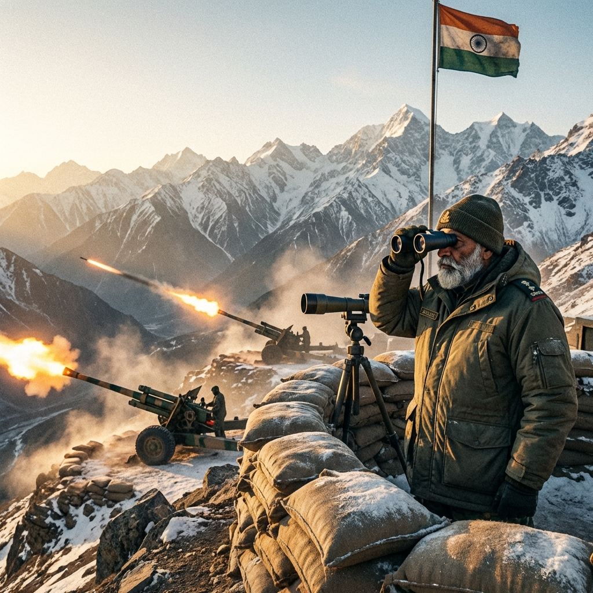

---

> ⏱️ **【時間軸備註】**
> 本章與 Chapter 22〈鐵鉗〉為平行時間線。當伊萊亞斯在波蘭發動反擊、美軍潛艦在台灣海峽獵殺登陸艦隊的同時，喜馬拉雅山脈的另一側，另一場戰爭正在無聲地展開。這不是為了征服，而是為了分散。

---

**時間：T-Hour + 30 天 (2028 年 12 月 10 日 05:30:00 IST)**
**位置：印度，阿魯納恰爾邦 (Arunachal Pradesh)，達旺前線 (Tawang Sector)**
**視角：阿爾瓊·辛格 少將 (Major General Arjun Singh) / 印度陸軍第 17 山地師師長**

---

#### 龍的尾巴 (The Dragon's Tail)

海拔四千三百米。

空氣稀薄得像是被抽乾了一半。每一次呼吸都像是在吸玻璃碎片。

辛格將軍站在邦迪拉山口 (Bomdila Pass) 的觀測點上，用望遠鏡看著對面的山脊。那裡是中國實際控制線 (LAC) 的另一側。在晨曦的微光中，他可以看到解放軍西藏軍區的哨所，像是一排冷峻的牙齒，咬在喜馬拉雅的脊樑上。

「將軍，德里的命令到了。」副官拉吉夫上校跑過來，手裡拿著一份加密電報。

辛格接過電報，掃了一眼。

**【最高機密】**
**發自：國防部長辦公室**
**收件：第 17 山地師**
**內容：執行「雪豹」行動。時間：1200 IST。目標：牽制。規模：有限。**

牽制。有限。

辛格苦笑了一下。這就是德里的風格——永遠不肯把話說清楚。

「有限」意味著什麼？一個營？一個團？一座山？

但他理解背後的邏輯。

三十天前，當「寧靜海」病毒席捲全球時，印度也受到了波及。GPS 失靈、衛星通訊中斷、金融系統癱瘓。但與台灣和歐洲不同的是，印度沒有成為直接的攻擊目標。

中國不想同時打兩場戰爭。他們把所有的籌碼都押在了台灣。

但這給了印度一個機會。

「拉吉夫，」辛格把電報收進口袋，「告訴所有營長，0900 在指揮部集合。我們要讓龍的尾巴動起來。」

---

#### 簡報 (The Briefing)

指揮部是一個深埋在山體中的混凝土碉堡。牆上掛著一幅巨大的地形圖，標記著從達旺到邦迪拉的每一條山路、每一個哨所。

六名營長站在地圖前。他們的臉上都帶著高原特有的紫黑色，那是長期缺氧和紫外線灼燒的痕跡。

「先生們，」辛格走到地圖前，用指節敲了敲台灣海峽的位置，「三十天了。台灣還沒倒。今天盟軍在波蘭和太平洋同時發動攻勢。」

他在地圖上畫了一條線，從達旺延伸到麥克馬洪線。

「『雪豹』行動。1200 開始。第 4 步兵營佯攻克節朗河谷。第 7 山地營滲透色拉山口。炮兵 1230 火力準備，一小時。」

「將軍，」一名營長舉手，「這是真正的進攻，還是……？」

「表演。」辛格說，「但必須逼真。」

「傷亡呢？」另一名營長問。

辛格沒有回答。他把手從地圖上放下來，看著這些臉色紫黑的軍官。

「解散。1200 準時發動。」

---

#### 第一槍 (First Shot)

克節朗河谷。

這是 1962 年中印戰爭的舊戰場。當年，印度軍隊在這裡遭受了慘敗。那些教訓被刻在了每一個印度軍官的骨頭裡。

「開火。」

炮兵陣地上，十二門 155mm 榴彈砲同時怒吼。砲彈劃過稀薄的空氣，落在對面山脊的解放軍陣地上。

不是精確打擊。是火力覆蓋。

目的不是摧毀，而是製造噪音。

「第 4 營報告，」無線電傳來嘈雜的聲音，「前鋒連已經越過河谷。遭遇輕微抵抗。敵軍正在後撤。」

辛格點點頭。這是預料之中的。

中國在這個方向的防守相對薄弱。他們的主力部隊都在拉達克方向，對付更接近新德里的威脅。達旺只是一個次要戰區。

但現在，它不再是次要的了。

「通訊官，」辛格命令道，「用明碼發送進攻報告。」

「明碼，長官？」

「告訴他們，第 17 山地師正在向達旺推進。目標：收復 1962 年失去的領土。72 小時內完成第一階段。」

通訊官愣了一下，然後開始發送。

---

#### 迴響 (The Echo)

兩個半小時後，辛格收到了他想要的回應。

「將軍，」情報官跑進指揮部，「衛星偵察顯示——呃，不對，衛星還是壞的……但我們的人在山口觀察到，對面有大規模部隊調動。」

「多大規模？」

「至少一個旅。從昌都方向調過來的。車隊綿延十公里。」

辛格嘴角微微上揚。

一個旅。大約五千人，加上坦克、火炮、後勤車輛。這些部隊本來可能被空運到福建，參與對台灣的最後攻勢。

現在，他們被釘在了喜馬拉雅山脈。

「傷亡報告？」他問。

「第 4 營陣亡 7 人，傷 23 人。第 7 營在滲透時遭遇伏擊，陣亡 4 人。」

辛格閉上眼睛。三十一人。為了一場「表演」。

但他知道，在台灣海峽，每減少一架敵機，就可能挽救幾十條盟軍的性命。

這是一筆殘酷的交易。但戰爭本來就是殘酷的。

「繼續施壓。」他命令道，「讓炮兵保持間歇性射擊。讓偵察隊繼續滲透。我要讓北京相信，我們是認真的。」

「我們要真的進攻嗎？」拉吉夫問。

「不。」辛格搖頭，「牽制，不是征服。繼續施壓就好。」

---

#### 來自台北的消息 (News from Taipei)

傍晚，一份加密電報從德里轉發過來。

辛格讀了兩遍，然後把電報遞給拉吉夫。

「台灣海峽的戰報。」他說，「美軍潛艦擊沉了三艘解放軍兩棲攻擊艦。登陸艦隊損失慘重。第二波攻勢已經取消。」

拉吉夫的眼睛亮了。「那意味著……」

「牽制起作用了。」辛格說。

他走到窗邊，看著外面被夕陽染紅的雪山。沒有說話。

「將軍，」拉吉夫說，「士兵們在問，我們還要打多久？」

辛格的手指在窗框上敲了兩下。

「直到台灣安全為止。」

---

#### 夜襲 (Night Raid)

夜幕降臨。

在色拉山口，一支由三十名特種兵組成的小隊正在雪地中匍匐前進。

他們的目標是一個解放軍的通訊中繼站。那是一個建在懸崖上的小型設施，負責轉發西藏軍區和成都軍區之間的加密通訊。

「還有三百米。」隊長低聲說，「記住，我們的目標是破壞，不是佔領。炸掉天線就撤。」

這是「雪豹」行動的一部分——不斷騷擾敵軍的通訊線路，讓他們疲於奔命。

特種兵們在月光下移動，像是一群幽靈。他們的白色偽裝服與雪地融為一體，連呼出的白霧都被特製的面罩過濾。

「就位。」

隊長舉起手，比了一個手勢。

三秒後，爆炸聲撕裂了寂靜的夜空。

通訊天線在火光中扭曲、倒塌。

「撤！」

特種兵們消失在黑暗中，只留下燃燒的殘骸和慌亂的中國守軍。

遠在二十公里外的指揮部，辛格收到了行動成功的信號。

「今晚睡個好覺，拉吉夫。」他說，「明天還有更多的表演要上演。」

---

#### 星空下 (Under the Stars)

深夜。

辛格獨自站在碉堡外的觀測點上，看著滿天的星星。

在這個高度，沒有光害，銀河清晰得像是一條流過天際的河。

他想起了自己的祖父。那個曾經在 1962 年戰爭中失去一隻手臂的老兵。

*「阿爾瓊，」* 祖父曾經對他說，*「印度的問題不是缺乏勇氣，而是缺乏耐心。我們總是想要快速的勝利。但真正的戰爭，是一場馬拉松，不是短跑。」*

辛格現在明白了這句話的意思。

他們不需要征服達旺。他們不需要打贏一場決定性的戰役。他們只需要堅持下去，消耗敵人的注意力和資源，直到全球的戰局發生轉變。

這是一場沒有榮耀的戰爭。沒有壯烈的衝鋒，沒有光榮的勝利。只有無盡的騷擾、牽制、和等待。

但這正是印度能夠貢獻的東西。

在這個瘋狂的世界裡，有時候最大的勇氣不是衝鋒，而是等待。

辛格抬起頭，看著北方的星空。

在那個方向的某處，台灣正在燃燒。波蘭正在戰鬥。澳洲的沙漠中，有人正在穿越無人區傳遞希望。

而他，一個印度將軍，站在喜馬拉雅的山巔，用三十一條生命的代價，為這個世界爭取了一點點喘息的空間。

這就是戰爭。

不是電影裡的英雄故事。只是無數個普通人，在無數個不為人知的角落，做著無數個艱難的選擇。

辛格敬了一個禮——向那些今天犧牲的士兵，向那些還在戰鬥的盟友，向那片依然在黑暗中閃爍的星空。

然後他轉身，走回碉堡。

明天，還有更多的仗要打。

---

---
