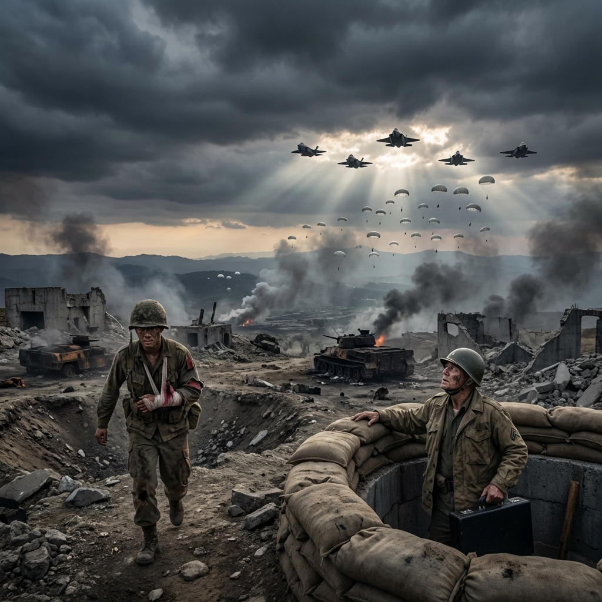

---

**時間：T-Hour + 35 天 (2028 年 12 月 15 日)**
**位置：台灣，林口台地 (Linkou Plateau)，最後防線**
**視角：林子修 (Skywatcher)**

---

風中帶著硫磺和屍體的味道。

林子修縮在一個被迫擊砲炸出的深坑裡，雙手緊緊抱著那個裝有「重啟代碼」的黑色硬殼保護箱。他的頭盔歪了，臉上沾滿了乾涸的泥土和血跡——不知道是誰的血。

「他們上來了！」前方的散兵坑傳來嘶吼聲，「方位 270！煙幕彈！」

「穩住！等我口令！」

回答那個嘶吼聲的，是柯大勇連長粗曠的咆哮。

柯大勇趴在戰壕的最前緣，手裡端著那把槍管已經打得發紅的 T-91 步槍。他的左臂包著滲血的繃帶，但依然像是一頭受傷的黑熊，死死地釘在陣地上。

林子修的胃在抽搐。

柯大勇頭也沒回：「少校，抱緊你的箱子。」

就在這時，林子修腰間的無線電發出了一陣斷斷續續的雜訊。那是「孤島頻率」的緊急頻道——他妹妹林雅婷在用的那個頻道。

「子修……」雅婷的聲音很微弱，像是從很遠的地方傳來，「王醫師……王醫師走了。」

林子修的心猛地一沉。

「什麼……什麼意思？」

「他連續工作了四十八個小時。」雅婷的聲音在顫抖，「今天早上急救一個大出血的傷患時，他突然倒下了。心臟病發。我們……我們搶救了半個小時……」

無線電那頭傳來了壓抑的哭聲。

林子修閉上眼睛。

「雅婷，」他低聲說，「我很抱歉。」

「子修，你要活著回來。」

「我會的。」

他關上無線電。遠方又傳來了炮火聲。

柯大勇轉過頭看了他一眼，什麼都沒問。在戰場上，每個人都在失去某個人。

在濃密的白色煙霧中，無數個人影正在移動。沒有坦克——因為油料耗盡，解放軍的裝甲部隊已經變成了固定的碉堡。這是純步兵的衝鋒。

斷糧三天了。五萬人困在島上，海峽被潛艇封死。

噠噠噠噠——

槍聲像炒豆子一樣響起。柯大勇開始射擊，接著整個連隊的殘存火力網同時噴發。

「RPG！」

一枚火箭彈拖著尾焰飛來，在柯大勇身邊的土堆炸開。

「連長！」林子修本能地大喊。

塵土消散。柯大勇吐了一把帶血的沙子，罵了一句髒話，又爬回了射擊位置。「沒死！繼續打！」

他在流血。大量的血從他的防彈背心下緣流出來，染紅了黃土。

「少校！」柯大勇一邊換彈匣一邊吼，「你那個高科技連上了沒？」

「我……」林子修看著 VLF 接收器上該死的紅燈，「還沒。」

柯大勇拉動槍機，沒再說話。

通往台北的橋樑全炸了。隧道塌了。林口新市鎮已經是一片瓦礫。

突然，右翼傳來了慘叫聲。

「缺口！他們從側面——」

通訊中斷了。槍聲從側後方響起。

「該死。」柯大勇轉過身看著林子修，「他們突破了。」

他把無線電通話器扯下來，丟給林子修。那上面沾滿了他的血。

「設成廣播。」柯大勇把無線電扯下來丟給他，喘著粗氣，「信標。路標。懂？」

柯大勇撿起那一串手榴彈掛在身上。「機步269旅，柯大勇。代號黑熊。別拼錯。」

他衝出了戰壕。

轟！轟！轟！

一連串的爆炸聲。然後是死寂。

林子修跪在泥坑裡，淚水混著泥土流下來。

他聽到了腳步聲。很多腳步聲。他們正在包圍這裡。

他是這片高地上最後一個活人。

他撿起那個沾血的無線電，在鍵盤上輸入了最後一組頻率。

「這裡是 Skywatcher，」他的聲音在顫抖，但他強迫自己念清楚每一個字，「呼叫任意盟軍單位……呼叫 Broken Arrow。」

他看著地圖上那個柯大勇用鮮血畫出的紅圈。

「坐標 Grid 445215。」

那是他自己的位置。

「向我開砲。」

沒有回應。只有無盡的靜電聲。

林子修閉上眼睛，抱緊了那個黑盒子。

就在這時，雲層裂開了。

不是雷聲。是噴射引擎的轟鳴聲。

在遙遠的西方，在海平面的盡頭，一道銀色的光芒劃破了烏雲。

那是一架編隊飛行的 F-35 戰機。它身後，是無數個白色的降落傘。

第 82 空降師。

「援軍……」林子修的腿軟了，整個人滑進泥坑底部。

---
