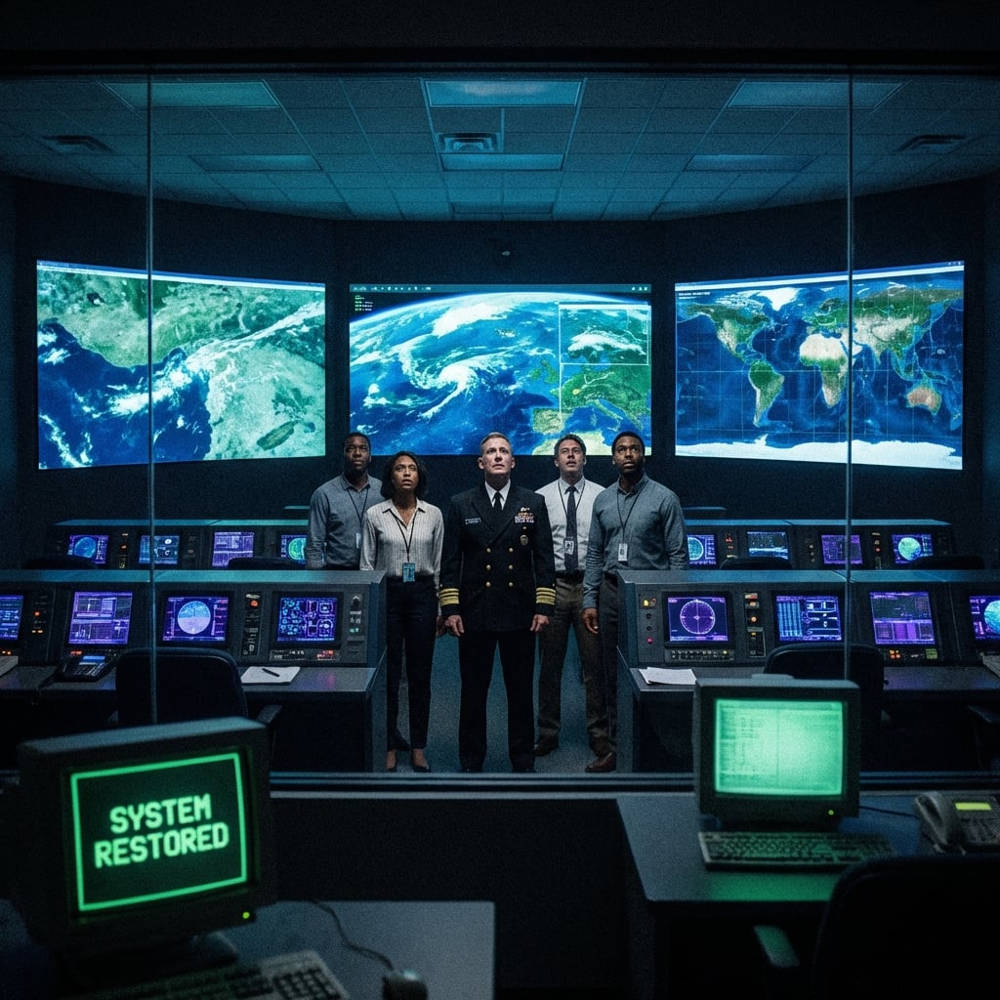

---

這是世界上最安靜的房間。

但是在數位世界裡，這裡正在發生一場核戰爭。

凱恩站在防彈玻璃後，看著中央控制台前的賈法爾博士。這位身材矮小的科學家此刻滿頭大汗，手指在鍵盤上飛舞的速度幾乎看不清。

「還有多久？」美國太平洋艦隊司令問道。他的聲音緊繃。

「北京正在反擊。」賈法爾頭也不回地喊道，「他們在向節點注入垃圾數據！『老師』知道我在這！」

螢幕上的進度條卡在了 89%。紅色的警報框不斷彈出。

**DDOS ATTACK DETECTED.**
**GATEWAY OVERLOAD.**

「他們試圖燒毀我們的上行鏈路！」負責網絡防禦的少校吼道，「伺服器溫度過高！」

「讓它燒！」凱恩插嘴道，「只要撐過最後 11%！」

賈法爾突然停下了手。

「我進不去核心層。」他絕望地轉過頭，「他們的防火牆進化了。那是量子加密。我需要一個更高權限的密鑰。」

「你就是密鑰的製造者！」凱恩吼道，「想辦法！」

「不——雙重驗證。」賈法爾的臉色慘白，「Link-16 參數加上松樹谷的心跳信號，兩個都要，否則系統判定偽造。」

他盯著卡住的進度條。

「松樹谷十一天前收到過一份乾淨參數包，但還沒進核心驗證模組。我需要台灣那邊確認校驗碼。」

凱恩愣了一下。

他抓起衛星電話——那是經由松樹谷 VLF 轉發、勉強連通台灣林口前線的專線。這條線路是林子修用命保下來的最後確認通道。

「Skywatcher，聽得到嗎？」

電話那頭傳來嘈雜的靜電聲，還有爆炸聲。那是從林口前線傳來的背景音。

「我在……」林子修的聲音微弱得像是在另一個世界，「我們快守不住了……」

「聽著，林！」凱恩大喊，「松樹谷把你十一天前傳出的參數包送到我們這裡了。我需要你確認校驗碼！還有那個心跳頻率，最後三組脈衝序列！」

「什麼？」

「你的硬碟！李士官長留下的那份系統日誌！松樹谷收到的是它的備份，但我們不能把一個沒確認的備份丟進衛星核心層。給我校驗碼，現在！」

電話那頭沉默了兩秒。

「那是……李士官長留下的……他說這是最後的希望……」

隨後，林子修用幾乎被砲聲吞沒的聲音念出一串校驗碼。每四個字元停頓一次，每停一次，賈法爾就在螢幕上敲下一組確認。

Link-16 參數已經躺在隔離伺服器裡——松樹谷轉送的加密密鑰和節點架構。賈法爾一邊敲入校驗碼，一邊把類比接收機的輸出線接進控制台。

*咚-咚-咚。空。咚-咚-咚。*

松樹谷的心跳。類比信號，病毒碰不到的東西。

賈法爾把兩組數據同時灌進驗證模組。

進度條動了。

90%... 95%... 99%...

**SYSTEM RESTORED.**
**GPS SIGNAL LOCKED.**
**SATELLITE MESH: ONLINE.**

樟宜指揮所裡的所有大螢幕同時亮起。即時影像。

4K 衛星畫面。台灣海岸線上每一輛解放軍坦克。波蘭森林裡每一個俄軍士兵的熱信號。每一枚導彈的軌跡。

司令官拿起紅色的電話。

「這裡是太平洋司令部。代號：光明使者 (Lightbringer)。」

「授權全境打擊。」

---

**同一時間，台灣林口台地**

林子修躺在戰壕裡，看著天空。

他以為那是死前的幻覺。

數百道白色的煙軌從雲層上方落下。那是戰斧巡弋飛彈。但這一次，它們沒有盲目地亂飛。

它們像是長了眼睛一樣。

每一枚飛彈都精準地砸向了解放軍的砲兵陣地、指揮車、彈藥庫。

轟轟轟轟轟！

大地在顫抖。但這一次，顫抖的是敵人。

緊接著，他手腕上的戰術手錶突然震動了一下。

那個顯示了 36 天「無信號」的 GPS 圖標，突然變成了一個綠色的定位點。

誤差：0.5 米。

耳機裡傳來了久違的、清晰無比的聲音。再也沒有雜訊。

「Skywatcher，這裡是 Viper 1-1。F-35 中隊已抵達。你的坐標已確認。我們接管戰場。」

林子修閉上了眼睛。

## 名詞解釋
- **DDoS（分散式阻斷服務攻擊）**：用大量流量淹沒服務/閘道，讓正常通訊無法進出（本章作為「系統被攻擊/被干擾」的警示訊號）。
- **戰斧巡弋飛彈（Tomahawk）**：美軍長程精準打擊巡弋飛彈，能依導航/目標更新對地面目標進行遠距離打擊。
- **Satellite Mesh（衛星網狀網路）**：多顆衛星彼此轉發形成的通訊網，單點失效時仍可繞路維持連線與覆蓋。

---
