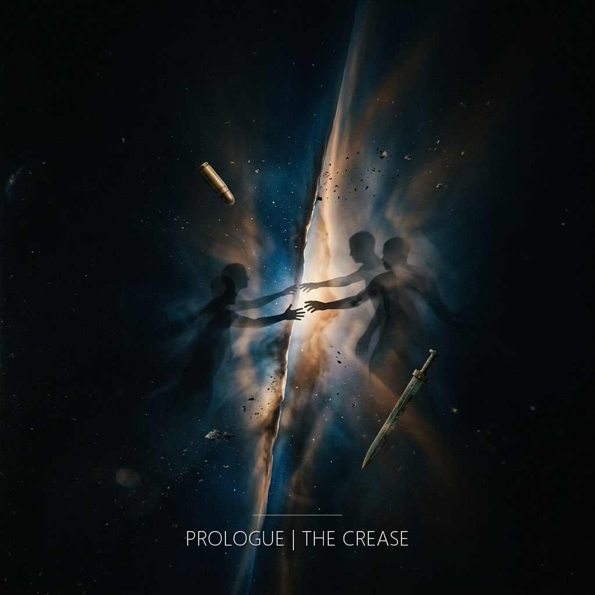

有些瞬間不按照年份排列。

它們像紙裡被壓住的舊痕。看不見，直到某一天，光從錯誤的角度照進來，所有摺線同時浮起。

有人跪著。有人漂著。有人躺在柏油上。有人走進白色的光裡。

她們彼此不認識。她們相隔很遠。遠到任何一種曆法都不夠用。

但在那道摺痕裡，距離失效了。

&nbsp;

她跪在泥地上。

清晨的風從東邊來。很冷。不是冬天的冷。是鐵的冷。她的膝蓋壓在昨夜下過雨的地面上，泥水浸濕了褲腿。她沒有低頭。

&nbsp;

遠處有海。有人站在海的方向。天剛亮。光線是灰的。

一個金屬的聲音——不是槍響。是槍被舉起來的聲音。機括。咔。

然後是海浪。然後是別的聲音。

有人在海的方向倒下去。

&nbsp;

信在另一個人手裡。她躺在柏油路面上。天空很藍——不對，爆炸之後天空應該有煙的。但天空是藍的。她看著那個藍。紙張邊緣焦黑。字跡完好。

一封寫了一百零八年的信。

&nbsp;

光。

不是陽光。不是燈光。不是任何她見過的光。

所有的光疊在一起。所有時間的光。白。不是白天的白。是一種沒有影子的白。她走進去。腳底的地面不確定它自己是不是地面。

警報響了三秒。

三秒在那裡面是沒有意義的。

&nbsp;

有一行字被寫下來了。在泥地上。在筆記本裡。在白板上。在螢幕上。

同一行字。用四種她們各自的語言。記錄同一道不該存在的光。

沒有人知道另外三個人也寫下了它。

&nbsp;

四隻手。

或者是同一隻。

在各自消失的邊緣，有人握住了她們。
