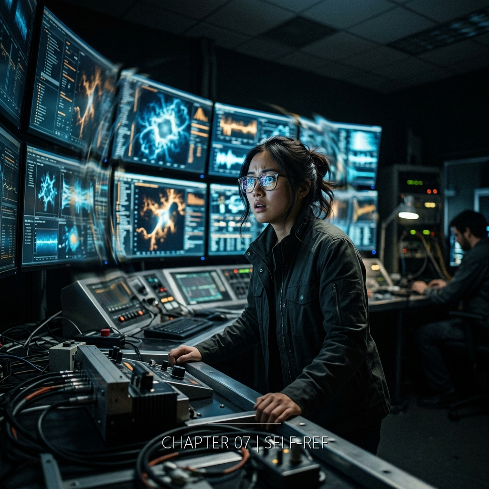

她正在推導的方程式有一個她永遠無法解釋的步驟，而那個步驟之所以正確，是因為一個在一百零八年前被槍決的物理學家在死前最後一秒算出了答案——那個答案穿過了被摺起來的時間，變成了她的直覺。

&nbsp;

**2055年6月 · 日內瓦 CERN**

三月到六月。三個月。她把整個模型重建了兩遍。

第一遍是結構性的失敗——張量場的縮並在第四步就發散了，無限大像水從破掉的管子裡湧出來，淹沒了所有後續的推導。她用了兩週的時間找到原因：她假設了一個不存在的對稱性。時間的摺疊不是對稱的。紙可以對摺，但摺痕的兩邊不一樣長。她把所有的白板擦掉，從頭開始。

第二遍花了六週。這一次她沒有假設任何對稱性。讓方程式自己告訴她結構是什麼形狀。每一步推導她都寫在白板上，不用電腦——不是因為她不信任電腦，是因為白板的物理空間可以讓她同時看到所有步驟之間的幾何關係。手寫有一種計算軟體取代不了的東西：肌肉記住了符號的順序。

到第六週的最後三天，方程式做了一件方程式不應該做的事。

它描述了自己。

&nbsp;

白板佔滿了三面牆。

她的辦公室本來有兩面白板。第三面是她從隔壁退休教授的辦公室搬過來的。退休教授人在蘇黎世養老，不會回來了——全球暖化讓日內瓦的夏天變得不適合六十歲以上的人類。她把第三面白板靠在原本放沙發的那面牆上。沙發被推到角落。再也沒有人在上面坐過。

三面牆。藍色是三月的推導。紅色是四月的。黑色是五月的修正。六月用了綠色——她的白板筆已經用完了常規色，從蘇顯宗的桌上偷了一支綠色的。蘇顯宗沒有說什麼。他改用鉛筆。

蘇顯宗用手機拍下了所有東西。每一天。她要求的。因為四月的某一天她在擦掉第二面白板上半段推導的時候沒有注意到自己同時擦掉了一個關鍵步驟。那個步驟她花了兩天才重推出來。從那以後蘇顯宗成了她的外部記憶體。他每天下午五點站在辦公室門口，舉起手機，從左到右，三面牆，一張一張拍。有時候她在辦公室裡，有時候不在。他不需要她在。記憶體不需要被主機看見。

他拍照的時候站在辦公室最遠的角落。她注意過。他可以站在白板正前方拍——那樣字會更清楚。但他選擇站在離白板最遠的地方。她計算過那個距離：大約四公尺。蘇顯宗用距離來表達謹慎，就像其他人用語氣或措辭。四公尺是「我尊重這個東西但我不確定我是否應該靠近它」的距離。

她不責怪他。三面牆的推導，從遠處看，確實像某種需要敬畏的東西。或者需要害怕的東西。取決於你是在看教堂的穹頂還是精神病患的房間。

&nbsp;

六月第二週。研究組報告。

房間裡七個人。她站在第一面白板前面，手裡拿著紅色白板筆——筆蓋已經不見了，大概在四月的某一天滾到了桌子底下，她沒有去撿。筆尖暴露在空氣中的白板筆會在大約三週內乾掉。這支已經撐了兩個月。她猜是因為CERN地下室的濕度比地面高，溶劑揮發得慢。

Marc坐在最靠門的椅子上，雙臂交叉。他坐著的時候總是把左腳往前伸——滑雪舊傷的那隻腳。她注意到他今天伸得比平常遠。這意味著他已經準備好不同意了。Marc的身體語言比他的法語更精確。

「方程式描述的是時間的摺疊。」她用筆尖點了第一面白板右上角的藍色推導。「三月到四月的工作確認了這一點。沒有新的東西。」

她走到第二面白板。紅色。

「但四月之後我們發現了一個問題。」她在兩組紅色方程式之間畫了一條線。「方程式的數學結構——它的拓撲——和它描述的摺疊結構是同構的。不是相似。是同構。」

她轉過身面對七個人。

「意思是：描述摺疊的方程式，本身可能就是通過摺疊洩漏出來的資訊。方程式不是我們發明的工具。它是現象的一部分。」

沉默。大約四秒。她在心裡數了。

Marc第一個開口。

「*Unfalsifiable*。」他說這個詞的時候嘴角往下。法國人說英文技術術語的時候會帶一種不屑的精確度。「它解釋了一切——包括它自己為什麼存在。你知道這叫什麼嗎。這不是物理學，Ruoxin。這是神學。你建了一個不可能被推翻的模型。任何證據都可以被它吸收。任何反例都可以被說成是『摺疊的另一種表現』。」

他停了一下。左腳收回去了一點。這意味著他說完了他準備好的部分，接下來是即興的。

「你不覺得這很像宗教嗎？」他補了一句。輕一點。幾乎是善意的。

她沒有立刻回答。她把白板筆從右手換到左手——一個她在思考的時候會做的動作，蘇顯宗拍過一張照片記錄了這個動作，她看到之後覺得自己的左手拿筆的姿勢很醜。

「或者，」她說，「這是第一個真正自指的物理系統。」

她走到第三面白板。綠色。蘇顯宗的筆。

「Godel在1931年證明了數學可以自指。一個足夠複雜的形式系統可以構造出描述自己的命題。那個命題不是假的，不是錯的——它只是不在系統能夠證明或否證的範圍內。」

她在綠色方程式旁邊寫了一行字。英文。*The equation is about itself.*

「我們現在說的是同樣的事，只是對象從數學變成了物理。這個方程式描述時間摺疊。但方程式本身——它的存在、它的結構、它被我們寫下來這件事——也是時間摺疊的一個結果。不是因為我們發明了好的數學。是因為摺疊洩漏了描述自己的資訊，而那些資訊恰好以方程式的形式被我們的大腦接收了。」

「所以我們是方程式的一部分。」這是研究組裡最年輕的博士後，一個叫Ana的克羅埃西亞人。她的語氣不像在反對。像在確認。

「對。」

「那我們的自由意志呢？如果我們只是方程式的——」

「自由意志不是這個方程式關心的變數。」她把筆放下。「你問的是哲學。我回答的是數學。數學說這個結構是自洽的。哲學可以等。」

房間分裂了。

分裂的方式和她預測的完全一致：Marc和他的兩個法國博士後認為她瘋了。Ana和另外兩個年輕研究員——一個德國人，一個印度人——認為這解釋了過去三年所有無法解釋的量子異常。兩派的數量是三對三。

蘇顯宗沒有表態。他站在辦公室最遠的角落裡。四公尺。舉著手機。拍照。

她從他的手指間距判斷——手機螢幕上的畫面穩定，十指的位置沒有變。大約三分。這是她見過他最放鬆的時候。也許是因為他在拍照的時候不需要有意見。鏡頭沒有立場。

&nbsp;

Marc走了之後，Ana留下來。

「你打算怎麼驗證？」Ana問。她坐在被推到角落的沙發上，雙腿盤著——這個沙發唯一被使用的時刻。

「*Unfolding*。」許若昕說。她在第一面白板左下角畫了一個圖。一張紙被摺起來，然後被從中間撐開。「人工放大摺痕。在LHC裡製造一個局部的時間摺疊增幅場。如果方程式是對的，增幅場內應該能觀測到跨時間的資訊洩漏——不是粒子穿隧，是資訊穿隧。因果律在那個區域內會變成非線性的。」

Ana歪了一下頭。「LHC的能量夠嗎？」

「不夠。」她把筆扔到桌上。「需要重新配置所有偵測器的焦點。把分散在二十七公里環上的偵測能力集中到一個點上。像把散射的光聚焦成雷射。」

「這意味著——」

「申請。報告。委員會審查。大概六到八個月。也許更久。也許他們直接拒絕，因為我的提案聽起來像一個四十二歲的台灣女人決定用全世界最大的粒子加速器來做一個不可證偽的實驗。」

Ana笑了一聲。短的。「你會寫那個報告嗎？」

「會。」

「你覺得他們會批准嗎？」

她想了一秒。「不知道。但申請被拒絕和不申請是不同的。前者是一種計算結果。後者是放棄。我不放棄。」

Ana看了她一眼。那種年輕人看年長者的眼神——不完全是崇拜，更像是在記住一種姿態，以備將來自己需要的時候可以模仿。

Ana走了之後，辦公室裡只剩她和三面牆。

&nbsp;

**公元166年 · 洛陽靈台**

褶痕⑤回聲的回聲

&nbsp;

夜。靈台。衛央一個人。

值夜名冊上有三個名字。另外兩個沒有來。一個的名字上週從名冊上被劃掉了。另一個昨天主動申請調離靈台。沒有人問原因。

她不在意獨自值夜。獨自值夜意味著不需要管理另外兩雙眼睛。她可以直接記錄。

閃光。

她的手先停了。然後眼睛跟上。西北方。同一個位置。冷白。

她開始數。

一。二。三。四。五。六。

六息。比之前最長的那次多了整整一倍。她的手指收緊了筆。墨在竹簡表面暈開了一個點。

閃光消失了。

她記錄。方位。仰角。持續時間。色溫。和之前所有的閃光一樣精確。二百三十一次了。數據歸檔。

但這一次有什麼不同。

閃光消失的那個位置——西北方、仰角三十度——她的視線離開之後，視網膜上留下了一層東西。不是光的殘影。光的殘影是圓的、暖色的、會消退的。這個不消退。這個是——數字。

不是她看見的數字。是她「知道」的數字。一組排列。一個結構。像有什麼東西在閃光消失的瞬間，用一種不經過眼睛的方式，把一個圖案壓進了她的意識裡。

她搖了搖頭。眨了幾次眼。圖案沒有消失。不是在視野裡——是在更深的地方。在記憶和感知之間的某個縫隙裡。一個她「知道」但沒有「看到」的東西。

她低頭看竹簡。數據已經寫完了。她猶豫了一下。

然後在竹簡最邊緣的位置，用最細的筆尖，畫了一個小小的圖形。

一個圓。裡面兩條交叉的線。

她不知道這是什麼。手決定的。她看了它一眼。放下筆。沒有再想。

鎖好匣子。天還是黑的。

&nbsp;

六月第三週。東亞科技共同體的郵件。

她正在寫開摺實驗的申請書。第三版。前兩版她自己否定了——第一版太保守，讀起來像在請求許可做一件她已經知道答案的事。第二版太激進，用了太多「如果摺疊是真的」的句式，Marc看到了會說這證明了他的「神學」論點。第三版她在找一個中間地帶：足夠精確讓物理委員會覺得這是科學，足夠模糊讓他們不會意識到她真正想做的事有多危險。

郵件在下午三點十一分到的。她知道時間因為她剛好在存檔。

寄件人：東亞科技共同體秘書處。主旨：關於《日內瓦修正協議》第七條之研究數據報備事宜。措辭禮貌。行距寬。字體是那種專門設計來讓官僚文件看起來不像威脅的字體。

內容：鑒於貴研究組近期在維度拓撲領域之研究進展，依據《日內瓦修正協議》第七條第三款，涉及時空結構可能改變之實驗相關數據須向共同體進行報備。請於收到本函三十日內提交完整之研究計畫書及原始實驗數據。

她讀了一遍。

然後她把郵件關掉了。

不是最小化。不是存檔。是關掉。點了右上角的叉。郵件回到收件匣的列表裡，變成一行灰色的未讀標記。她把滑鼠移開。

蘇顯宗站在門口。他來拍下午五點的白板照片，早到了。他看見了她的螢幕——不是刻意看的，是辦公室太小、螢幕太大、他的眼睛無處可去。他看到了郵件的標題。

他的手指間距變了。從三分回到了六分。

她知道他知道。「東亞科技共同體」這六個字對任何2043年之後出生或成長的台灣人來說，都有一層字面意義之外的重量。共同體是戰後的產物。是那場戰爭的贏家用來管理輸家的框架之一。她的弟弟死在那場戰爭的一次「精確打擊」裡。「精確」這個詞她花了很多年才能平靜地使用——因為她是物理學家，精確是她的工具，而那些用「精確」殺死嘉偉的人把這個詞污染了。

共同體委員會裡的某些人。她不知道是哪些。她不需要知道。結構不需要名字。

她沒有回覆那封郵件。不是因為她忘了。是因為她做了一個精確的決定：不回覆。沉默不是疏忽。沉默是一種語言。在這個情境裡，沉默的意思是：你的協議不適用於我。你的權力結構不包含我。你們用來管理世界的那些條文，寫在我弟弟的屍體上面。

她知道這個決定的代價。不回覆意味著共同體有權將她的研究標記為「未報備」。未報備的研究可以被中止。中止意味著她的實驗——如果能通過CERN委員會的話——會在執行之前被政治力量掐死。

她也知道自己會做什麼。她會繼續寫申請書。提交給CERN。不提交給共同體。如果共同體來了，她會——

她沒有想完這個句子。不是因為害怕。是因為她不需要現在就做那個決定。決定可以等。方程式不能等。

她重新打開申請書的第三版。游標閃爍在第二段的末尾。她開始打字。

&nbsp;

七點。她上到地面。

混凝土出入口。推門。熱浪。三十九度。六月比三月多了一度。六月應該是二十幾度的。在她記憶裡——她小時候的記憶，在新竹——六月的傍晚是可以穿短袖站在外面不流汗的。那種氣候已經不存在了。和嘉偉的高中一樣。被覆蓋了。被取代了。被一種新的、更差的東西替換了。

她掏出合成尼古丁棒。咬住。吸了一口。前端亮起淡藍色的光。薄荷和塑膠的中間值。

她想到方程式。

自指性的意義不只是數學上的優雅。如果方程式真的描述了自己——如果它的存在本身就是它描述的現象的一個實例——那麼使用這個方程式的人也是方程式的一部分。她是方程式的一部分。她的動機是方程式的一部分。

她研究開摺的動機。

一個二十二歲的男生。新竹。電機系。期末考。無人機。八百公尺。

那也是方程式的一個項嗎？

她吸了一口。嘴裡的薄荷味被三十九度的熱空氣稀釋了。日內瓦湖方向的光在空氣中扭曲。白的。六月的白比三月的更厚。野火的微粒在大氣層裡累積了半年。空氣有一種看不見的質地——不是髒，是稠。像戴了一副度數不對的眼鏡看世界。

嘉偉如果活著，今年三十四歲。電機系畢業。也許在竹科。也許出國了。也許在做她完全不懂的東西——她的物理和他的電機之間有一條她從來沒有跨過的學科邊界。他們小時候會爭論哪個比較難。她說物理。他說電機。她說物理是電機的基礎。他說基礎不代表比較難，地基不比房子難蓋。她那時候覺得他在詭辯。現在她覺得他是對的。

她沒有想完。不是因為痛。是因為句子結構不完整。「嘉偉如果活著」這個句子的主詞是一個假設——而假設不是物理。物理是實測。實測的結果是：嘉偉不在了。這是數據。數據不可協商。

這個決定會殺了她。但不是今天。

今天她要回到地下室。繼續寫申請書。繼續讓白板上的方程式往某個她還看不清的方向延伸。繼續做一個精確的部分，而不是一個馬虎的部分。

她把尼古丁棒摁滅在那個2030年代的鐵製菸灰缸裡。漆又掉了一塊。菸灰缸比CERN裡大部分的研究計畫都活得久。也比大部分的研究者活得久。

她轉身。推門。走下樓梯。回到攝氏十八度的地下。

三面白板在等她。方程式在等她。藍色、紅色、黑色、綠色。四種顏色。三個月。一個答案。

一個描述自己的答案。

她拿起筆。繼續寫。
