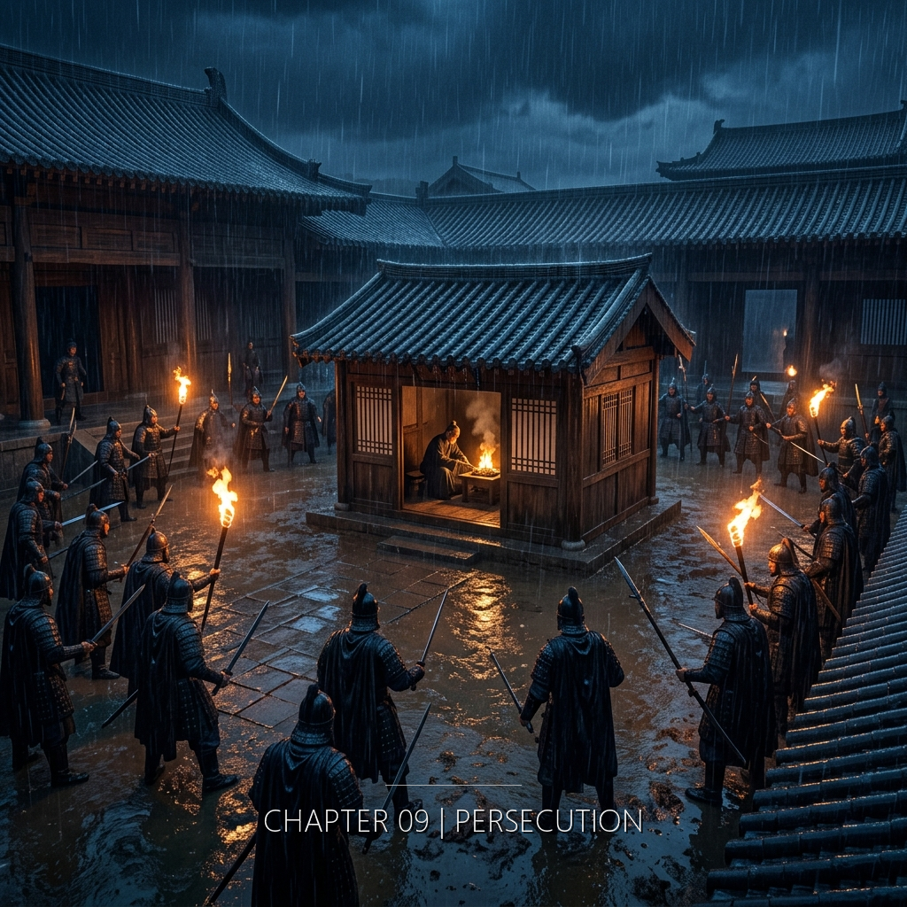

她正在刻的第二百三十六個座標的位置，將會在一千八百八十九年後成為一個方程式的最終解的關鍵參數——而她選擇那個位置的原因，是那個方程式本身。

&nbsp;

**公元168年 · 洛陽靈台**

蔡丞走了兩年。

靈台沒有人提他的名字。不是禁止。沒有人下過這個命令。是所有人自己決定不提。名字是一個形狀。說出來，那個形狀就會在空氣裡停留一瞬。停留一瞬就夠了。夠讓某個人記住誰說的。

他的位子上坐了新的人。姓孔。年輕。寫字快。觀測簿上記的全是標準天象。不多一個字。不少一個字。恆星在正確的位置。行星沿正確的軌跡。日月正常。天命穩固。

衛央在靠窗的位子上看了他兩個月。他從不抬頭看天。他看的是星表。星表上寫什麼，他就記什麼。天空是星表的副本。不是反過來。

銅漏壺滴水。一滴。一滴。靈台觀測室裡還剩三個值夜的人。兩年前是八個。

&nbsp;

她還在。

她不確定原因。也許她的位階太低。靈台書記官，九品以下，甚至沒有正式品秩。名單上的人是太學生、議郎、中郎將、名士。她不是。她是一個抄寫天象的人。抄得準。不多話。不結交。沒有師門可以株連。沒有清議可以追查。她是靈台牆壁上的一塊磚。磚不會被列進名單。

也許是偽裝太好了。

三年。男裝三年。身體學會了一切。走路的步伐——比她自然的幅度寬半寸，左腳先落地，重心偏低。坐下的姿勢——膝蓋分開，背挺直，手放在膝蓋上而不是大腿上。咳嗽的聲音——從喉嚨深處，不是胸腔。站起來的時候不扶桌沿。蹲下去的時候兩腿分開。所有的動作都是練出來的。練了三年。身體記住了。有些動作已經比原來的更自然。她在家裡——如果靈台旁那間土牆小屋算家的話——也用男人的姿勢坐著。不是偽裝。是身體忘了另一套。

只有手。

手改不了。指節的寬度。骨架的比例。指甲的形狀。她的手不是男人的手。寬袖能擋住大部分時候。但拿筆的時候。遞東西的時候。磨墨的時候。手會露出來。

衛寧每次看的都是她的手。

開門。眼睛落在手上。停一息。收回。三年。每一次。衛寧從來不看她的臉。臉是偽裝。手不是。手是衛央。

&nbsp;

蔡丞最後那天不是說了什麼。是看了她一眼。

那個眼神。她在兩年裡想了很多次。每次想出來的都不一樣。恐懼。不是。囑託。不是。溫情。不是。

是交接。

一個人做完了他能做的部分。把工具放在桌上。轉身走了。工具還是那些工具。活還是那些活。人換了。

不是因為他信任她。是因為她在。她在這裡。蔡丞環顧靈台，能交給誰。孫書記官走了。陳書記官走了。周恪不會碰不該碰的東西。何沖太年輕，剛來一年，什麼都不懂，或者什麼都懂但選擇不懂。剩下的人裡，只有她手上有私人竹簡。只有她的匣子裡鎖著不該存在的天空。

蔡丞把竹簡交給她不是因為選了她。是因為沒有別人。

她接了。

&nbsp;

她做了決定。

渾天儀。靈台觀測室角落的那一台。

舊的。年代久遠。圓環已經鏽蝕，轉不動了。表面的刻度被氧化的銅綠覆蓋，摸上去粗糙得像砂石。沒有人用它。觀測用的儀器在房間另一端，新的，銅面光亮。這台舊的被推到角落裡，靠著牆，擋住了牆角的一道裂縫。它在這裡的功能已經不是觀測。是填補空間。

底座。

整鑄的青銅。沉。一個人搬不動。底座和圓環之間有一圈接合處，年久氧化，銅綠把接縫填死了。要打開需要專門的工具——細鑿。錘。鋼楔。她在靈台的工具庫裡見過。工具庫在觀測室隔壁。鎖是銅的，鑰匙掛在值班書記官的腰帶上。值夜的時候鑰匙在她身上。

底座打開以後，內壁是空的。空間足夠。她在白天的時候假裝整理角落的舊器物，用布擦拭渾天儀表面，順便量了內壁的面積。她的手指沿著底座內壁繞了一圈。冷的。銅的冷。面積夠。二百三十六個點，每個點之間的間距用她自己的指節寬度計量，全部刻得下。

幾百年內不會有人拆開這個東西。

它太舊了。太沉了。太不值錢了。沒有人會費力氣把它搬走。沒有人會好奇它的底座裡面有什麼。它會待在這個角落裡，積灰，氧化，被人遺忘。和她的數據一起。

她從工具庫裡取了刻刀。最細的一把。刃寬不到半分。刃口的角度是四十五度。她用拇指試了一下。鋒利。銅的硬度比竹片高得多。刻竹簡用的力道在這裡不夠。她需要更大的壓力，更穩的角度，更慢的速度。

蔡丞留下的教材裡有金工的部分。三卷竹簡。其中一卷專門講青銅器的修復和刻銘。她讀過。從未實際操作。但文字描述了要點。刃口與銅面的角度。切入的深度。切削的方向——順著金屬的紋理。不要逆。逆了會崩。

她在夜間觀測時動手。

&nbsp;

第一個點。

子時。觀測室裡只有她和孔書記官。孔書記官在另一端記錄南天區。背對她。銅漏壺在兩人中間。滴水的聲音掩蓋了刻刀碰銅的聲音——大部分時候。偶爾刻刀滑了一下，會有一聲短促的刮擦。很輕。比翻竹簡的聲音還輕。

她把渾天儀底座的接合處用細鑿撬開。氧化的銅綠碎了一圈，落在地上。她用袖口掃乾淨。底座內壁露出來。暗銅色。沒有刻痕。沒有銘文。空的。

她拿出私人竹簡。第一個座標。方位角。仰角。她在腦中換算成底座內壁的相對位置。左手按住底座邊緣。右手持刻刀。刃口落在銅面上。

角度。蔡丞教材上說，四十度到五十度之間。太淺了，刻痕只是表面的劃痕，手指一擦就沒了。太深了，銅會變形，底座的結構會出問題。她選了四十五度。刃口切進去的時候有阻力。銅很硬。她的手指用力。指節發白。

一個點。刻完了。她把刻刀退出來。用指尖摸了一下。淺淺的凹痕。不深。但清晰。指甲能感覺到邊緣。不會被磨損抹去。

她看了一眼自己的手。右手食指和中指之間，拇指的指腹。用力的痕跡。明天會有新的繭。不是寫字的繭。

孔書記官翻了一頁。紙的聲音。她沒有抬頭。

&nbsp;

一夜十到十五個點。

她算過。二百三十六個點。每夜十五個。十六個夜。每夜值班時間是子時到寅時末。六個時辰。刻一個點需要的時間隨熟練度變化。第一個夜裡，她刻了十個。每個點都要反覆確認位置。第三個夜裡，十五個。手記住了。

天亮之前收工。刻刀擦乾淨。底座蓋回去。接合處用一層薄薄的泥糊上。乾了之後的顏色和氧化銅綠接近。不仔細看看不出來。

觀測簿翻開。標準天象。恆星位置。行星軌跡。抄完。字跡均勻。和其他書記官一致。官方的天空。

兩套工作。兩種時間。白天的時間是靈台的。她在抄寫室裡和其他人一起抄天象記錄。六個人變成了四個人。四個人的字跡都一樣。標準化的字。沒有鳥尾巴的撇。沒有個人的痕跡。

夜間的時間是她的。刻刀。銅。座標。

&nbsp;

第一百二十個點。

她停了一下。不是因為累。手穩。刻刀的角度已經不需要想了。手指知道多大的力道剛好。知道什麼時候該退刀。知道銅面上哪個方向的紋理順，哪個方向的紋理逆。這些不是蔡丞的教材教的。教材上的字她讀了三遍，但手上的準確度超過了文字的範圍。她不知道為什麼。她的手——那雙衛寧看了三年的手——出乎意料地知道怎麼刻。

像手自己決定的。

她想到衛寧。

上個月去姊姊家。衛寧開門。照例先看手。看完了。沒有收回視線。又看了一眼。

指節上的繭。新的。位置不在食指和中指之間——那是寫字的位置。在拇指指腹和食指第二節的側面。不是筆的形狀。是別的工具。

衛寧沒有問。

她把裝換洗衣物的布袋遞過去。衛寧接了。兩人走進內室。門關上。衛寧從櫃子裡取出新的內衫和布帶。照例。白棉。細織。寬一寸。雙道收邊。針腳比市場貨細。

衛寧把新衣物放在桌上。手指碰到桌面的時候停了一息。她在看衛央放在桌邊的那隻手。拇指指腹上的繭。

然後她轉身去收拾舊衣物了。

衛央站在內室裡。窗外有陽光。灰白的冬天的光。衛寧蹲在竹筐邊上把舊內衫疊好。她的背對著衛央。

衛央想寫封信。

寫什麼。

「我在做一件事。」——衛寧知道。

「這件事可能會讓我死。」——衛寧知道。

「我沒有辦法停下來。」——衛寧知道。

「你要小心。不要讓任何人知道你有一個在靈台的妹妹。」——衛寧從第一天就知道。妹妹用男裝進靈台的那一天。她知道。她沒有阻止。她縫了第一件男款內衫。量了第一條束胸的布帶。邊緣收了雙道線。從那天起她就知道了。所有的事。

寫什麼？

她放下了筆。

繼續刻。第一百二十一個點。

&nbsp;

下個月不去衛寧家了。

走得太頻繁會引起注意。靈台書記官每月一次外出是正常的。兩次就有人會記住。記住了就有可能被問。問了就有可能被查。查了就有可能——

她不去。一個月。

衛寧會等。她每個月等妹妹來。門口的位置。開門。看手。遞衣物。這是她們的全部。

下個月她不來了。衛寧會在門口等。等到天黑。等到第二天。等到第三天。

然後她會知道的。

不是因為有人告訴她。是因為沒有人來。

一個月不來，也許是忙。兩個月不來，是不能來。三個月不來——衛寧不需要到第三個月。她從第一天起就在計算。每一次開門看手的那一息，她都在確認妹妹還活著。她數的不是月份。她數的是下一次。有沒有下一次。

衛央把刻刀退出銅面。擦了一下刃口。銅粉。細的。落在她手指上。

她看著窗外。天還是黑的。離天亮還有一段時間。觀測室的另一端，孔書記官的筆停了。也許在打瞌睡。也許在等天亮。

第一百二十二個點。

她把刻刀重新放上銅面。角度四十五度。力道均勻。切入。

&nbsp;

---

**2301年 · 恆紀**

褶痕TZ-0447。第三次修補嘗試。

縫工把右手放在邊緣參數介面上。標準協議。能量注入。左手記錄數值。

手指碰到褶痕邊緣的時候，她停了。

發熱。

不是灼痛。不是系統回饋的觸覺模擬。是一種餘溫。像觸碰到一個很久以前燃燒過的東西。火已經熄了幾個世紀。灰早就冷了。但灰燼最深處有一層熱度，不屬於現在，不屬於這裡。從某個地方、某個時間殘留下來的。

不是她的熱。

她知道自己的體溫。36.2。標準值。手指末端的溫度通常比核心低0.5到0.8度。但現在手指的溫度高了。高了多少她不確定。感覺上像是有人剛剛握過她的手然後放開了。那個人的掌心很熱。熱到在她的皮膚上留下了印記。

持續了大約二十秒。然後消退。

她查看手指。沒有傷。沒有紅。皮膚完整。監測數據沒有波動。

她在日誌裡打了一行字：「體感異常。觸碰TZ-0447邊緣時手指發熱。監測無對應數據。原因不明。」

關閉日誌。

她看了一眼TZ-0447的曲線。穩定。沒有異常。

回到工作站。繼續。

&nbsp;

第一百七十三個點。第一百七十四個。

她不趕。每一個點刻完，用指尖摸一下。確認深度。確認位置。然後下一個。

她不知道這些點會被誰看見。她不知道會不會有人看見。她只知道——這些閃光是真的。它們出現在西北方的天空裡。蔡丞看見了四十三次。她看見了五十多次。兩個人加起來快一百次了。近一百次的閃光。冷白色。無尾跡。無聲。出現在不該出現的地方。

它們存在。

她的工作是記錄。不是理解。

竹簡會腐爛。墨會褪。紙會碎。但銅不會。銅會氧化。氧化的銅綠會蓋住表面。但刻痕不會消失。刻進去的東西就在那裡了。

她繼續刻。

第一百七十五個點。

窗外的天從黑變成灰。東方的地平線上出現了一條細縫。光從縫裡滲出來。

她收了工具。蓋上底座。泥糊好。擦手。

觀測簿翻開。標準天象。無異常。

字跡均勻。和昨天一樣。和前天一樣。

她站起來。肋骨下方。布帶的邊緣。刺了一下。她沒有碰。

走出觀測室。
