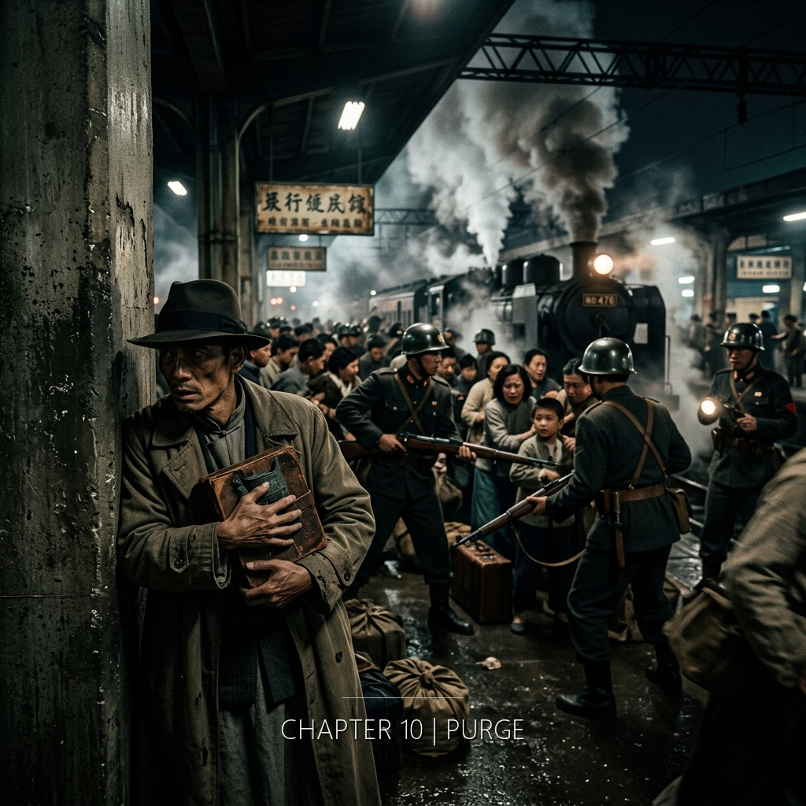

林秀英將會用一生等待一個不會回來的人，而她幫他藏進牆壁裡的東西，將會被她自己的曾孫在同一面牆壁裡找到——但她永遠不會知道這件事，就像她永遠不會知道丈夫葬在哪裡。

&nbsp;

**1947年3月 · 台北**

三月八日。收音機的聲音很小。

老黃把它從一樓搬下來的時候，電線不夠長，接頭拖在地上。陳明哲和他兩個人蹲在地下室的角落裡，把耳朵湊到喇叭前面。收音機是真空管的，開機之後需要大約四十秒才能暖管。那四十秒裡他們什麼都沒說。老黃的呼吸帶著菸味和一種更深的東西——不是緊張，是一種已經在緊張很久的人的味道，發酸的汗和磨損的棉布。

聲音出來了。很小。嘶嘶的雜訊底下壓著播報員的聲音。國軍部隊已在基隆港登陸。整編二十一師。陳明哲聽見「基隆」兩個字的時候腦中自動浮出的是*キールン*。日文的發音。他把那個音壓回去。

老黃關了收音機。兩個人在地下室裡坐了一會兒。老黃站起來的時候膝蓋響了一聲。他走到樓梯口，停了一下，回頭說：「明哲，你那些箱子——你自己看著辦。」

他不知道老黃指的是渾天儀。老黃只知道他在地下室裡整理「日治時期的文物」。日治。這兩個字現在本身就是一個罪名的形狀。

第二天老黃沒有來上班。

陳明哲站在物理系的走廊上，看見老黃的辦公室門開著，桌上的茶杯還在。茶已經涼了。旁邊放著半份沒有改完的學生作業。紅筆擱在第三題的旁邊，筆蓋沒有蓋。他走過去。沒有進門。他看了一眼那支紅筆。筆蓋。老黃是一個會蓋筆蓋的人。每次。他教書的時候把筆蓋夾在襯衫口袋裡，改完一題蓋回去，改下一題再拔開。那個動作他做了十幾年。

筆蓋沒有蓋。

第三天，林先生也沒有來。

第四天，走廊上只剩他自己的腳步聲。系主任的門鎖了。秘書的桌子是空的。一樓的布告欄上有人貼了一張手寫的紙條，字跡潦草：「本週課程暫停。」沒有署名。沒有日期。

陳明哲回到地下室。渾天儀殘件放在木桌上，用他的外套蓋著。筆記本攤開在旁邊。推導停在第四頁的中間。摺疊深度，自由參數*d*，仍然是一個未知數。他需要更多的數據。但他知道他不會再得到更多的數據了。不是因為物理上不可能——而是因為他可能在算出來之前就不在了。

他把筆記本合起來。把渾天儀殘件用衣物包好，放進帆布袋裡。袋子很重。殘件加上筆記本，大約七公斤。他不是搬運工。他是一個身體不太好的三十二歲物理學者，在京都的六年裡除了走路去圖書館之外幾乎沒有任何體力活動。

他從地下室的通風口往外看。天還亮著。他需要等。天黑之後走。

&nbsp;

天黑了。

他從台大後門出去。繞過校園。街上的人比平常少。路燈有些亮著，有些沒有。他走過一條巷子的時候聽見牆後面有人壓低聲音說話。聽不清內容。語調是台語的，語速很快。他加快腳步。帆布袋的帶子勒在右肩上，隨著步伐晃動。青銅殘件在袋子裡抵著他的背，硬的，涼的，金屬的邊角透過衣物刺進皮膚。

台北車站。

月台上的光線昏暗。幾盞燈泡吊在鐵架上，被風吹得微微搖擺。月台上的人不多。一個老婦人坐在長椅上抱著包袱，兩個年輕人站在柱子旁邊抽菸。售票口前面站著兩個穿軍裝的人，步槍斜背在肩上。

陳明哲排在一個男人後面買票。他低著頭。帆布袋擋在身前。他開口說「彰化」的時候，嘴裡的味道是乾的。他的國語——他知道他的國語有問題。聲調的高低不對。句子的結構是日語的語序，硬塞進中文的詞彙裡。售票員看了他一眼。只看了一眼。然後遞出車票。

他上了車。沒有坐。站在車廂連接處。帆布袋放在腳邊，他用腳踝抵著它。車廂裡的氣味是人的汗、柴油煙、和一種難以描述的焦灼——不是燒焦的味道，是空氣本身被一種集體的恐懼灼過之後留下的殘餘。

車開了。窗外的景色從建築變成田野。他看見遠處有煙。黑色的。不知道燒的是什麼。稻田還沒有插秧。三月初的中部平原是一大片暗灰色的泥地，在夜裡幾乎看不見，只有偶爾的水窪反射出車窗裡透出的光。

他在彰化下車。從彰化到鹿港沒有火車。他走路。十八公里。帆布袋從右肩換到左肩，再從左肩換回右肩。肩膀先是疼，然後麻，然後不疼了——不是不疼，是身體決定不再向大腦報告這個訊息。他的腳步聲在空曠的道路上回響。路兩邊是甘蔗田。甘蔗已經砍了。只剩矮矮的根茬，排列整齊，像一個被清空的書架。

走到鹿港的時候，天亮了又黑了。

&nbsp;

他站在門前。

門是木門。漆剝了大半。門板上有兩道裂痕，一深一淺，是這幾年的風和鹽分留下的。他認得這扇門。他和林秀英結婚的時候，她站在這扇門裡面。1944年。三年前。她穿了一件淡色的衣服。他記不清顏色了。但他記得她站在門框裡的樣子——門框比她高出很多，她的頭頂上方是一大片空的木頭。

他敲門。

腳步聲。她的腳步聲他認得。不是因為聲音的特徵——木地板上的腳步聲都差不多。是因為節奏。林秀英走路的節奏很均勻，不快不慢，像她什麼事情都用同一個速度做。洗衣服。改作業。等他回來。

門開了。

她看了他一眼。然後看了他肩上的帆布袋一眼。

她沒有問他為什麼這個時候回來。沒有問帆布袋裡是什麼。她側身讓他進來。然後轉身往廚房走。

他把帆布袋放在玄關地上。站在那裡。聽見灶上的火被點燃的聲音——火柴劃過磷面的嘶嘶聲，然後是更低的轟的一聲，木柴接上火的聲音。水壺。水在壺裡被加熱的時候發出細微的聲響，一開始像耳語，越來越密，最後變成持續的低吼。

他站在玄關沒有動。他的鞋還沒有脫。他低頭看自己的鞋。布鞋。鞋底的泥是彰化到鹿港的泥。十八公里的泥。他蹲下來脫鞋。鞋帶的結打得很緊，手指僵硬，解了兩次才解開。

她端了一碗麵出來。放在桌上。碗是粗陶的。麵上面有一顆蛋，蛋白的邊緣微微焦了。湯是清的。蔥花。油蔥的味道。這個味道是鹿港的味道，是這間房子的味道，是她的味道。

他坐下。她在旁邊坐著。不是對面。是旁邊。

筷子是木頭的。用了很久。尖端磨成圓的。他把筷子拿起來的時候注意到自己的手在抖。不是恐懼的那種抖——他已經不確定自己在不在害怕了——是疲勞的抖。從台北到鹿港，大約十二個小時。他的手記得這十二個小時裡每一次換肩的動作。

他吃。她在旁邊看著。

他們很久沒有這樣同時安靜地待在一個房間裡了。不是因為吵過架。他們從來不吵架。是因為他一直在台北。而她一直在這裡。他在台北的日子裡，他在地下室推導方程式，在走廊上聽同事的爭吵，在宿舍的黑暗裡用日語做夢。她在鹿港的日子裡，她在小學教書，改作業，然後回到這間空的房子裡等他的信。他的信很短。因為他不知道怎麼用中文寫他真正想說的東西。日文可以。日文裡有一種溫度是中文的字形裝不下的。但他不能寄日文的信。信經過郵局。郵局有人看。

她沒有問他有沒有吃飯。沒有問他走了多遠。沒有問外面怎麼了。她只是坐在那裡。碗裡的麵慢慢少了。湯的熱氣在空氣裡散掉。他吃完的時候碗底只剩一點湯。

他放下筷子。

「我要藏一些東西。」

她看著他。她的眼睛是那種很深的棕色——不是因為顏色深，是因為眼神深。她在看他的時候不像是在看表面。她在看一個她嫁了三年但聚在一起的時間加起來不到半年的男人，她在看他的倦、他的怕、他肩上帆布袋的帶子留下的紅痕。

她站起來。

「跟我來。」

&nbsp;

龍山寺在深夜裡是灰的。

月光照不進來。簷角的石雕獸在暗處只是一團一團的黑影。林秀英走在前面。她的腳步很穩。這條路她從小走到大。五歲的時候她媽媽帶她來拜拜，她記得那時候龍山寺比現在新，柱子上的漆是紅的，現在已經剝得差不多了。她在這座寺裡做過躲迷藏。她知道哪根柱子後面可以藏一個小孩，哪面牆壁有裂縫，哪塊地磚是鬆的。

她帶他繞過主殿。穿過一個狹窄的廊道。到後殿的角落。

「這裡。」

她蹲下來。用手摸了摸牆壁底部的一排磚。然後她找到了那一塊。看上去和其他磚塊沒有分別——同樣的灰色，同樣的磨損。但她用手掌推了一下。磚塊鬆了。她把它抽出來。後面是另一塊。抽出來。第三塊。

牆體裡面是一個空腔。不大。大約一尺見方。裡面是乾的——這面牆朝南，雨水打不到。空氣裡有石灰和舊磚的味道。

陳明哲蹲在她旁邊。把帆布袋打開。取出渾天儀殘件。取出筆記本。她看見那塊青銅在月光的餘暉裡泛著暗綠色的光。她不知道那是什麼。她從來沒有問過。

他把渾天儀殘件和筆記本用油布包好。油布是他從台大帶來的，包實驗器材用的。他把油布包塞進牆壁的空腔裡。大小剛好。他把三塊磚放回去。表面看不出任何痕跡。

她站起來。拍了拍膝蓋上的灰。

他沒有站起來。他蹲在那面牆前面，手掌壓在磚塊上。他在感覺牆壁的溫度。磚是涼的。和青銅一樣涼。一千八百年前的涼和三月夜裡的涼，隔著一層磚壁，靠在一起。

&nbsp;

回到家。他坐在桌前。

桌上還有她收掉又擺回來的茶壺。茶已經涼了。她泡的。不知道什麼時候泡的。也許在他出去之前。也許在他出去之後，她一個人在家裡等的時候。

他拿出一張紙。鉛筆。三菱。筆桿上的字已經被刮掉了。他在紙上寫下：

「致未來打開摺痕的人——」

他停了一下。「摺痕」這個詞他自己也是第一次用。之前他在筆記本裡寫的是「時間障壁」「穿隧」「邊界條件」。但這些都是技術詞彙。他現在寫的不是筆記。是信。信需要一個讀它的人能記住的詞。

摺痕。紙被摺起來的時候留下的痕跡。打開了之後痕跡還在。你知道這裡被摺過。但你不知道是誰摺的，什麼時候摺的，為什麼摺的。

他寫了很久。信的內容是方程式的脈絡，不是方程式本身。方程式在筆記本裡。信是寫給能讀懂筆記本的人的——如果那個人存在的話。他在信裡解釋了他為什麼相信那些座標不是古代天文學，而是某種穿越時間維度的資訊穿隧的證據。他用盡可能簡單的語言。不是因為他預設讀信的人不懂物理——能讀懂他筆記本的人一定懂物理。是因為他希望這封信像一個人說話的樣子，而不是一篇論文。

信的最後，他寫了一句話。寫完之後他看了很久。沒有劃掉。

「如果你正在讀這封信，代表我的數學是對的。也代表你即將犯一個無法挽回的錯誤。不是因為你的計算有誤，而是因為你和我一樣——太想知道答案了。」

他把信摺好。又去了一次龍山寺。把信塞進油布包裡。把磚塊放回去。回來。

&nbsp;

林秀英在等他。她沒有睡。她坐在桌前。桌上的茶壺還在。她的手放在膝蓋上。

他站在門口。看著她。燈光是黃的。油燈。火焰在風裡微微搖晃。她的影子在牆上晃動。

「秀英。」

她抬頭。

「如果有人來問，你什麼都不知道。」

她看了他幾秒。她的表情沒有變。

「我本來就什麼都不知道。」

她的聲音是平的。不是刻意壓平的。是本來就平的。她真的不知道。她不知道那些方程式是什麼。她不知道薛丁格是誰。她不知道量子穿隧是什麼意思。她不知道二百三十六個刻痕代表什麼。她只知道她的丈夫從台北連夜跑回來，肩上的帶子勒出了紅痕，手在吃麵的時候發抖。她只知道他要把什麼東西藏進龍山寺的牆壁裡。她只知道那個東西對他很重要。重要到他半夜帶著它走了十八公里。

她什麼都不知道。這句話是保護。也是事實。如果有人來問，她能給出的就是這個答案。不是因為她在說謊。是因為她真的只知道這些。她知道的和她不知道的之間隔著一整個物理學的距離。但那個距離不影響她做的事。她煮了一碗麵。她帶他去了牆壁的空隙。她不問。

&nbsp;

<!-- RESIDUE: Thread C → B, ~500字, 褶痕①墨痕 -->

**2055年 · 鹿港 / CERN**

2055年。冬天。鹿港。

蘇顯宗從CERN回來過年。他搭高鐵到台中，轉公車到鹿港。鹿港的冬天比日內瓦暖，但比他記憶裡的鹿港冷。阿嬤已經不在了。走了兩年了。她以前是小學老師，退休之後話更少，最後幾年幾乎不說話。他只知道阿嬤的阿嬤也住在龍山寺旁邊。蘇家幾代人都在這一帶。

這次回來的時候，龍山寺正在做修復工程。震損加上百年結構老化。後殿的牆被拆開了一段。施工圍籬還在，但今天沒有工人——過年。

他路過的時候停了下來。

牆體的截面。磚和磚之間有一個空腔。空腔裡有東西。一團暗色的布。不是布。油布。他走過去。蹲下來。四周沒有人。年假。他伸手把油布拉出來。

裡面是一塊青銅殘件。氧化得很深，表面的綠鏽像一層厚厚的苔。旁邊是一本筆記本。紙已經泛黃，邊緣碎了一些，但裡面的頁數大部分還在。還有一封信。摺成四折。紙張邊緣有水漬的痕跡，字跡完好。

他打開筆記本。翻了幾頁。

方程式。手寫的。筆跡工整但帶著一種緊迫感——字距不太均勻，某些符號寫得特別用力，鉛筆幾乎刻進了紙裡。有些行被劃掉了。劃掉的下面是日文。他認出一些符號。積分。邊界條件。波函數。

然後他看到了那組推導。

他的手開始抖。他說不上來為什麼。是一種直覺——那些推導的結構、那些符號排列的邏輯，和許若昕白板上的東西太像了。不是相似。是同一棟建築的不同樓層。

他拍了照片。打開通訊軟體。發給許若昕。

許若昕在CERN的辦公室裡。日內瓦時間凌晨三點。她沒有睡。她很少在那個時間睡。她打開照片。用兩根手指放大。

沉默。

三十秒。一分鐘。

然後她說了一句話。聲音很輕。但蘇顯宗在通訊的另一端聽得很清楚。

「你現在就帶過來。不要讓任何人看到。」

<!-- END RESIDUE -->

&nbsp;

龍山寺。

陳明哲坐在後殿的台階上。

天上有星星。鹿港的星星比台北多。光害少。三月的夜空在這個緯度上很乾淨。他看見獵戶座。他看見天狼星。他想到衛央——他不知道那個人叫衛央。他不知道有一個人。他只知道一千八百年前有一雙手把二百三十六個點刻進青銅裡。那雙手是穩定的。他在觸摸那些點的時候感覺到了。

他低下頭。

方程式還沒有算完。摺疊深度*d*。自由參數。他的推導走到了第四頁的中間就停了。因為他需要更多的數據。他需要障壁另一面的觀測值。一千八百年前的青銅提供了障壁的形狀，但只有形狀。沒有深度。

他閉上眼睛。在腦中繼續推導。沒有紙。沒有筆。只有黑暗裡的符號。他的大腦用日語建造的那個精密區域還在運作——方程式在那個區域裡是有形狀的，有質感的，像積木一樣可以旋轉、組合、拆開。他把那些積木在腦中擺弄。試圖繞過那個缺失的參數。也許可以從邊界條件本身反推。也許障壁的形狀裡已經隱含了深度的線索——*暗黙の制約条件*。隱含的約束條件。

他不確定。

他睜開眼睛。星星還在。他不知道他剛才閉了多久的眼。也許幾秒。也許幾分鐘。

然後他哭了。

不是那種有聲音的哭。眼淚從眼角滑下來。滑過臉頰。滑進下巴的線條裡。他沒有擦。他的雙手放在膝蓋上。他坐在台階上。身後是那面藏了他所有東西的牆壁。面前是天空。

他不是因為害怕死亡而哭。他想到了死。在過去幾天裡他斷斷續續地想過。老黃不見了。林先生不見了。清鄉的邏輯他大致理解——不需要證據，不需要審判，只需要名單。名單上有名字就夠了。他的名字在不在名單上他不知道。但他知道他的存在本身就是一個可以被填進名單的形狀：台灣人，日本教育，京都帝大，在地下室裡研究日治時期的文物。這些詞彙的每一個單獨拿出來也許不致命，但它們加在一起構成了一種輪廓，而清鄉的人只需要辨認輪廓。

他不是因為這些而哭。

他哭是因為方程式沒有算完。

四頁推導。走到一半。答案的形狀他已經看見了——像在濃霧裡看見一座建築物的輪廓，你知道它在那裡，你知道它的大致形狀，但你看不清門在哪裡。如果再給他三個月。也許兩個月。也許他可以繞過那個缺失的參數，從另一個方向逼近答案。湯川先生教過他：「一個好的物理學家，遇到走不通的路，不會站在原地。他會退回去，找另一條路。路總是有的。」

路也許是有的。時間不夠了。

他哭也因為林秀英。

她在家裡等他。她一直在等。她等他從京都回來，等了三年。等他從台北回來，等了三個月。現在他回來了。帶著一個青銅殘件和一本寫滿了方程式的筆記本。把它們藏進牆壁裡。然後坐在龍山寺的台階上哭。

他知道他可能回不去了。不是回不去台北。是回不去她身邊。也許明天就會有人來。也許後天。告密者可能是任何人。也可能不是告密。可能只是巡查。巡查的士兵不需要知道他是誰。只需要看見一個形狀。

林秀英二十九歲。她是小學老師。她的字很小，很規矩，是日本時代小學教的那種筆法。她在信裡問他過年回不回來。她在深夜裡開門，不問他為什麼回來，煮了一碗麵。她帶他去她從小就知道的牆壁空隙。她說「我本來就什麼都不知道」。

如果他不在了，她會一直住在這裡。她不會再嫁。不是因為守節。是因為她的性格——她做決定的時候很安靜，決定了之後不會再改。她嫁他的時候是這樣。等他的時候也是這樣。她會在這間房子裡等。等一年。兩年。十年。沒有人告訴她他死了。沒有人告訴她他死在哪裡。她只會知道他沒有回來。

眼淚流完了。

他用手背擦了一下臉。手背上的皮膚冰涼，沾著三月夜裡的濕氣。他低頭看自己的手。右手。推導方程式的手。觸摸青銅上一千八百年前刻痕的手。拿筷子的手。指尖上還有石墨粉的殘餘，卡在指紋的溝壑裡。

他站起來。回家。

林秀英還坐在桌前。她看見他的眼睛。紅的。她沒有說話。他也沒有說。他坐下來。她把手放在他的手背上。

她的手是溫的。不是熱。是那種一直待在室內的溫。手掌心乾燥，指尖有磨繭——改作業的繭，拿粉筆的繭。她的手壓在他的手背上。不重。就是放在那裡。

他沒有翻過手掌去握她。他只是讓她的手放在那裡。他的手背感覺到她的溫度。那個溫度從他手背的皮膚滲進去，慢慢地，像墨水滲進宣紙——不是一下子。是一點一點地。

油燈的火焰在風裡跳了一下。影子在牆上晃動。他們坐在那裡。兩個人。一張桌子。一盞燈。牆壁外面是鹿港的夜，龍山寺的方向，藏著一個青銅殘件和一本筆記本和一封信的那面牆。

他不知道一百零八年後，有人會從同一面牆壁裡把那些東西取出來。

他不知道那個人是她的曾孫。

他不知道她會用一生等他。

他知道的只有她的手的溫度。此刻。在這裡。在這間房子裡。她的手放在他的手背上，像是在說一句她從來沒有說出口的話。

窗外沒有聲音。鹿港的夜很安靜。遠處有狗叫。更遠處也許有海浪。他聽不見。他只聽見油燈的火焰。和她的呼吸。
