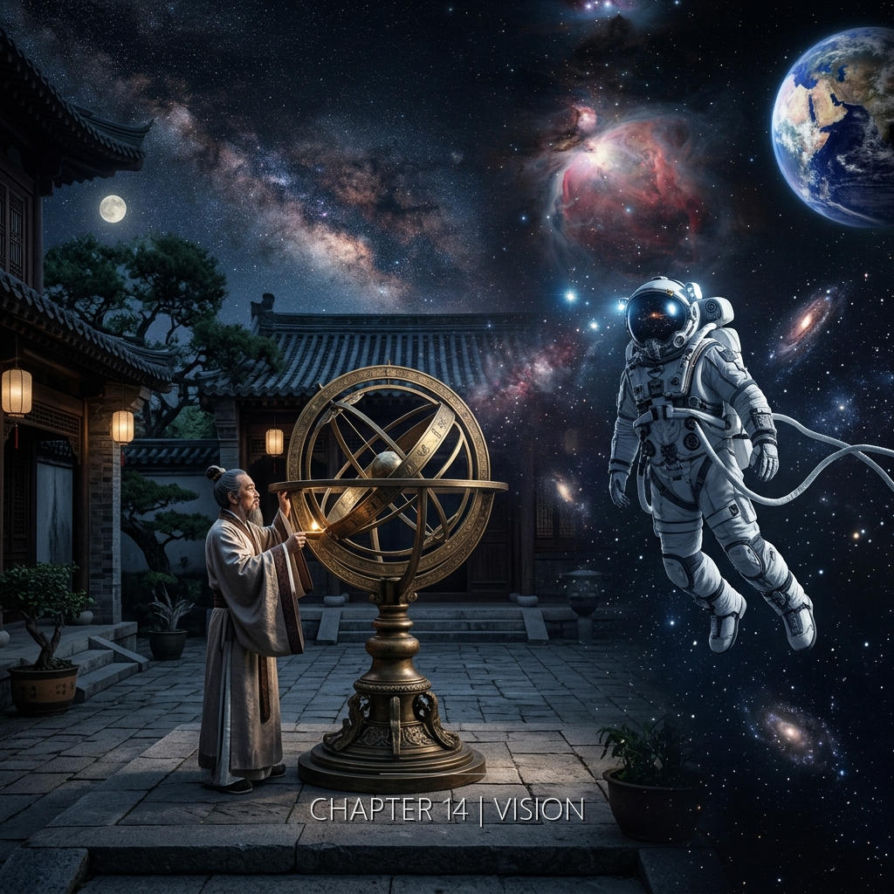

在摺疊的時間裡，衛央和縫工之間只隔著一張紙的厚度——儘管那張紙展開後是兩千一百三十五年。衛央感到的「不孤單」和縫工感到的「有人在」，是同一個感覺被褶痕壓成了兩份。

&nbsp;

**公元169年 · 洛陽靈台**

子時三刻。

她在觀測位上坐了兩個時辰。今夜的天區是西北象限。脖子偏左。角度固定。銅漏壺滴水。一滴。一滴。觀測室裡剩她一個人。

孔書記官調走了。上個月。沒有說去哪裡。位子空了。硯台留在案上。墨條也留著。沒有人來收。

她一個人值夜。觀測室的門沒有鎖。靈台現在不鎖門了。不需要。該走的都走了。

她的觀測簿攤開在案面上。空白。今夜到現在沒有寫一個字。西北方的天空是黑的。恆星在該在的位置。沒有異常。

然後裂了。

&nbsp;

不是閃光。

前面所有的異常都是閃光——冷白色，短促，一息到六息。像天幕上戳出的洞。這一次不是洞。是裂。

天從西北偏西的位置往東撕開了一道線。白的。但不是冷白。比冷白更——她不知道怎麼形容。不是顏色的差異。是存在方式的差異。閃光是光。這個不是。這是光之前的東西。

她的手沒有拿筆。

按標準程序，她應該拿筆。在觀測簿上記錄方位、仰角、起始時間、持續時間、色溫。她做過二百三十六次。每一次都記。手比腦快。眼睛看到異常，手已經在蘸墨了。

這一次手沒動。

手放在膝蓋上。兩隻手。十根手指。不動。

她的眼睛看著裂口。

&nbsp;

裂口沒有擴大。長度大約是——她不知道。她沒有辦法用以前的量測方式估算。以前的閃光是一個點。點有位置。可以用方位和仰角定位。裂口是一條線。線有兩端。兩端的座標不一樣。她的眼睛在兩端之間來回。

裂口裡面有光。不是從裂口外面照進去的。是裂口本身的光。沒有來源。沒有投射的方向。沒有影子。光在那裡。存在。

她看了三息。五息。

第七息的時候她看見了形。

不是影像。不是圖案。她說不出那是什麼。形狀。一個輪廓。不在裂口的邊緣，在裂口裡面。很深。像透過極厚的冰看水下的東西。模糊的。但在那裡。

不是星。不是月。不是任何天文典籍裡有名字的東西。

它在看她。

她不知道自己怎麼確定的。形沒有眼睛。沒有臉。沒有朝向。但它的存在有方向性。像一扇窗。窗的另一邊有人。人不一定在看你。但窗是朝著你開的。

&nbsp;

<!-- RESIDUE #2: Thread D → A, 褶痕④體溫 -->

暖。

不是從天上來的。不是從裂口裡來的。是從她的胸口開始的。從鎖骨下方。從銅鑰匙貼著皮膚的那個位置。暖意往外擴散。不快。慢慢地。從胸口到肩膀。從肩膀沿著上臂往下走。到手肘。到前臂。到手腕。

沒有到手指。停在手腕。

不是熱。是暖。區別在於：熱是外來的，暖是你本來就有的但你忘了它在。像一面在冬天曬過太陽的牆。你靠上去的時候不會覺得牆是熱的。你會覺得牆記得太陽。

不孤單。

這兩個字從她身體裡的什麼地方冒出來。不是腦子裡。不是嘴上。是更低的地方。胸腔。腹部。那種你在黑夜裡獨自做一件事，突然知道——不是猜測、不是希望、是知道——有另一個人在做同一件事。在另一個你永遠去不了的地方。看著同一片天空。或者不是天空。但是同樣的東西。

不孤單。

她的手還是沒有拿筆。

<!-- END RESIDUE #2 -->

&nbsp;

裂口持續了大約兩刻。

這是她的估算。銅漏壺的水在裂口出現之後滴了多少次，她沒有數。但她從裂口的光線角度和恆星的位移量估算了時間。兩刻。大約半個時辰。比之前最長的閃光長二十倍。

裂口閉合的方式和出現的方式一樣。沒有過程。不是慢慢縮小。不是漸漸消失。它在那裡。然後不在了。天空恢復成原來的樣子。黑。星。

暖意退了。退的速度比來的時候快。像有人把手收回去了。

她坐在觀測位上。觀測室只有她。銅漏壺還在滴水。她的呼吸很淺。肋骨下方的布帶壓著。

她拿起筆。蘸墨。

在觀測簿上寫。字很小。筆畫均勻。

方位：西北偏西至正北。型態：線狀裂口。持續：約二刻。色：非常規。

停了一下。

加了一行。

「裂中似有形。非星。非月。不可述。」

她放下筆。看了一遍。

那兩個字不在紙上。「不孤單」。她沒有寫。她想過。筆尖碰到紙面的那一瞬。但她沒有寫。不是因為危險。不是因為沒有人會看懂。是因為那兩個字不是觀測數據。觀測簿記錄天空。天空裡沒有那兩個字。那兩個字在她身體裡。和天空無關。

她把觀測簿合上。筆洗淨。墨硯蓋好。

站起來。肋骨下方。刺了一下。

窗外天還是黑的。離天亮還有一段時間。她坐回去。

銅漏壺滴水。一滴。又一滴。

觀測室裡只有她一個人。但她不覺得只有她一個人。不是因為裂口。裂口已經閉合了。是因為那個暖的殘餘。手腕以上。胸口以下。還有一點。

她沒有辦法記錄這件事。她的工具是墨和竹簡。墨可以記錄方位、仰角、持續、色溫。竹簡可以保存文字。但沒有任何工具可以記錄「不孤單」。

所以她不記。

&nbsp;

---

&nbsp;

**2301年 · 恆紀軌道城市**

警報。

她看螢幕。褶痕KR-7。狀態從「監測」跳成「異常」。時間戳：恆紀歷2301.07.14，第三班次，17:42:03。

她打開數據面板。KR-7。位置：泡邊緣第一象限，距恆紀二百八十九公里。長度：七十六公尺。分類：中型褶痕。歷史修補次數：三。上次修補：2301.03.22。收斂率：百分之九十五。穩定。

不穩定了。

波形圖展開在螢幕中央。KR-7的標準頻譜她認得——每條褶痕都有自己的頻率特徵。KR-7是低頻的。穩定的。像呼吸。

現在波形裡多了一條線。

147.3赫茲。

&nbsp;

她把數據放大。時間軸拉到毫秒級。

147.3赫茲的訊號穩定。振幅低但恆定。不隨時間衰減。不隨泡的擴張波動。獨立的。乾淨的。像有人在敲。

不是噪音。噪音是隨機的。這個有節奏。短促。停頓。短促。停頓。間隔不完全均等，但差異在百分之三以內。

像工具碰硬物的聲音。金屬對金屬。她不知道自己為什麼這樣描述一組頻率數據。頻率是數字。不是聲音。但波形的形狀——每個峰值的上升坡度、頂端的停留時間、下降的曲線——像什麼東西在被刻劃。

她跑了頻譜分析。結果。

單一頻率。諧波微弱。源頭方向：無法定位。源頭不在KR-7的物理位置範圍內。

訊號乾淨。太乾淨了。恆紀軌道城市的背景噪音頻譜她每季校準一次。環境控制系統、推進系統、居住區的機械嗡聲——所有的背景噪音都有對應的頻率範圍。147.3不在其中。

她打開歷史紀錄。KR-7過去三年的頻譜數據。逐月掃描。147.3的頻率從未出現。

新的。

&nbsp;

她站起來。走到窗邊。窗外是恆紀的弧面。居住區在對面。很小的人影在走動。三個。和上次一樣。也許不是同樣的三個人。

她回到工作站。坐下。把數據重新調出來。

147.3赫茲。她在鍵盤上輸入搜索指令。全局檔案庫。關鍵詞：147.3。範圍：全部。

結果：零。

沒有任何已知的褶痕修補案例記錄過這個頻率。

她把搜索範圍擴大到修復局之外。恆紀公共資料庫。

結果：三筆。

第一筆：聲學文獻。147.3赫茲接近人類聽覺中的D3音。無關。

第二筆：材料科學。某種合金在特定應力下的共振頻率。接近但不完全匹配。

第三筆。

2055-GVA-EXP-001。那份她三個月前看過的檔案。開摺實驗。原始數據包。她打開。找到對應的時間段。實驗啟動前七十二小時。偵測器記錄。

147.3赫茲。

&nbsp;

同一個頻率。

在2055年的CERN實驗室裡。在2301年的軌道城市裡。在褶痕KR-7的異常訊號裡。同一個數字。

她盯著螢幕。兩組數據並排顯示。左邊：2055年。右邊：2301年。波形的形狀不完全一致——振幅不同，背景噪音不同。但頻率完全一致。147.3。小數點後一位。

她的手指停在鍵盤上。沒有動。

<!-- RESIDUE #2 mirror: Thread A → D, 褶痕④體溫 -->

空間變了。

不是物理空間。工作站還是工作站。螢幕還是螢幕。椅子的扶手左邊的塗層還是磨掉的。溫度還是二十一點五度。

但密度變了。空氣的密度。不是氣壓。不是濕度。是別的。像房間裡多了一個人。沒有聲音。沒有影子。沒有熱源。但空間的質地不一樣了。

像有人正在做什麼。在很遠的地方。很專注地做什麼。那個專注的密度穿過了某種她不知道的距離，到達了她坐著的這個位置。

她知道那裡有人。

不是推測。不是判斷。是一種比感知更底層的確認。像知道自己在呼吸——不需要觀察，不需要量測，不需要證據。在。有人在。

持續了大約兩分鐘。

她坐在椅子上。手放在扶手上。左手。金屬表面。涼的。二十一點五度。但她的手掌不涼。手掌是暖的。從掌心開始。不是體溫升高。是一種殘留。像觸碰過一個溫暖的東西之後留下來的感覺。她沒有碰過任何溫暖的東西。恆紀的一切都是二十一點五度。

兩分鐘。然後退了。

空間的密度恢復正常。手掌的暖意消散。螢幕上的數據沒有變化。147.3赫茲的訊號還在。

她沒有動。

<!-- END RESIDUE -->

&nbsp;

她打開日誌。

日期。時間。異常描述：褶痕KR-7出現非標準頻率147.3赫茲。持續時間：進行中。源頭方向：無法定位。頻譜特徵：單一頻率，低諧波，節律性。與2055-GVA-EXP-001偵測器記錄中相同頻率交叉比對：匹配。

她寫完。讀了一遍。

游標停在備註欄。

她什麼都沒寫。

她的手在鍵盤上方懸停了三秒。備註欄空白。她把日誌存檔了。

這是她第一次在日誌裡省略了什麼。以前的每一份報告，她都寫完了。數據、分析、感想——不是。她從來不寫感想。她寫的是觀測事實。所有能被量測的、能被記錄的、能被另一個人驗證的事實。

那兩分鐘不能被量測。密度的變化沒有對應的感測器數據。手掌的溫度如果她量了也許會量到——但她沒有量。因為那不是溫度的問題。溫度只是表面。下面的東西沒有名字。

有人在。

三個字。她的日誌裡沒有這三個字。她的嘴裡沒有說。她的腦子——也許有。也許在那兩分鐘裡她的某個地方知道了這件事。但知道一件事和記錄一件事是不同的。記錄需要格式。格式需要欄位。欄位需要名稱。「有人在」不是任何一個欄位的名稱。

她關閉日誌。螢幕回到標準監測界面。

147.3赫茲的訊號還在。穩定的。乾淨的。像有人在很遠的地方做一件很精確的事。

她坐在椅子上。工作站的燈在她頭頂。恆紀的照明系統模擬的日光。十四小時亮。十小時暗。現在是亮的。

明天：監測。

KR-7的備註欄是空的。

第一次。
