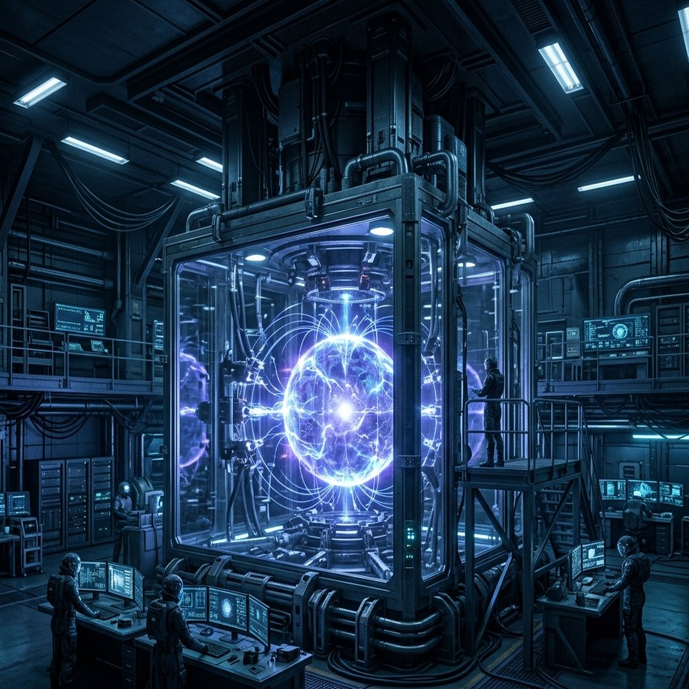

許若昕按下那個按鈕之前猶豫了三秒。在那三秒裡，她想到了陳明哲的信（「你即將犯一個無法挽回的錯誤」），想到了弟弟（死在一個不該被炸的地方），沒有想到兩百四十六年後一個沒有名字的女人會因為這三秒而在軌道城市的走廊裡每天經過一個忘了自己是誰的同事。她按下了按鈕。泡誕生了。

&nbsp;

**2055年9月 · 日內瓦 CERN**

實驗前七十二小時。

偵測器#2的讀數不對。

不是壞了。偵測器#2是她親手校準的——上週四，花了六個小時，用三組獨立基準源交叉比對，每個通道的增益誤差壓到萬分之一以下。它沒有壞。但讀數不對。

環境噪音頻譜。標準掃描。每天一次。結果和過去六個月的基線比對，偏差在正常範圍內。除了一條線。

147.3赫茲。

她把數據拉到第二個螢幕上。頻譜圖。橫軸是頻率。縱軸是功率密度。在147.3赫茲的位置，有一個尖銳的峰值。高出背景噪音約十四個dB。

她檢查了CERN地下隧道的所有機械設備清單。冷卻系統。真空泵。超導磁鐵的電源供應。地面通風設備。每一台機器都有已知的振動頻譜。147.3赫茲不在任何一台機器的頻譜裡。

她用手機查了隔壁實驗室的運行日誌。ATLAS。CMS。LHCb。沒有任何一組實驗在過去七十二小時裡改變過運行模式。

環境源頭排除了。

她又看了一遍波形。

有節奏。不是正弦波的節奏。是一種不均勻但穩定的節奏。短促的脈衝。停頓。脈衝。停頓。間隔在0.7到1.1秒之間。

像鑿刻。

她不知道自己為什麼這樣想。她是粒子物理學家。她每天看的是偵測器讀數、衰變路徑、統計偏差。不是聲音。頻率是數字。數字不會「像」什麼。但這組數字的波形——每一個峰值的上升速度、頂端的平台持續、下降的曲線——像一把刃口在硬物上切入，停住，退出，移位。穩定的。有耐心的。

像一個人在青銅上刻字。

她搖了搖頭。把頻譜圖關掉。打開了下一項校準流程。

&nbsp;

蘇顯宗在五十六小時前把最後一組模擬結果放在她桌上。

厚的。一百三十七頁。他打印出來的。「老師，我知道妳不看電子版。」他說這句話的時候嘴角微微動了一下。不是笑。是一種小心翼翼的幽默。他正在學她的黑色幽默。學得還不太好。但有進步。

她翻到第七十三頁。能量密度模擬。褶痕被LHC產生的能量場放大之後，預期行為：局部時空拓撲翻轉。翻轉範圍：半徑0.5到2.0公尺。翻轉持續時間：0.1到3.0秒。置信區間：百分之九十五。

半徑0.5到2.0公尺。3.0秒以內。

可控的。

她把模擬結果合上。放在桌面左邊。陳明哲的信在桌面右邊。信已經被她讀了太多次了。紙的邊緣碎了更多。每次展開都會掉幾粒纖維。碳素墨水的字跡沒有變。碳不怕手指的溫度。

「你即將犯一個無法挽回的錯誤。」

她知道。

*Irreversible*。她一直在用這個詞。在論文裡用的是「不可逆拓撲事件」。同一個意思。更精確。更安全。放在論文裡不會讓人聯想到道德判斷。

她拿出合成尼古丁棒。走到地面出入口。推開門。九月的日內瓦。三十五度。比三月涼了三度。空氣裡的野火微粒少了一些。天空的白色淡了一點。

她咬住尼古丁棒。吸了一口。薄荷和塑膠的中間值。

她想到嘉偉。

不是「想到」。是嘉偉一直在那裡。在她的動機結構裡。在她的方程式裡。在她按下按鈕之前的三秒裡。不是為了救他。她知道打開摺痕不會讓任何人活過來。是為了確認——那一秒還在。嘉偉的最後一秒。不是消失了。是被折在某個她還沒展開的地方。

她想完了這個念頭。第一次。以前她從來不想完。

完了之後答案是什麼？答案是她不知道。但她知道「不知道」和「不存在」不一樣。她的方程式告訴她的。陳明哲的方程式告訴她的。一千八百年前的二百三十六個座標告訴她的。時間是折的。被折在一起的東西不會消失。它還在。在摺痕裡。

她把尼古丁棒摁滅。轉身。推門。走下樓梯。回到攝氏十八度的地下。

&nbsp;

實驗前四小時。

控制室。七個人。她。蘇顯宗。三名技術員。兩名國際監管委員會的觀察員——按照協議。觀察員坐在控制室後排。不說話。不操作。只記錄。

所有參數。綠。

LHC的加速序列已經啟動。質子束在二十七公里的環形隧道裡繞圈。每秒一萬一千圈。能量在爬升。從基線到目標值大約需要四十五分鐘。

蘇顯宗坐在她左邊。他的手指間距。很大。幾乎攤平。十分的謹慎。

她拿起桌上的咖啡。熱的。剛倒的。喝了一口。正常的溫度。正常的味道。CERN的咖啡機二十五年沒換了。壞了三次。修了三次。機器比大部分的研究計畫都命長。和那個菸灰缸一樣。

「全部綠。」蘇顯宗說。

她點了點頭。

「老師。」他的聲音比平常低。「偵測器#2的那個頻率——」

「147.3。」

「我查了。沒有環境源。我又跑了一次自檢。偵測器正常。」

「結論？」

「它是真的。」他停了一下。「但我不知道它是什麼。」

她看了他一眼。他的表情是認真的。那種把不確定性當成事實來陳述的認真。

「留著。」她說。

蘇顯宗點了點頭。一次。

&nbsp;

實驗前十分鐘。

能量到達目標值。質子束穩定。碰撞點就緒。環形隧道的溫度。超導磁鐵的電流。真空度。全部在範圍內。

她從口袋裡掏出陳明哲的信。不是拿出來讀的。是確認它在那裡。手指碰到信的邊角。紙張粗糙的觸感。一百零八年的纖維。她把手收回來。信留在口袋裡。

「褶痕放大序列。」她說。

蘇顯宗開始輸入指令。手指在鍵盤上。穩定的。今天他的手指間距收到了三分。不是因為不害怕。是因為他做了決定。做了決定的人的手會收攏。她見過。在自己的手上見過。

LHC的能量場開始集中。從碰撞點向外，磁場結構重新配置。不再是粒子碰撞的模式。是褶痕放大的模式——她的方程式預測的那個操作。用能量場沿著已經存在的褶痕施壓。不是創造褶痕。是把一條已經在那裡的、極微弱的褶痕撐開。

「能量場鎖定。」蘇顯宗。

「確認。」技術員一號。

「確認。」技術員二號。

後排的觀察員在寫字。筆在紙上的聲音。在安靜的控制室裡很清楚。

她看著主螢幕。碰撞點的即時影像。超高速攝影機。畫面中央是真空管道的橫截面。鎢靶。粒子束的軌跡在偵測器的重建影像裡顯示為一組彩色的線。

她的手放在控制台上。右手。食指按在一個灰色的按鈕罩蓋上。罩蓋打開。按鈕露出來。紅色。不大。直徑大約兩公分。

她看著它。

&nbsp;

三秒。

第一秒。陳明哲的信。口袋裡。紙的觸感。「你即將犯一個無法挽回的錯誤。」是的。

第二秒。嘉偉。不是他的臉。是他的背影。穿著白T恤走進家門。二十二歲。從那扇門走進去之後就再也沒有走出來。門還在。人不在了。

第三秒。空白。

她按下了按鈕。

&nbsp;

0.7秒。

主螢幕上，碰撞點的位置出現了一個形狀。

球形。

不是粒子碰撞產生的噴注。不是電磁簇射。不是任何標準物理事件的影像。一個球。表面平滑。邊緣清晰。直徑——

「1.3公尺。」蘇顯宗的聲音。帶著一種她從來沒有聽過的音調。不是興奮。不是恐懼。是一個二十六歲的物理學家第一次看見教科書以外的東西時發出的聲音。

球在擴張。

慢的。肉眼可見的慢。從1.3公尺往外。均勻的。每個方向。

球的表面是亮的。不是反射光。是自發光。沒有光源。沒有影子。光在球的內部循環。進去了出不來。出來了回不去。因果律在球的邊界處斷裂。

偵測器的讀數在控制台的副螢幕上跳動。數字。很多數字。太多了。資料流量超過了標準處理管線的容量。緩衝區在填滿。

「資料溢位警告。」技術員三號。

「擴張速率？」

「0.0007公尺每秒。穩定。」

穩定。它在擴張。穩定地擴張。沒有加速。沒有減速。沒有停。

她看著那個球。

*It's real.*

她在心裡說了這句話。英文的。不是因為英文更準確。是因為中文的「真的」有太多層意思。*Real*只有一層。存在。就在那裡。不是模型。不是模擬。不是假設。一個直徑1.3公尺的因果混沌泡在CERN的地下隧道裡誕生了。

潘朵拉的盒子打開了。不是比喻。

她轉過頭。看蘇顯宗。他坐在椅子上。手放在膝蓋上。手指攏在一起。間距零。他的眼睛沒有離開螢幕。嘴唇張開了一點。沒有合上。

「記錄。」她說。「全部記錄。」

蘇顯宗點了點頭。一次。手指開始動。鍵盤的聲音。快。

後排的觀察員站起來了。其中一個拿出手機。另一個走到控制台前面，彎下腰看副螢幕上的數據。他的臉離螢幕很近。螢幕的光照在他的臉上。光是白的。沒有色溫。

球還在那裡。1.37公尺了。還在擴張。穩定地。

她把手從按鈕上移開。按鈕的紅色在控制台的灰色面板上。很小。兩公分直徑。她剛才按下去的力度大約是一公斤。一公斤的力。按下了一個將會覆蓋地球百分之三十面積的東西。

她不知道這件事。現在不知道。

她只知道球在那裡。真的。

&nbsp;

---

&nbsp;

**2301年 · 恆紀軌道城市**

檔案編號：2055-GVA-EXP-001。

她之前看過這個編號。三個月前。在深層資料庫裡找到的。那次她看的是1947年的筆記殘片——嵌在2055年實驗檔案裡的異質文件。她沒有看完。

現在她要看完了。

歷史檔案室。刷卡。燈亮。三面牆的資料終端。地面沒有灰。

她坐下來。打開2055-GVA-EXP-001。

完整檔案。不是上次看的碎片。這次她用了另一組存取權限——修補KR-7的授權等級。修補褶痕需要調閱與該褶痕相關的歷史數據。KR-7的歷史起源追溯到2055年。系統自動開放了完整的實驗紀錄。

影像檔案。時間戳：2055年9月，格林威治標準時間。畫質低——二百四十六年前的攝影技術。但清楚。

她按下播放。

&nbsp;

控制室。七個人。螢幕。控制台。

一個女人坐在控制台前面。黑色頭髮。扎在腦後。沒有散的。穿灰色的實驗室外套。坐姿直。肩膀平。手穩。

她旁邊坐著一個年輕男性。二十多歲。安靜。手放在膝蓋上。

螢幕上有數據。頻率曲線。能量讀數。她看不清數字——解析度不夠。但她看得出數據在變化。曲線在爬升。

那個女人的右手從控制台上移動到一個小型面板上。面板上有一個紅色按鈕。按鈕很小。直徑大概兩公分。

女人的手停在按鈕上方。

一秒。兩秒。三秒。

按下去了。

&nbsp;

畫面切換。碰撞點的攝影。

球。

她看見了。出現在畫面中央。一個圓的東西。表面光滑。自發光。

在二百四十六年前的攝影畫面裡，球的邊緣模糊了一些——鏡頭的對焦範圍不足以處理一個自發光物體的亮度。但形狀是清楚的。圓。均勻。擴張。

影片右下角有數據疊加。直徑：1.3m。她看著那個數字。1.3公尺。

她按了暫停。

畫面停在球出現後大約兩秒的位置。球是1.35公尺了。控制室裡那個年輕男性的嘴巴是張開的。那個女人的手已經離開了按鈕。

官方歷史對這個女人的描述。她讀過。修復局培訓教材第一課。

「極端民族主義科學家。」

「無視國際監管委員會的三次警告。」

「擅自進行未經授權的維度拓撲實驗。」

畫面上的女人。黑色頭髮。灰色外套。坐姿平穩。手穩。

她按下繼續播放。

&nbsp;

球在擴張。影片加速。時間戳在右上角跳動。天。月。年。

球從1.3公尺擴張到10公尺用了四天。從10公尺到100公尺用了三十一天。從100公尺到1公里用了一百四十七天。CERN的地下隧道被吞沒了。地面的建築被吞沒了。日內瓦湖的西岸被吞沒了。

影片的拍攝角度在變。從地面攝影切換到衛星拍攝。從衛星切換到軌道站。球的形狀在地球表面展開。不再是球了。是一個不規則的光區。亮的。沒有影子的亮。太陽照上去不產生陰影。雲飄過不留形狀。

她快轉。時間戳跳躍。

2060年。覆蓋面積：百分之三。

2080年。百分之七。

2120年。百分之十二。

2180年。百分之十九。

2240年。百分之二十五。

2301年。百分之三十。

她按了暫停。

百分之三十。和她每天在工作站螢幕上看到的數字一樣。0.003%的擴張率。穩定的。不加速。不減速。不停。

她把影片倒回去。回到最開始。控制室。七個人。那個女人坐在控制台前面。

她看著那個女人。

黑色頭髮。灰色外套。右手在按鈕上方。一秒。兩秒。三秒。

按下去了。

1.3公尺。

二百四十六年後：地球百分之三十。

&nbsp;

她把影片關掉。

螢幕變暗。歷史檔案室的照明反射在黑色螢幕表面上。她看見自己的臉。模糊的。輪廓。沒有細節。

那個女人的全名。官方記錄裡有。但記錄的措辭是這樣的：「實驗主導者：[分類資訊]。學術身份已被國際科學倫理委員會追溯撤銷。」

沒有全名。

有的只有：「極端民族主義科學家。」

她不知道那個女人的名字。不知道她為什麼按了那個按鈕。不知道她旁邊那個年輕男性是誰。

她站起來。走出歷史檔案室。走廊。腳步聲。回聲。金屬地板。照明均勻。空氣二十一點五度。

回到工作站。坐下。螢幕亮起。標準監測界面。泡擴張率：0.003%。KR-7的147.3赫茲訊號還在。穩定的。乾淨的。

她看著螢幕上的地球。三成是亮的。亮的部分沒有影子。

那就是起點。

1.3公尺。一個女人。一個按鈕。三秒的猶豫。

她看了螢幕很久。

然後她打開日誌。寫：「已調閱2055-GVA-EXP-001完整影像紀錄。與KR-7異常頻率之關聯性需進一步分析。」

存檔。

螢幕暗了一下。系統自動儲存。然後亮回來。

明天：監測。

0.003%。
