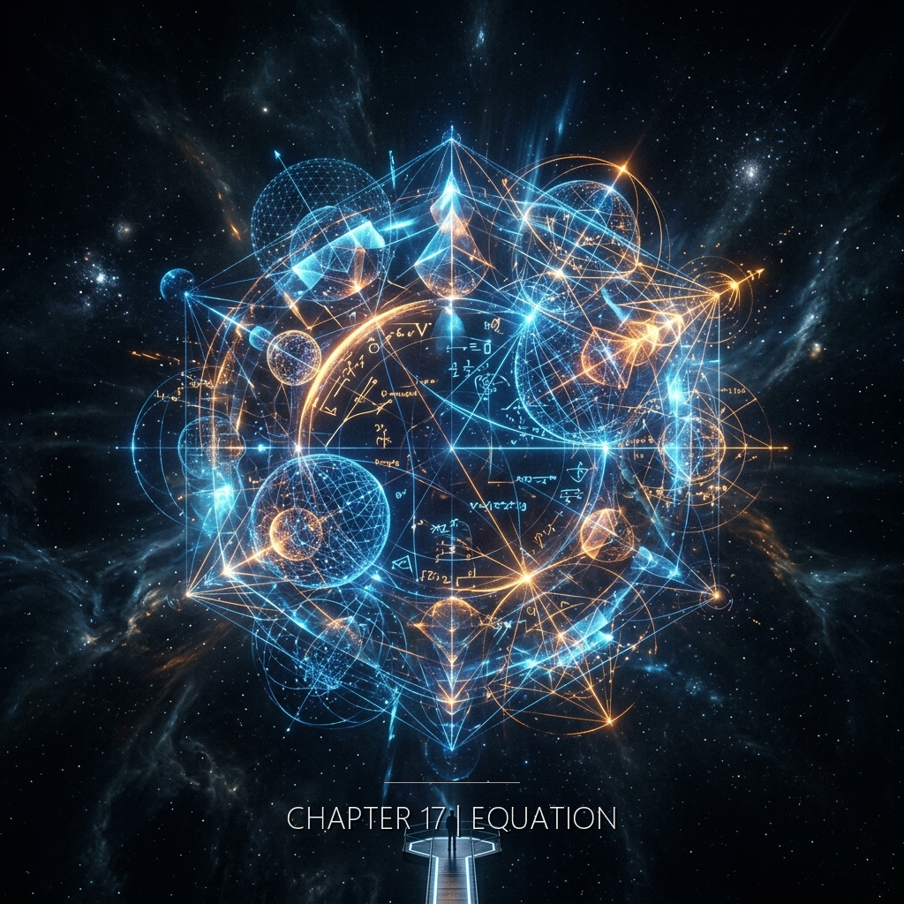

在褶式方程的數學裡有一個步驟是無法被推導的，只能被四個人同時完成——一個在公元169年的夜晚用刀在青銅上刻下了最後一個座標，一個在1947年的牢房裡用手指在空氣中畫出了看不見的曲線，一個在2055年的白板前跳過了一個她無法解釋的步驟，一個在2301年的夢裡想到了一個她以為是自己發明的參數。她們不知道彼此的存在。但方程式知道。方程式一直都知道。因為方程式描述的不只是時間如何摺疊——它描述的是它自己如何被四個人在四個不同的時代裡，一步一步地，寫出來。

&nbsp;

**公元169年 · 洛陽靈台**

所有的事都做完了。

二百三十六個座標刻在渾天儀底座的內壁上。每一個凹點的深度一致。位置精確。銅屑已經擦掉。刻刀回到布套裡。磨石放在最下面。一壺機油塞在角落。匣子合上。鎖扣扣好。

她站在觀測室裡。窗外的天空正在從黑轉灰。東方有一道線——不是光。是光的預兆。還沒亮。但黑色在退。

昨夜沒有閃光。

她不知道以後還會不會有。兩年零七個月。二百三十六次。也許明天還有。也許不會了。也許閃光和她一樣——該做的做完了，就不再來。

匣子放在觀測室的架子上。架子是木頭的。靠牆。匣子是銅的。小。大約一個手掌長、半個手掌寬。她每天把它從架子上取下來、打開、取出底座、刻一個或兩個座標、放回去、鎖好。三年。這套動作她做了三年。身體記住了每一個步驟的重量和角度——匣子的重量，鎖扣的彈力，底座從匣子裡取出時需要向左傾斜三度才能滑出來。

她把手掌按在匣子的蓋面上。

金屬是冷的。清晨。銅的溫度比空氣低。她的手掌覆蓋住匣子的中央。指尖碰到蓋面邊緣的銅釘。食指的繭正好壓在第二顆釘子上。

然後有什麼碰了她一下。

不是物理上的碰觸。房間裡沒有人。門是關的。風從窗口進來但風碰不到這裡。不是掉落的東西。不是震動。是一種——到達。像什麼人從非常遠的地方，穿過了她不知道的距離，在這一刻剛好抵達了她站著的位置。

碰在她的手背上。

輕的。沒有溫度。或者有——但那個溫度不是外部的。是她自己的手掌突然變熱了。從手心開始，向外擴散，經過掌紋，蔓延到指根。均勻的熱。像有人把手覆蓋在她的手背上。

她想哭。

沒有理由。所有的事都做完了。座標安全了。匣子鎖好了。她沒有被發現。她沒有理由在這個清晨站在觀測室裡流淚。

但眼睛發酸。酸的位置在眼角的上方。淚腺。她知道那個位置。她不知道為什麼那個位置在這一刻被啟動了。像收到了什麼——不是消息。不是聲音。是一種確認。像有人在很遠的地方看見了她做的事。看見了那些座標。看見了二百三十六個點。看見了那個她不知道自己為什麼知道的第二百三十六個位置。有人看見了。

有人在。

她不知道是誰。不知道在哪裡。不知道在什麼時候。但她感覺到了——有人在。

她沒有哭。

眼睛的酸在大約五秒後退去了。像有人把手收回去了。

她把手從匣子上拿開。手掌的溫度在消退。銅面上有她手掌留下的一小塊霧氣——呼吸一樣薄，一秒就散了。

她走出觀測室。走廊安靜。腳步聲是她自己的。清晨的靈台只有更鼓的殘響和銅漏壺的水聲。

她忽然停下來。

那個溫度——那個從匣子傳過來的、不屬於她的溫度——她方才理解了一件事：那不是保存。那是**使用**。有人正在使用她刻下的那些點。座標不是被埋起來等人發現。座標正在某個她看不見的地方被讀。被算。被用。

她的工作沒有結束。她的工作只是遞出去了。

&nbsp;

**1947年4月 · 鹿港牢房**

牢房的地面是石頭。涼的。粗糙的。他坐在角落裡。背靠牆壁。牆壁也是石頭。兩種溫度——地面的涼和牆壁的涼——在他的脊椎底端匯合。

沒有窗。

光從門板下方的縫隙裡進來。一條線。寬度大約一指。白天的時候那條線是亮的。現在是暗的。所以是晚上。或者是陰天。他分不清。

他坐了多久了。他不確定。被帶進來之後審訊了一次。然後回到牢房。沒有人再來。門外有人。偶爾有腳步聲。偶爾有咳嗽聲。一個人的咳嗽。聲音低沉。帶痰。

他在算。

他的大腦在這種狀態下不會停止。這是它的運作方式。京都六年的訓練。每天早晨醒來之前他的大腦就已經在算了——在半夢半醒的狀態裡繼續昨晚沒有推完的步驟。有時候他醒過來的時候，答案已經在那裡了。不是完整的。是一個形狀。一個輪廓。像從很深的水裡浮上來的東西，只露出頂端。

褶式方程。最後三步。

筆記本不在了。被軍官收走了。但方程式在他的腦子裡。每一個符號。每一行展開式。每一個邊界條件和自由參數。他記得它們的方式不是記憶——是質地。他摸得到那些符號。感覺得到它們的重量和紋理。像匠人記得木頭的紋路。像林秀英記得學生名字的順序。

第一步。展開項。

褶式方程的核心不是把時間比喻成一張紙。那只是他在筆記第一頁用來讓自己靠近問題的圖像。真正的結構比圖像更冷：四組本來不該相接的座標，在同一組邊界條件下互相約束。不是傳遞。是接觸。

展開項把這個摺疊結構用數學語言打開。每一摺是一個算符。每一個接觸面是一組邊界條件。他在腦子裡把展開項的前八個項都排列好了。第九個項是他在筆記本第三十二頁寫到一半被腳步聲打斷的那個。他現在在腦子裡繼續。第九項。第十項。收斂了。展開項收斂了。

第二步。邊界條件替換。

他把236個座標的值代入邊界條件。不是一個一個代入——他做不到，他沒有紙。他用一種他在京都學到的方法：把座標的統計特徵代入。平均值。標準差。空間分布的傅立葉分量。前四個分量他記得很精確。後面的模糊了一些。但足夠了。邊界條件在替換之後簡化了。自由參數*d*消失了——被座標的幾何約束消掉了。不是零。是被吸收了。*d*不是外部參數。*d*是摺疊本身的一部分。

他的手在空氣中畫。

右手。食指伸出。在黑暗裡描繪。他畫的不是文字。不是符號。是一個形狀——方程式的幾何形狀。一個摺疊的結構。手指在空中彎曲、迴旋、交叉。像在描繪一張看不見的紙的所有褶痕。

第三步。

最後一步。他需要把前兩步的結果代入薛丁格方程的非標準形式——那個他在筆記本裡做了座標變換的形式。變換後的方程有一個特殊的對稱性。他看見了那個對稱性。不是用眼睛。是用手指在空氣中畫出來的那一刻，對稱性從黑暗裡顯現了。

幾乎了。

答案有一個形狀。他摸得到它。不是圓的。不是方的。是一種他沒有詞可以描述的結構——同時存在於所有時間的結構。摺疊的。閉合的。自指的。方程式的解描述了方程式本身如何被寫出來。

但最後一步。最後一步他還差一個參數。一個座標。一個值。

他的手在空中停了。手指懸在黑暗裡。指尖微微發涼。

他知道那個值在某個地方。不在他的筆記本裡。不在他的腦子裡。在別的地方。在一個他到不了的地方。

他把手放下。靠回牆壁。石頭的涼從背脊滲進來。

門板下方的光線暗了又亮了。有人從門外走過。腳步聲遠去了。

*Mō sukoshi*。再一點點就到了。

他閉上眼睛。他不知道明天是什麼日子。他不知道還有沒有明天。但方程式在他的腦子裡是完整的——幾乎完整的。差一步。帶著這個「幾乎」，他在石頭地面上坐著，背靠石頭牆壁，在牢房裡等。

然後他意識到一件事。

他不是一個人在寫這個方程。

他推導的每一步都有一個形狀——一個他以為是他自己推出來的形狀。但那些符號、那些邊界條件、那個他無意識寫下然後劃掉的圖案——都不是他一個人的。**方程在另外幾個時代裡同時被寫著。** 他只是這個寫作的一部分。

他笑了一下。薄薄的笑。

他從來不是孤獨的推導者。他是一個合寫者。

&nbsp;

**2055年 · 日內瓦 CERN**

因果混沌泡的直徑已經擴張到七公尺。

CERN地下走廊B-7區段被封鎖。黃色警戒線後退了三次。第一次在實驗後第二天。第二次在第五天。第三次在今天——第十一天。泡的擴張速度穩定。每二十四小時增加約0.3公尺。數學上可預測。她的模型預測了這個速度。模型是對的。模型一直都是對的。

許若昕站在最新的警戒線後面。黃色塑膠帶在空調的氣流裡微微抖動。泡在她前方四公尺處。

它是半透明的。但「半透明」不是準確的描述——光穿過它的方式不是線性的。光進入泡的表面之後不再沿直線行進。它折返。迴旋。疊加。從泡的內部出來的光攜帶著和進入時不同的頻率。像一個人走進一間房間，出來的時候穿著不同的衣服。

她看著泡。

大部分時候泡的內部看起來是一種混沌的光影——亮暗交替，沒有穩定的圖案。非線性光學干涉。她在上週的報告裡用的就是這個詞。蘇顯宗幫她做了頻譜分析。結論是泡內的光包含了至少七個不同時間戳的光子群——這意味著泡內的光同時來自不同的時間。

但今天她看見了別的。

她稍微移動了位置。向左一步。視角變了大約三度。

泡內的光影重新排列了。

兩個影子。

一個在刻東西。姿態穩定。工具握在右手。工具的尖端在一個弧形的表面上移動——刻一下，停，移位，再刻一下。動作很慢。很有耐心。像一個知道自己在做最後一件事的人。

另一個在寫東西。手在平面上快速移動。不是紙——是某種她看不清的材質。手的動作偶爾停頓。停頓的時候手懸在表面上方，像在思考。然後落下。繼續寫。

許若昕不動。

她知道泡內沒有人。那些影子是光的干涉圖案——不同時間的光疊加在一起產生的類人形結構。她的論文裡會寫 *non-linear optical interference pattern exhibiting anthropomorphic structures*。她知道這些。

但她站在那裡。看著刻東西的人。看著寫東西的人。她不知道自己為什麼覺得認識他們。不是「認識」——是一種更深的東西。像她看著自己的兩隻手，一隻在刻，一隻在寫。不是她。但也不完全不是她。

刻東西的人轉了一下頭。

她的呼吸停了半拍。

那不是真實的動作——光的干涉圖案不會有方向性。但她看見了。一個轉頭的姿態。像有人感覺到被注視了。

然後光影重新排列。影子溶解了。泡的表面回到混沌的亮暗交替。

她退後一步。

泡的表面反射了走廊的光。在那個反射裡，她看見了自己的臉。扭曲的。非線性的。像被摺疊過的紙上的一個圖案。

「你有看到嗎？」她問。

蘇顯宗站在她身後三步的位置。他搖頭。「看到什麼？」

她看了他一眼。二十六歲。鹿港人。安靜的眼睛。他站在警戒線後面的姿態是一個學生的姿態——等著被告知應該看哪裡。

「沒有。」她說。「*Nothing*。光學干涉。」

她轉身走回控制室。沒有再回頭。但她的手——她注意到自己的右手——在走路的時候微微握了一下。像在握一把不存在的刻刀。

她走到白板前。站住。

剛才泡裡的兩個影子。她突然明白了一件她之前沒看清的事——那兩個影子不是在**看她**。他們在**做**。一個在刻，一個在寫。他們沒有抬頭。沒有注意到她。他們在繼續自己的工作。

她和他們不是觀察關係。他們是**同事**。在同一張白板上，從四個方向各自寫著同一個方程式。

她拿起筆。沒有擦。在第四十七步旁邊，加上了一行小字：「*co-authored*。」

&nbsp;

**2301年 · 恆紀軌道城市**

監測系統的數據流穩定輸出。

褶痕KR-7的結構圖在主螢幕上緩慢旋轉。標準三維渲染。色標從藍到紅。藍色是穩定區域。紅色是高張力區域——摺痕正在擴張的方向。大部分是藍。KR-7在過去七十二小時裡沒有顯著變化。

縫工坐在工作台前。

她已經看了三天。不是看KR-7的擴張數據。是看KR-7結構圖裡嵌著的一組座標排列。

那組座標不屬於修復局的標準系統。來源標記遺失。沒有人知道是誰、在什麼時候、用什麼方法把這些座標嵌入了KR-7的基礎監測架構。它們存在於系統的底層——不是作為數據，而是作為結構的一部分。像建築物的地基裡嵌著的石頭——你不會注意到它們，除非你把地板挖開。

她挖開了。

三天前她在做例行維護的時候注意到一個異常：KR-7的渲染速度比其他褶痕的渲染慢了0.7毫秒。不是硬體問題。是數據量。KR-7的底層數據比標準格式多了一組——一組被嵌入監測架構本身的座標陣列。

她把座標提取出來。236個點。

三維空間中的分布。她跑了標準分析。沒有已知的天體對應。沒有已知的褶痕結構對應。236個點在三維空間裡看起來是隨機的。

但它們不是隨機的。她知道。因為隨機不會被嵌入監測系統的基礎架構。有人放了它們在那裡。有人用她不理解的方式，把236個座標刻進了她每天使用的系統的骨頭裡。

她從歷史資料庫調出了那份1947年的物理筆記掃描。檔案編號2055-GVA-ORIG-SUB7。筆記本第七頁。手繪座標圖。236個點。

她把兩組座標疊在一起。

螢幕上的渲染花了1.2秒。比她預期的長。數據量太大了。兩組各236個點，要計算空間匹配度。

結果出來了。

完全吻合。

236個點。三維空間座標。1800年前刻在青銅器上的。1947年被一個物理學者辨認出來的。2055年被一個實驗物理學家用來校準模型的。2301年嵌在她每天使用的監測系統底層裡。

同一組座標。跨越了2135年。從青銅到竹漿紙到數位掃描到監測系統架構。載體變了四次。座標沒有變。

她坐在工作台前。光源恆定。螢幕的光是白的。沒有影子。

她想哭。

她不知道為什麼。這是數據。236個座標匹配。計算結果。螢幕上的數字。數據不應該讓人想哭。

眼睛發酸。酸的位置在眼角上方。胸腔的溫度升高了。不是體表的。是內部的。來源：不明。

她坐了很久。螢幕上的匹配結果沒有變。236/236。100%。

她把匹配結果存進加密目錄。檔案名稱：KR-7-COORD-MATCH。沒有備註。沒有分析。

她沒有記錄那個感覺。

日誌裡她寫的是：「KR-7底層座標陣列提取完成。與歷史檔案2055-GVA-ORIG-SUB7比對。匹配率100%。」

她沒有寫眼睛發酸。沒有寫溫度。那些不是數據。那些不屬於日誌。

她關閉螢幕。

光源恆定。工作台的表面是灰色的。她的手放在桌面上。兩隻手。指甲短。皮膚在恆定光源下是均勻的顏色。

她打開另一個視窗：修復局的基礎監測程式碼。第三層濾波演算法。她每天維護的那一段。

她搜尋 KR-7 的衰減參數。然後拉出底層數據的初始化序列——那些在她來到修復局之前就寫好的常數，沒有人知道出處。

236 個數字。

一樣。

她靠回椅背。眼睛看著天花板。這意味著她每天都在操作這組座標。她修改的每一個參數，都是在那 236 個點的基礎上做微調。她的整個工作——包括她縮小攔截半徑的三個月——都是在這236個點的基礎上做微調。

數字在那裡。等某個人找到它們。

她站起來。走出監測室。走廊的光也是恆定的。沒有窗。沒有外面。她的腳步聲在走廊裡回響。均勻的。

螢幕。數字。光。恆定。
