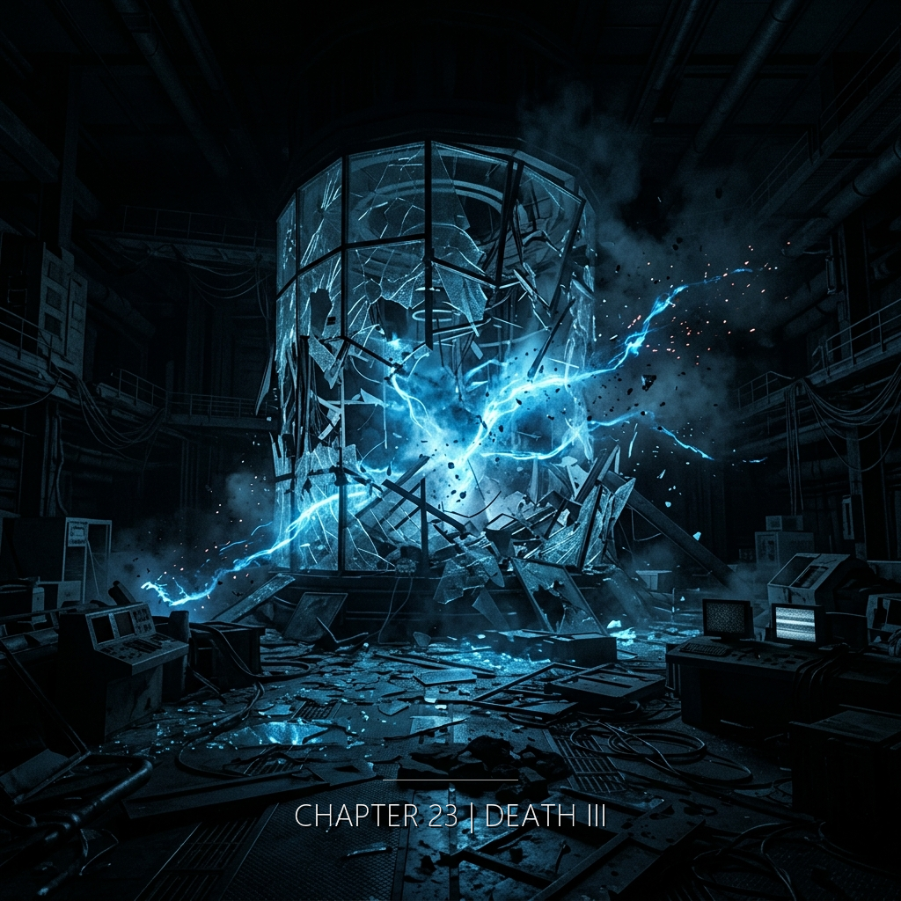

許若昕走向停車場的時候手裡拿著一封來自1947年的信，信的作者已經死了一百零八年，而那封信將會在爆炸中倖存——紙張邊緣焦黑，字跡完好——就像真相總是在暴力中倖存，不是因為它堅固，而是因為暴力從來不知道該燒什麼。

---

**2055年11月 · 日內瓦 CERN**

**2301年 · 恆紀**

---

她從B棟地面出口走出來。天空是那種只有瑞士十一月才有的藍，乾淨得像被誰用布擦過。停車場在右手邊，五十公尺。她左口袋裡放著那封信，折了三折，已經帶在身上一個月了。今天早上出門時她把它拿出來，不是出於預感，只是想在開車回家的路上，等紅燈的時候，再讀一次最後那一段。

縫工打開最終錨點部署確認畫面。四個錨點，全部上線，綠燈。她把終端的亮度調低一格——不是為了省電，是為了讓眼睛習慣即將到來的黑暗。恆紀的空氣總是乾的，她的指尖在觸控板上留下一層薄薄的油印，像是某種自我背叛。她讀了一遍部署日誌，又讀了一遍。沒有錯誤。

她把鑰匙握在右手，左手還握著信。信的紙張很薄——1947年的紙，七個人從上海帶到台北，從台北帶到新竹，從新竹帶到日內瓦——薄得像快要變成空氣。她想：如果信會說話，此刻它應該說什麼？大概只會說「妳遲到了。」她笑了一下。風從阿爾卑斯方向吹過來，很涼。

縫工切換到監控系統主頻道。攔截系統有效半徑：23.7公尺。她在螢幕旁邊寫了一個小數字——2.3——用指尖，不留痕跡。還差2.3公尺。她知道這2.3公尺意味著什麼：她自己站的位置，必須比計算的安全線再往前一步。她把這件事寫進日誌，又把它從日誌裡刪掉。

她看到他的時候，距離停車場入口還有二十公尺。年輕的男人，從B棟西側走廊走出來。她在監視器畫面裡見過這條走廊——那是她上週在整理異常訪客紀錄時順手看過的。男人走得很慢，頭低著，手裡拿著什麼。嘴唇在動。她沒聽見聲音，但她看得出來——他在禱告。

縫工調出許若昕的完整實驗資料。不是官方版本，是原始版本。她看過很多次了，但她每次都從頭讀。她知道為什麼這個女人做了那場實驗。不是為了科學。是為了一個弟弟。一個二十二歲的、清大電機系、在新竹死於某個下午的、正在準備期末考的弟弟。

以利亞。她不知道他的名字，但她看過他的眼睛。那是一種她熟悉的眼睛——相信自己正在做正確的事情。因果律是神的創造。打開那道門的人，應當由打開的人關上。他抬起頭，看見她。兩個人之間隔著停車場的鐵欄、一排種了一半的樹、一輛剛駛過的黑色Audi。她忽然覺得她應該跑。但她沒有。

縫工調出許若昕弟弟的資料。許若賢。二十二歲。新竹光復路段。2047年的那個午後。她讀了三遍。她的手指停在「父母在告別式上沒有哭」這一行上。她想起自己的母親——不，她沒有母親。恆紀的縫工沒有母親。她們從資料裡被接生。但她此刻仍然記得某種、像是被人摸過頭髮的感覺。

她走到停車場入口。柏油路面上有一道白色分隔線，她剛踩過去。左口袋裡的信被風吹得鼓起來又貼回去。她伸手到右口袋裡拿鑰匙——車鑰匙，那種老式的、有金屬片的、她堅持不換成指紋的——因為陳明哲在信裡寫過，「真正的鑰匙應該是可以被看見的東西」。她笑了一下。她想：陳明哲，你這個老頑固。

縫工把手放在啟動鍵上。攔截系統需要三秒鐘充能。三秒鐘在恆紀是很長的時間——夠她把所有想後悔的事情想完一遍，再把它們全部駁回。她想起許若昕的最後一張照片，是CERN B棟門口的安全攝影機拍的。照片裡那個女人抬起頭看天空。縫工每次看都在想：她看到了什麼？是藍色嗎？

爆炸從左後方傳來。距離她三公尺。不是直接命中——是碎片。金屬和混凝土的碎片。她被推倒在地。左耳消失了。右耳在響。她的臉貼著地面，她看見停車場地面上一粒很小的石子，石子旁邊有一隻螞蟻。十一月的螞蟻。真奇怪。牠沒有停下來。

縫工按下啟動鍵。三個綠燈變成紅燈。攔截系統開始運作。她看著螢幕上的倒數——00:47:32——四十七分鐘，她自己的時間。她沒有從椅子上站起來。她沒有做任何戲劇性的動作。她只是把許若昕那份資料的最後一頁，從右邊翻到左邊，像翻完一本書最後一頁那樣，輕輕地。

她慢慢翻過身來。天空是藍色的。應該有煙。為什麼沒有煙？她想找煙。她以為爆炸就是要有煙的。後來她想——煙大概在她的左邊，她看不到。她的左眼視野邊緣是黑的。她不確定那是血還是什麼別的。她試著轉頭，但她的脖子不太聽話了。

縫工站起來，走到資料室最後一排。她從架子上抽出一本實體筆記。她有很多年沒有用實體筆記了——恆紀不提倡紙——但她留著這一本。她把筆記攤開在地板上，用指甲在第一頁劃下一道淺痕。這是她給下一任縫工的標記。她沒有留下名字。她留下的是一個弟弟的名字——許若賢——因為她覺得，這個名字應該被人記得。

背在痛。不多。很奇怪。應該更痛才對。她嘗試動一下手指——手指還在。她嘗試動腳——腳也還在。她忽然非常、非常荒謬地想笑。*真的很荒謬。**開門的人被門炸死了。*她真的笑出聲——不，她不確定她有沒有發出聲音。她的嘴唇動了。就這樣。

縫工回到終端前。她把許若昕那份資料的最後一段，複製到自己的日誌裡。不是為了留念。是為了在她自己被擦掉之後，這段文字還能在某個地方存活。她寫：「她知道這會殺了她。她還是做了。換我，我也會。」她把這句話加密，鑰匙是那個弟弟的生日。沒有人找得到，但有人可以找到。

陳明哲的信是對的。她知道她會被攻擊。她知道打開這扇門的人會被找上。她還是做了。她會再做一次。因為這不是勇敢——這是她唯一知道怎麼活著的方式。

縫工把加密日誌傳到第四個錨點。錨點確認接收。她靠在椅背上，吸了一口氣。空氣有鐵的味道，大概是她自己的血——她的左手腕在之前的部署裡受過一次小傷，一直沒癒合好。她想：在我死之前，至少讓許若昕不是白白死的。她又想：但她本來就不是白白死的。她是被選中的。被她自己選中的。

她的弟弟。二十二歲。清大電機。那天他在準備期末考。她記得他前一天還打電話跟她抱怨熱力學。他說：「姊，熱力學是反人類的。」她說：「熱力學只是很誠實而已。」他笑了。那是她最後一次聽見他笑。她希望——她希望他知道她找到了。不是找到他。是找到了那個早晨還存在於某個地方。折疊著。沒有消失。

縫工在終端上寫下最後一行字：「第三折已閉合。請繼續。」她沒有署名。她想起一百多年前有一個女人，在日內瓦的一個停車場裡，手裡拿著一封1947年的信。她想像那個女人的最後一眼看見的是什麼。她希望——她希望那個女人看見了她。雖然那不符合物理。雖然那是不可能的。

然後她看見了。不是用眼睛。是用某個她叫不出名字的器官。一個女人。跪著。面朝東方。手裡有工具。青銅的聲音一下一下傳過來，很清楚，比她自己的呼吸還清楚。那個女人抬起頭。她們對上了眼睛。

縫工愣了幾秒。然後她笑了。她從來沒有笑過，至少不是這樣笑。她說了一句話，很小聲，連她自己都快聽不見：「原來你在。」

縫工把目光從終端移開。她站起來，走到資料室的窗戶旁邊。恆紀沒有日落，但此刻天空的顏色忽然變了——從灰藍變成某種、像琥珀一樣的黃。她知道這不是真的。這是系統給她的最後一份禮物，或者是她自己的幻覺。她不在乎是哪一個。她閉上眼睛。她聽見鑿子的聲音。

信在地上。左口袋被拉出來了。信的紙角上有血。但字沒有被蓋住。陳明哲的字，七十八年前寫的，墨水已經褪成咖啡色，但每一筆都還看得清楚。她的視野越來越窄。她想伸手去撿那封信，但她的手已經不聽話了。沒關係。她想。信會自己活下去。信比她更耐炸。

縫工睜開眼睛。終端上的倒數變成了00:00:00。她知道時間到了。她坐回椅子上——她決定坐著，而不是站著——因為她想，死亡應該像讀完一本書那樣，合上，放下，而不是像逃跑。她把手放在膝蓋上。她想起那個跪在青銅前的女人。她想：那個女人也是坐著的嗎？大概不是。大概是跪著的。

她看見弟弟。不是幻覺——或者是幻覺，但沒差別。弟弟穿著那件洗到發白的清大T恤。弟弟手裡拿著一本熱力學課本。弟弟說：「姊，妳怎麼也來了？」她想回答，但她的喉嚨裡有東西。她笑了一下。她用嘴型說：「我找到了。」

縫工閉上眼睛。攔截系統發出一個低頻的嗡鳴——不是警報，是運作的聲音。她知道，在某個很遠的時空裡，有一個女人剛剛死在日內瓦的停車場。她知道，那個女人的死換來了她此刻的呼吸。這就是縫。這就是她的名字。

她最後看見的不是天空，不是弟弟，不是那個跪著的女人。她最後看見的是那封信。信躺在她身邊，紙角焦了，像是被火舔過但沒有被吞下去。她想——陳明哲，你看，你的紙真的比我耐用。她的嘴角動了一下。那是一個笑。很短。沒有人看見。

信沒有燒壞。
