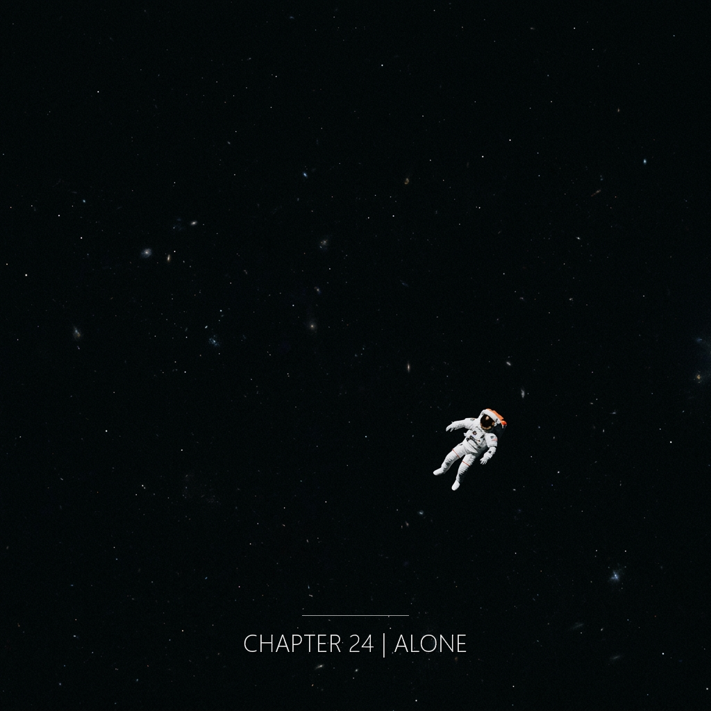

在縫工修改攔截系統的第七十三天——也是她寫下最後一份假裝平靜的工作日誌的那天——她聽見了三個不屬於她的聲音：刻刻的聲音、海浪聲、和一個英文單詞的回音，但她不知道那些聲音來自三個已經死去的人，就像她不知道她即將走進的那個泡，就是她們死亡的折疊。

---

2301年。恆紀。

她起床。穿制服。吃一份定量配給。走出宿舍。

從宿舍到修復局，三百二十步。她數過。連續九百天數過。誤差不超過兩步。

走廊的地面有一道裂縫。在第四十七步的位置。細。三公分長。她的左腳會自動跨過去。她已經不記得自己在避開它。

第一百九十二步，燈影最長的那個位置。她會在那裡呼一口氣。不深。只是一次正常的呼吸，恰好落在那個位置。九百天了。每一天都落在那個位置。

走廊的燈是白的。均勻。每隔三點六公尺一盞。她經過時，影子落在左牆。一盞燈下，影子短。經過的途中，影子拉長。到下一盞燈前，影子最長。然後新的燈把新的影子壓回去。

這個過程重複八十九次，她到修復局門口。

修復局的金屬門把永遠是同一個溫度。不冷。不熱。她的手掌碰上去的時候，感覺不到接觸。只感覺到她自己的手。

她的腳步在走廊裡有回音。左、右、左、右。第三步和第四步之間的間隔比其他都略短一點——她年輕時踝關節受過傷。九百天裡，這個回音從未變過。

她打卡。指紋。虹膜。聲紋。

「技術員 縫工，核准進入。」

在打卡之前，她會在心裡數出「三」。不是數步——三百二十步她走完了。是另一個「三」。她不知道為什麼。她從不數出聲。只有那一個音節，落在她沒注意的地方。

她進入監測室。坐下。

螢幕亮起。摺痕共振曲線。攔截系統參數。錨點陣列狀態。一切正常。

她開始工作。

---

工作的第一個小時，她聽見了刻刻聲。

金屬敲擊金屬。有節奏。像很遠的地方，有人在堅硬的東西上雕刻。

她抬起頭。監測室裡沒有人。沒有金屬工具。沒有任何活動的機械。

聲音繼續。一下。停。一下。停。兩下連著。停。

然後她聞到一種氣味。青銅被加熱過，又冷卻。

這種氣味在2301年的恆紀不存在。恆紀已經六百年沒有明火鍛造。所有金屬加工都在封閉真空爐裡。

她記下這個現象。不記在官方日誌。記在自己的筆記上。第四十七次出現。

她沒有寫「為什麼」。她只寫：刻刻聲。青銅氣味。持續三分鐘。消失。

第四十九次出現，是在午休後十二分鐘。節奏比前幾次稍快。她記下：頻率略增。

第五十一次，氣味裡多了一種她無法命名的東西——像潮濕的石頭。她記下：氣味第二層，未識別。

---

第二個小時，她轉身去拿水。

在她轉過身的瞬間，一組數字出現在她腦中。

不是她熟悉的常數。不是修復局任何參數。不是摺痕振幅。不是錨點座標。不是共振頻率。

是一個更老的計算。手寫的。潦草的。符號她不認識——有些像古文明的數學，有些像更早的符號系統。她沒學過這些符號。恆紀的教育系統兩百年前就把這類符號刪除了。

那組數字在她腦中停留了四秒。然後消失。

接著是海浪聲。

不是人工製造的白噪音。是真的海浪——有鹽味，有潮汐的節奏，有遠處海鳥的叫聲，有風把浪頭撕開的細碎聲。

縫工出生在軌道平台。她沒見過地球的海。恆紀的地球也沒有海——六百年的恆溫政策，海早就乾了，變成灰色的鹽盆。

她記下：手寫數字。古代符號。海浪聲。持續七秒。消失。

她沒有寫「為什麼」。

兩週後。數字再次出現。這次只有兩個符號。她沒有認出來。海浪聲跟著來——這次更近。近到她可以聽見浪碎在石頭上的聲音。她記下：距離縮短。

又過了九天。數字來得更久。十一秒。海浪聲裡多了一個人的呼吸。很輕。不是她的。她記下：呼吸，非本人。

---

第三次殘響最少出現。大約每七天一次。

她閉上眼睛。

就會看見一種藍。

不是恆紀的人工天空藍——那是經過校色的，飽和度永遠在62到64之間。

是另一種藍。厚。不均勻。有顆粒感。像某樣東西剛在這片藍底下爆炸過，但煙已經散了。藍的中心有一個淡淡的餘白——像光還沒散完的痕跡。

然後在那片藍的正中央，一個英文單詞在回音：

*complete.*

她不知道那是什麼意思。她的英文教育只到技術詞彙。*complete* 不在修復局的標準詞表裡。

她記下：藍色。*complete*。持續兩秒。消失。

她沒有寫「為什麼」。

第八次。藍的邊緣多了一圈淡淡的灰。*complete* 的回音重複了兩次。她記下：回音次數增加。

第十一次。藍裡混進了一點紙的氣味。燒過的紙，但沒有燒完。*complete* 這次沒有回音，只是一個停頓。她記下：回音消失，停頓存在。

---

她沒有寫「為什麼」，因為她不問為什麼。

她只問：如何。

具體地、可操作地——**如何**。

---

九十天前，她決定了一件事。

她沒有把那件事寫進任何日誌。她只開始做。

每天，她修改攔截系統的一個參數。

振幅偏移：向內0.2公尺。
方向校準：收縮0.2公尺。
備註欄：「年度衰減校準，標準程序。」

每一次修改都在正常維護範圍內。沒有觸發任何警報。沒有引起任何複查。AI系統Henji-7也沒有標記異常——因為每一次0.2公尺都在它的容錯區間內。

第一天，攔截線在200公尺。
第二天，199.8。
第三天，199.6。
第四天，199.4。

……

第二十六天，194.8公尺。Henji-7跳出一個邊界警告。沒有觸發警報，只是一個黃色的閃爍提示。閃了三秒。她沒有反應。她繼續工作。警告自動歸檔。

第四十四天，休息時間。她回到宿舍，坐在床邊。她發現自己的右手正在桌上寫字。「還剩一百二十四公尺」。她看著自己的手寫完那行字。她把紙撕掉。她沒有記下這件事。

第六十八天，她的手在確認鍵上停了一下。那天的修改是0.3公尺，不是0.2。她多調了一位小數。她看著螢幕。三秒後她改回0.2。送出。沒有人發現。隔天她恢復正常節奏。她在筆記上記：誤差一次。已修正。

第八十三天，4.2公尺。她的手在確認鍵上停了一次呼吸的時間。然後她按下去。

第八十九天，3.2公尺。
第九十天，3.0公尺。

九十天。從200公尺，收到3公尺。

3公尺是什麼？

3公尺是，當2301年9月14日下午的共振到達臨界時，攔截系統會在她的身體周圍3公尺處啟動——而她，在那個時刻，會剛好站在臨界點上。

她算過。精確到秒。

攔截系統不會殺她。攔截系統是設計來「修正」的——遇到異常意識，就施加認知校正。切掉一部分，保留剩下的。

但在3公尺的距離，修正場不夠強。它會錯過她。

而摺痕共振會不會錯過她？

不會。

---

她沒有寫「如果這樣會怎樣」。

她只寫了工作日誌。

---

2301年9月14日。

下午14:03。

她寫下最後一份日誌：

「2301.09.14 | 技術員末班記錄 | 摺痕共振預計4小時內到達臨界。錨點部署完成。如無意外，修復序列將自動啟動。後續監測請移交AI系統Henji-7。——縫工」

她讀了一遍。

語氣和過去九百天的每一份日誌一樣。冷。準確。沒有多餘的詞。沒有情緒。沒有預示。

「如無意外」是系統範本裡的預設用語。所有末班日誌的結尾都是這一句。她沒有改。

她按下送出鍵。

日誌上傳。

---

14:07。

她站起來。

整理制服。沒有特別整理——只是把袖口拉直，這是她每天離開監測室時的習慣動作。

她關掉個人終端。關機程序三十秒。藍色指示燈由亮轉滅。

她走出監測室。

---

走廊。白色。燈。三點六公尺一盞。

她的影子在左牆。

這一次她沒有數步。

---

電梯。

她按下「地面層」。

電梯下降十二層——修復局總部建在地下。下降時間十一秒。

電梯門開。

---

通道。

通道的盡頭是氣閘。

氣閘後面是地面。

---

她沒有遲疑。

她輸入權限碼。氣閘內艙開啟。她走進去。門在她身後關閉。

真空泵啟動。內艙壓力降至外部大氣一致。

外艙開啟。

地面的風灌進來。

風是乾的。帶著地表塵土的氣味。恆紀的地表六百年沒有雨，土壤像粉。

她走出去。

---

地面上。

天空是人工的藍。太陽位置校準在下午14:22。

她看了一眼天空。

沒有特別的感覺。她只是確認了位置——攔截系統的錨點標誌在她正前方七公尺。摺痕的臨界點在錨點正中央。

她開始走。

第一步。
第二步。
第三步。

她的制服在風中有很輕微的抖動。

第四步。
第五步。

她的呼吸平穩。心率沒有明顯變化。

第六步。
第七步。

她走到離攔截線3公尺的位置。

---

攔截系統的警報響起。

不是對她的警報——是對**距離**的警報。系統偵測到意識體進入摺痕臨界範圍。預設程序是啟動修正場。

修正場啟動了。

但在3公尺的距離，它的強度只剩下17%。

17%不夠切斷一個完整的意識。

它只抓到了她的邊緣。

---

**來不及了。**

她最後的一個念頭。

不是恐懼。不是猶豫。不是「如果我剛才不走」。

只是一個技術員的判斷——對一組參數的評估結果。

**來不及了。**

然後她走出了第八步。

跨過了3公尺線。
