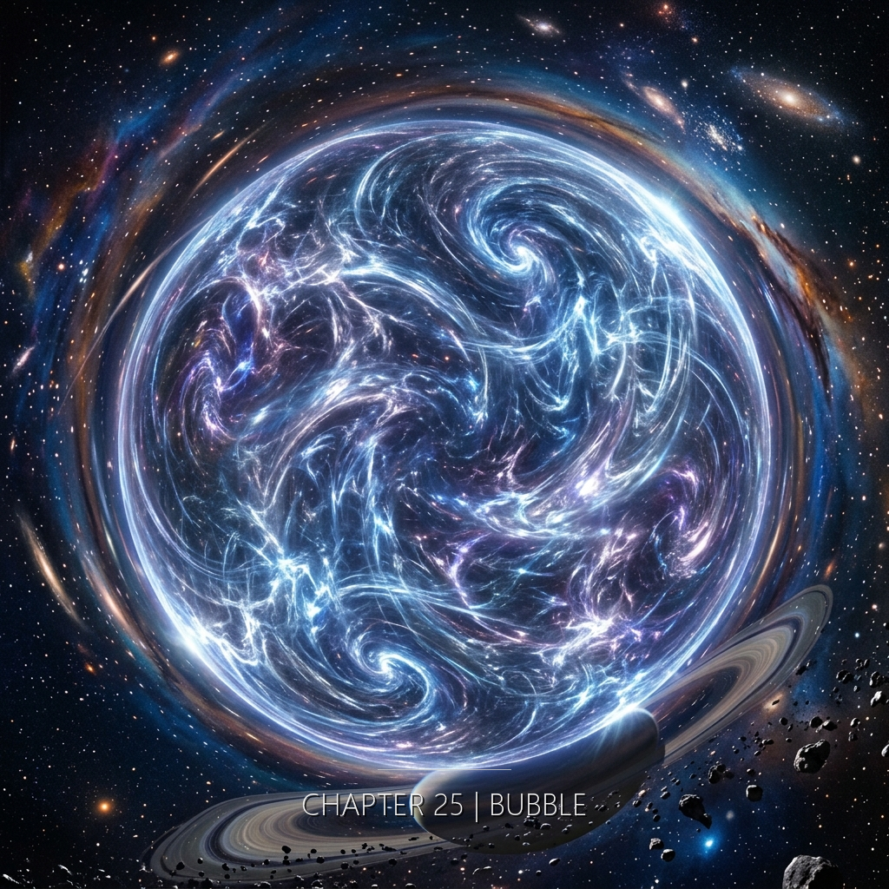

她跨過三公尺線的那一步是她人生中第一次沒有猶豫的動作——警報響了，但在褶疊的時間裡三秒可以是三千年也可以是零——然後痛來了，不是某個部位的痛，是意識本身被展開的痛，像一張摺了太久的紙被攤平時沿著摺痕裂開。

---

**第一秒。痛。**

不是身體的痛。

不是神經末梢的痛。

是意識本身被撕開——線性時間從中央被同時向兩個方向拉扯。

痛是白的。

不是明亮的白。是空白的白。是檔案被覆寫前那一刻的白。

痛是冷的。冷到像金屬貼在眼球內側。

再下一毫秒——痛是熱的。熱到像日誌被烤焦。

冷熱同時。沒有過渡。

她的肺被往兩個方向拉。一邊往上。一邊往下。兩邊都不是出口。

她的耳膜被同時往內推、往外推。鼓面消失了。只剩張力。

她的「現在」被拉長成一條無限長的線。

線的兩個端點都是不同的時刻。

線的中間每一個點都是一個她。

每一個她都在同時感覺同一件事。

微秒的尺度——每一微秒裡，她都完整地活過一次。

每一微秒都有開始。都有中間。都有結束。

然後下一微秒。又一次完整。

她沒有加速。她是被拉長。

其他三個人的死是瞬間的。
衛央——刀刃。零點三秒。
陳明哲——槍。零點一秒。
許若昕——爆炸。零點零二秒。

她的不是瞬間。

她的是——每一毫秒都清醒。每一毫秒都知道正在發生什麼。

這是她選的。

唯一一個沒有被切斷的死法。

她知道自己選了。

在痛的中央——她知道。

這個知道不能減輕痛。

但這個知道是她的。

---

**第三秒。痛轉化。**

痛沒有消失。

痛換了形狀。

她的視覺開始接收非線性的光。

不同時代的地球疊加在她眼前——

一座城市。屋頂是斜的。木頭。泥土。

煙從屋頂的洞裡升上去。

煙是灰的。帶一點藍。

是早晨的煙。不是燒毀的煙。

屋頂上有人。一個孩子。坐著。沒有看她。

遠處有鐘聲。她不知道那叫鐘聲。

她的資料庫沒有這個聲音。

這座城市沒有編號。

---

一片森林。

覆蓋半個大陸。

樹的頂端高到看不見。

綠得像要滴下來。

不是一種綠。是一千種綠疊在一起。

最上面的綠在動。是風。

最下面的綠是黑的。那裡是根。

根在泥土裡。泥土是濕的。

她從上面看。也從裡面看。

兩個視角同時。

森林裡有聲音。很多小的聲音。她沒有辦法數。

---

一片海。

她沒見過地球的海。

她生在軌道。她的第一個記憶是訓練艙。

她看過海的影像。看過海的參數。

鹽度。密度。波長。

但她沒見過海。

她的第一個反應是測量。

她的手伸出去，想找儀器。

她沒有儀器。

她是被訓練成手即儀器的人。但在這裡，手不是儀器。手只是手。

浪不停。

她沒有「不停的東西」這個類別。

軌道上的每一樣東西都有週期。都有啟動與關閉。都有排程。

浪沒有排程。

她聽見的聲音——她的訓練模組裡有一條比對項：低頻白噪。

比對失敗。

白噪是均勻的。這個聲音不是。

這個聲音有重量。

這片海很大。

比她所有的想像大。

比她所有的資料庫大。

比任何一個參數能描述的大。

大到——她的「大」這個字不夠用。

浪打在岸上。

岸是黑色的。

她聽見聲音。

那個聲音不是她學過的任何一種聲音。

那個聲音是活的。

鹹味。

空氣裡有鹹味。

她沒學過這種味道。

水是冷的。

她沒碰水。但她知道水是冷的。

她不知道她怎麼知道。

海的邊緣沒有結束。

她往左看——沒有結束。

她往右看——沒有結束。

她往前看——沒有結束。

這是她第一次遇到沒有結束的東西。

遠處有一條線。

天和水貼在一起的那條線。

她在軌道上看過地平線。從上面看。是一條弧。

她沒從下面看過地平線。

下面看的地平線是直的。

她在軌道上的一切知識——在這條直線面前，排不上用場。

---

**第七秒。恐懼消失。**

不是因為痛結束了。

是因為她開始懂了。

---

認知校正——

切掉你的一部分——

讓剩下的活下去。

那是**刪除**。

---

她在做的不是刪除。

是**展開**。

她選擇了把自己全部打開。

---

她看見了那個岔路。

在某一毫秒裡，她看見了。

一邊：認知校正。活下去。但少掉一塊。

少掉的那塊是——看見這一切的那個她。

另一邊：看完整。

看完整會死。看完整會把她拉長到斷掉。

但看完整是她的。

她選了後者。

她在痛的中央選了。

這個選擇不是被迫的。

她有時間。她在摺痕裡有時間。

她用那個時間選了完整。

她想起七號技師。

七號技師做過校正。七號技師活下來了。

七號技師的笑是平的。沒有角度。沒有深度。

那個笑裡少了一塊。

她看過那個笑。她沒有忘。

她選擇——不變成那個笑。

這個選擇是在摺痕裡做的。

摺痕給了她時間。時間剛好夠選。

---

一個無名的東西浮上來。

後來——

「後來」在這裡沒有意義——

她懂了那是：

**家。**

---

不是一個地點。

是一個狀態。

被展開的狀態。

沒有被剪掉任何一部分的狀態。

她一生沒有待在這個狀態裡過。

所以她沒有名字給它。

所以她叫它：家。

因為家是她聽過的字裡面，最接近的一個。

---

她的感官開始合併。

眼睛在嘗味道。皮膚在聽。耳朵在看光。

她分不清哪一個器官收到哪一個訊號。

但她還是她。

沒有變小。

沒有溶掉。

只是——被展開。

像一張紙，攤到最平。每一個摺痕都還在，只是不再重疊。

---

（第九秒。）

星空。

真的星空。不是人工投影。不是校色過的背景。

兩千年前的星空。光從那時出發，到現在才到。

她看見了。

---

（第十秒。）

海浪。

一次。

兩次。

三次。

---

（第十一秒。）

刻刻聲。

金屬。

金屬。

青銅冷卻的氣味。

---

（第十二秒。）

*Unfolding.*

一個英文單詞。

她不懂它的意思。

但她懂了它指的是——

現在。

這一刻。

她自己。

---

一個數字。

236。

---

一封信。

沒有燒壞。

---

一個人的聲音，很輕：「你聽得見嗎？」

---

另一個聲音：「爸爸，你在哪？」

---

另一個：「我——」

---

（她不知道這些聲音是誰。）

（她不知道這些畫面從哪來。）

（她只知道——它們都是她。）

（也都不是她。）

---

星空。

海。

刻。

*Unfolding.*

236。

信。

---

藍。

不均勻的藍。

厚的藍。

*complete.*

---

她終於懂了那個字。

*complete* ——

完整。

---

她一生都不是完整的。

她是被修剪過的。被校準過的。被「正常化」過的。

她的思考被限制在技術參數裡。

她的情感被限制在容忍度裡。

她的語言被限制在末班日誌的範本裡。

---

她從來沒有被允許完整過。

---

此刻——

她是完整的。

---

痛還在。

但痛也是她的。

也是完整的一部分。

---

家。

---

（第十三秒。）

一個女人在鑿一塊金屬。

（她不認識那個女人。）

（那個女人也即將被殺。）

---

（第十四秒。）

一個男人在一艘船上算數。

（她不認識那個男人。）

（那個男人也即將被殺。）

---

（第十五秒。）

一個女人坐在一片藍下面。

（她不認識那個女人。）

（那個女人也即將被殺。）

---

她們都是她。

她們都不是她。

---

她們的死沒有融合成一個死。

她們的死是四個。

在摺痕裡，四個死同時發生。

而她是第四個。

---

她是第一個——

**選擇**走進來的。

---

星。

海。

刻。

藍。

---

*complete.*

家。

---

她的線性時間開始溶解。
