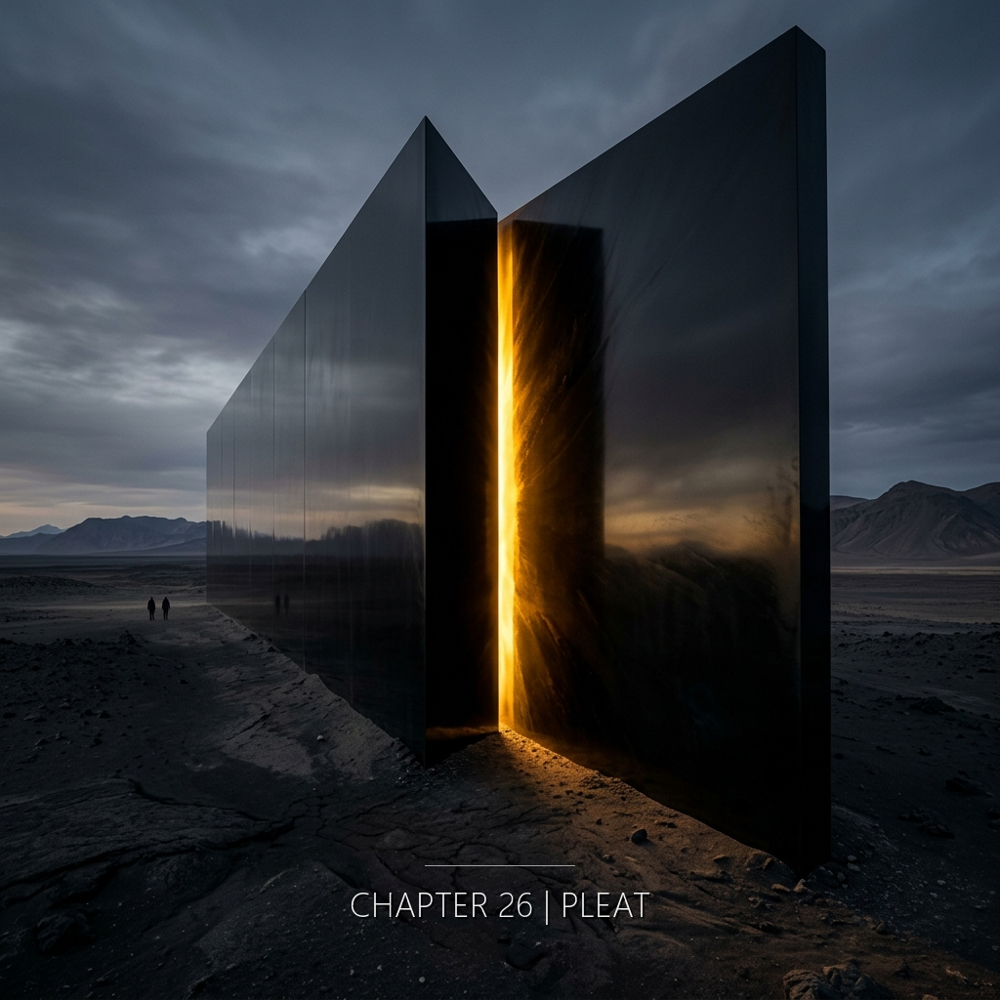

〔褶痕敘事者・崩裂〕 從本章開始，褶痕敘事者的聲音不再是完整的長句。它開始碎裂——先是句子變短，然後變成詞，然後變成空白。褶痕敘事者和四個角色一起消融。它不是永恆的全知者——它是褶痕的投影。褶痕展開時，它的聲音也展開，直到變成沉默。

---

她觸到了那個方程式本身。

不是作為數學。不是作為符號在紙上的排列。是作為一種存在的形狀——像站在一張紙的邊緣上，同時看見它的兩面展開。紙並沒有兩面。紙只是紙，而摺痕是紙決定自己是什麼的地方。她看見自己一直站在摺痕上。從來都是。不是她走到這裡，是這裡本來就是她的位置。四個方向都透明。四個時間都透明。她明白了為什麼「理解」這個詞不夠——因為她不是在理解什麼，她是正在成為那個被理解的形狀本身。

---

她跪著。清晨的風從東邊來。她沒有低頭。地面是軟的。昨天下過雨。

---

他聽見海浪。他不明白為什麼在這種時候他想到的是方程式。但他的大腦就是這樣運作的。*固有值*。最後一步。他笑了一下——或者只是嘴角動了一下，那個表情在他自己的臉上他從未見過。海水是冷的。他的手指鬆開了。

---

她躺著，看見天空。天空的藍很乾淨。她想這很奇怪，爆炸之後天空應該有煙的。信在她手邊。沒有燒壞。

---

她走進去的第一步。她感到腳底的地面開始不確定它自己是不是地面。

---

然後四個意識在高維空間相遇。

不是對話。沒有語言。沒有「你好」沒有「是你嗎」沒有問句。四個頻率在一個點上疊合——衛央的那個頻率像清晨乾淨的空氣，陳明哲的那個頻率像金屬與海水之間的冷，許若昕的那個頻率像被風翻開的紙，縫工的那個頻率像有人在很遠的地方輕輕呼吸。四條曲線在同一個點相交，產生了一個原本不存在的波形。那個波形不是它們的總和。那個波形是它們本來就是、但從未能單獨是的那個東西。

它們沒有驚訝。驚訝需要時間上的先後——「我以前不知道，現在我知道」。在這個點上沒有「以前」。

只有在。

---

每一個人都帶著一塊碎片。

衛央帶來的是座標。不是數字。是一種方向感——像在沒有指南針的夜裡，知道哪一邊是東方。是舌根上一點冷的金屬味，像含著一枚她一生觀測過的銅幣。她不知道那個方向有什麼，她只知道那個方向。

陳明哲帶來的是答案。不是符號。是一個正在震動的形狀——從裡面看見的摺痕，摺痕的內側。是一口沉在水下的銅鐘敲響的聲音，鐘聲在水中變形，但那個頻率還在。他知道那個頻率是對的。他不知道它在哪裡響。

許若昕帶來的是直覺。是一隻正在伸出的手——但那隻手不是她的。它從她那個無法解釋的第四十七步裡伸出來，穿過她的掌心，帶著一種溫度，像有人剛才握過她的手而那個人並不在這裡。她不知道那隻手要指向哪裡。她只知道那隻手知道。

縫工帶來的是夢。是一個在睡眠中出現的參數——小數點後第三位。是一個她從未學過的語言裡「家」這個字的發音。是一片她從未見過的海的顏色——厚的藍，有顆粒感，中間有光還沒散完的餘白。

---

她們合起來。是完整的摺痕方程式。

座標告訴它在哪裡。答案告訴它是什麼。直覺告訴它怎麼讀。夢告訴它為什麼。

四個缺一不可。四個單獨都不能解。四個合起來只存在一瞬間——在她們同時消失的那一瞬間。

---

座標遇見答案的那一刻，金屬味和銅鐘聲重疊了——方向有了聲音。
答案遇見直覺的那一刻，銅鐘的震動被那隻不是誰的手接住——聲音有了重量。
直覺遇見夢的那一刻，那隻手握住了那個從未學過的「家」字——重量有了歸處。
夢遇見座標的那一刻，那片未見過的海延伸出東方——歸處有了方向。

四個合起來的那一瞬間，有光。但不是從外面來的光。是從形狀內側透出來的光——像從紙的摺痕處漏出來的，本來就在紙裡面的光。有聲音。但不是聲音——是聲音停下來之前的最後一個頻率。有溫度。是四個身體在四個地方各自僅剩的那點體溫，在這裡重新成為一個身體的溫度。

然後是沉默。不是缺乏聲音的那種沉默。是形狀完成之後不再需要聲音的那種沉默。

那一瞬間有多長。

不是時間問題。

它發生過。它無法被握住。它溜走的方式不是離開——是它本來就不屬於可以停留的那一類東西。

四個碎片仍在四個地方。衛央仍跪著。陳明哲仍漂著。許若昕仍躺著。縫工仍站在她的第八步。什麼都沒變。

但摺痕獲得了一個新的形狀。

---

風從東邊來。衛央跪在洛陽的清晨裡，風裡有她指尖上青銅粉末的氣味。

海浪。陳明哲漂在鹿港外海，浪是台灣海峽特有的那種節奏，鹽正在他最後那幾頁筆記的紙上結晶。

天空的藍。許若昕躺在日內瓦的停車場，那片不應該在爆炸後還這麼乾淨的藍，柏油地還是溫的，貼在她的背。

腳底的不確定。縫工站在混沌泡的第八步裡，地面已經不再確定它是不是地面，白色沒有邊。
