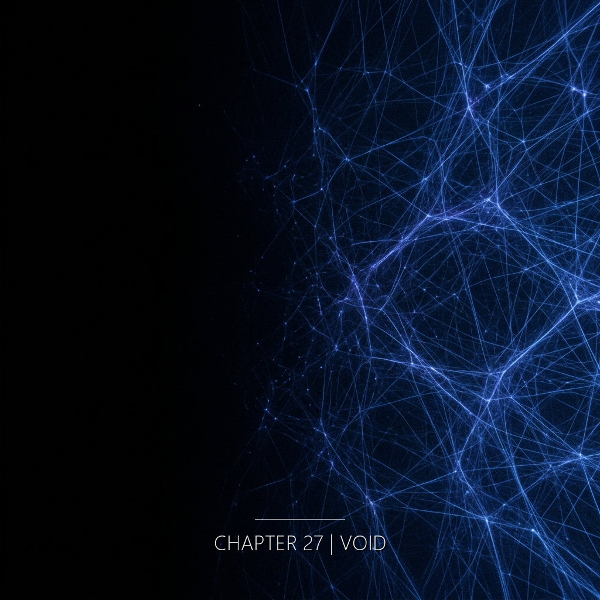

她沒有低頭。

他算完了。

信沒有燒壞。

地面不確定自己是不是地面。

---

四個聲音不再區分。讀者在這裡必須自己辨認——從句子的長度、質地、詞語的選擇。二十六章的閱讀訓練在這裡被測試。

---

刀刃的冷。

槍膛的聲音——不是槍響，是槍被舉起來的那個金屬聲音。

信在她手裡，沒有燒壞。

泡內的光是所有時間的光，疊在一起，變成白色。

---

她感到風。風從東邊來。她的布帶還綁著。

他感到水。海水鹹的。他的手指在空氣裡還在畫方程。

她感到紙。信的邊緣焦黑。字跡完好。

她感到自己在消失——不是恐懼，是一個很平靜的觀察。泡裡的白不再有邊界。

---

刀刃在她頸側停了一下。持刀的人抖了。

海面合上。沒有聲音特別為他響起。

火還在遠處。爆炸的回聲穿過她的胸腔。

白色變得更白。白色之後是什麼。

---

四個人。四個地方。四個年代。

同一個點。

---

縫工開口。

她說了一個詞。整本書她從未說過的詞。二十六章的沉默。所有被帶去心理評估的人。所有不再回來的詞。所有她在角落看著沒有說的話。

嘴唇動了。很小的一個動作。但比一生還大。

聲帶抖。聲帶從未被要求發出這個形狀。她受訓只記「觀察到」「已發生」「已消除」——這三種聲音她的喉嚨記得。這個詞不在。

舌尖先動。然後停住。好像在撞一道不存在的牆。

她的右手忽然沒有感覺。視野邊緣白了一格又暗回來。

那個詞在她的身體裡找不到路。它沒有肌肉記憶，沒有文法歷史，沒有一次被允許過的前例。

它必須撕開。

一個微秒的靜默——

然後，有東西從喉嚨裡裂開。不是痛。是某個被壓了一輩子的結構斷了。

　　　　

　　　　

**「如果她們聽得見——」**

　　　　

　　　　

不需要說完。整本書的重量壓在這兩個字上。

衛央在刀刃下——她聽到一個不是聲音的東西。她本來已經接受自己死得無人看見。但在這一刻，在邊界上，她知道：她被聽見了。

陳明哲在海水裡——他聽見自己的名字被一種不是語言的語言說出來。他本來是一道自己在寫自己的方程。現在方程回頭認識他。

許若昕在跑道上——手裡的信。她聽見寫信的人也正在聽她。溫度穿過又一層。

---

如果。

她從來不用這個詞。她的筆記只記「觀察到」「已發生」「已消除」。她的詞典裡沒有還沒發生的事。沒有可能的另一條路。沒有「本來可以」。只有「是」和「不是」。

這兩個字她壓了一輩子。

壓到今天。

---

「——」

---

她抬頭。天空有光。她不知道那個光是不是異常——在她的時代她已經無法記錄了——但她知道那個光在對她說話。用她的頻率。用她一生等待的那個頻率。

---

他的手被握住了。海水裡不應該有另一隻手。但有。他認出來了——不是認識，是認出。像小時候在廚房聞到母親做的菜，不需要看就知道是她。那隻手是她的。是她們的。他笑了，這一次是真的笑。海水鹹。

---

信的邊緣焦黑。字跡完好。她把信貼在胸口。她不是一個人躺在這裡。天空的藍是所有人看過的藍，從古代看到未來，那個藍是同一個藍。

---

她不孤單。

---

泡內的白色裡有四個影子。

不是影子。是形狀。

一個跪著的。一個躺著的。一個在水裡的。一個站著的。

她們沒有動。但她們在。

縫工伸出手。她的手穿過白色的光，碰到另外三隻手。

---

「如果她們聽得見——」

她們聽得見。

---

原來你們一直都在。
