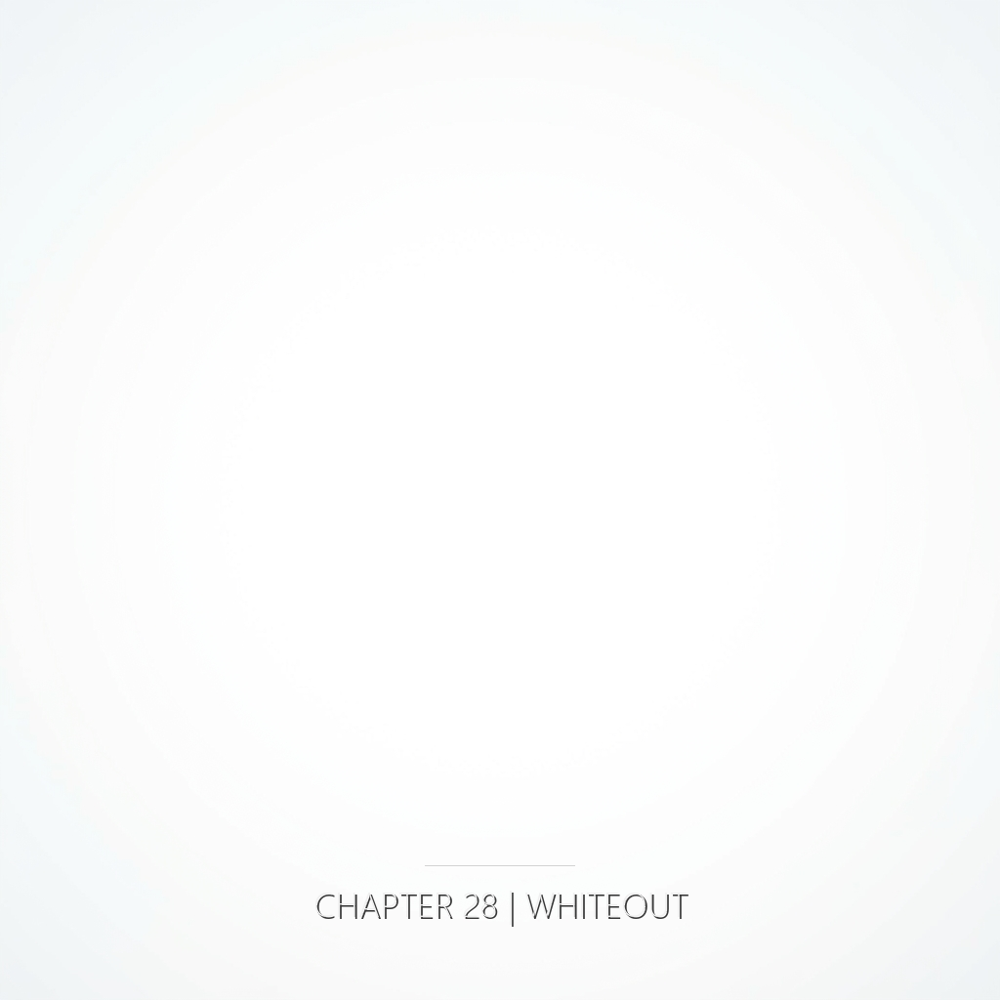

一隻手，食指與中指結著三年的銅繭，帶著洛陽破曉前的寒意。

一隻手，剛剛還握過鉛筆、握過妻子的掌心、握過龍山寺牆裡那塊磚，此刻被海水浸得透涼。

一隻手，指尖還沾著停機坪的血，掌心壓著一封沒有寫完的信，溫熱貼上溫熱的水泥。

還有一隻手——掌紋乾淨得近乎虛構，從未握過什麼，也從未被握過。

四隻手在不屬於任何時空的地方相遇。沒有電流，沒有溫度轉移，沒有重量。

---

衛央在刑場的風裡，第一次感覺到被遙遠的年代注視，脊背卻不再冷。

陳明哲在浪聲裡鬆開了一直緊抓著算式的手指——他那張沒能寫完的紙，有人在別處替他補上了半行。

許若昕在柏油的熱氣上輕輕笑了一下，原來那封信從來不只是寫給某一個人的。

縫工在泡沫的中心，第一次知道「被握住」三個字，並不需要先學會怎麼寫。

---

完整的摺痕方程式的解，存在於她們同時消失的那一瞬間。

縫工幾乎看見了它——像一張在無光處自行展開的紙，每一道摺痕都是另外三個人生命的轉角。她伸手去接，指尖剛觸到，那張紙就靜靜地散了。

沒有人知道全部。沒有人會知道。

但那個答案存在過。存在了一瞬，也就永遠地，存在於摺痕裡。

選擇的意義不在改變結果。

在觀測行為本身改變了摺疊的幾何。

---

風。

海浪。

藍。

白。

---

——
