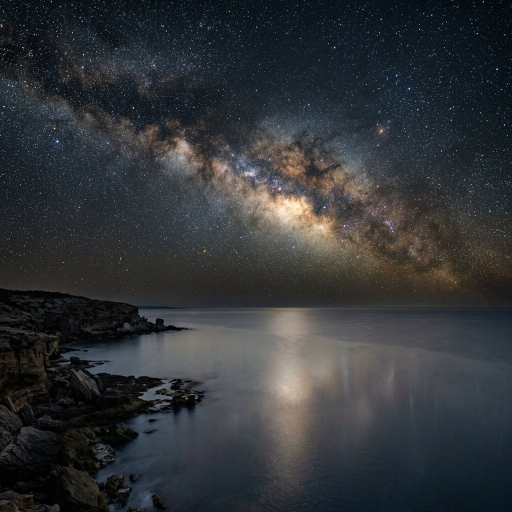

有人站在空地上，抬頭看。

天空裡有一道閃光。不是雷，也不是她認識的任何一顆星。顏色不好描述——像很薄的金，又像一層被水洗過的白。它在天頂偏東的位置，不高，也不低。它在同一個位置停了很短的時間——比眨一次眼長一點，比深呼吸短很多——然後摺了一下，像一張紙被誰從另一面輕輕推過來，然後消失。

沒有聲音。沒有雷。連風在那一瞬都停了。她身邊的草沒有動。遠處一隻鳥本來在叫，叫到一半，沒有叫完。空氣的溫度換了一下，又換回來——像有什麼東西從她身邊走過，但她沒看見。

風重新起來了，是涼的。遠處有水聲，可能是河，可能是別的什麼。空氣裡有一點點塵土的味道。她不知道這是一天裡的哪個時刻，因為那道光讓天色變得奇怪。

她猶豫了一下。

她先往左右看了看。沒有別人。只有她。

然後她伸手，拿起旁邊那個可以記錄的東西。不重要是什麼——是可以寫下位置、時間、亮度、持續長度的那種東西。她的手穩。她的手不抖。手背上有一道舊的痕，指節不年輕，但也不老。那是一隻用過很多年的手。她把它放在一個會比她活得久的表面上——一個會被讀到的表面。

她記下了位置：天頂偏東，大約三十度。記下了時間——用她這裡的時間。記下了亮度，用她能描述的詞：像薄金，像被洗過的白。記下了持續的長度：很短，但足夠看清。

她停了一下。

她想過要不要把另一件事也寫下來——那個溫暖，那個被看著的感覺，那一刻奇怪的平靜，好像有人在她看見那道光的同時，也正從很遠的地方看著她。

她決定不寫。那不是資料。那是她自己的。她留著。

她寫下一行：

今天有異常閃光。

她看了一眼天空，天空已經恢復正常。她低頭，繼續寫。

她記錄。
